---
## Front matter
lang: ru-RU
title: Лабораторная работа №1
subtitle: Установка ОС Linux
author:
  - Полякова Ю.А.
institute:
  - Российский университет дружбы народов, Москва, Россия
date: 28 февраля 2007

## i18n babel
babel-lang: russian
babel-otherlangs: english

## Formatting pdf
toc: false
toc-title: Содержание
slide_level: 2
aspectratio: 169
section-titles: true
theme: metropolis
header-includes:
 - \metroset{progressbar=frametitle,sectionpage=progressbar,numbering=fraction}
---

# Информация

## Докладчик

:::::::::::::: {.columns align=center}
::: {.column width="70%"}

  * Полякова Юлия Александровна
  * Студент
  * Российский университет дружбы народов
  * [yulya.polyakova.07@mail.ru](mailto:yulya.polyakova.07@mail.ru)
  * <https://github.com/JuliaMaffin123>

:::
::: {.column width="30%"}

:::
::::::::::::::

# Вводная часть

## Актуальность

- Умение устанавливать ОС самостоятельно является важным и полезным как для общего развития, так и для понимания архитектуры ОС и как работает ОС

## Объект и предмет исследования

- ОС Linux

## Цели и задачи

- Приобретение практических навыков установки операционной системы на виртуальную машину
- Приобретение навыков настройки минимально необходимых для дальнейшей работы сервисов

## Материалы и методы

- VirtualBox
- Fedora Sway Spin 41
- pandoc
- TeXlive

# Выполнение лабораторной работы

## Создание виртуальной машины

Скачиваем образ Fedora Sway Spin с официального сайта, заходим в ранее установленный VirtualBox. Нажимаем Машина -> Создать и настраиваем ее. Устанавливаем имя, образ, затем выделяем память, определяем кол-во процессоров и т.д. Настраиваем до состояния:

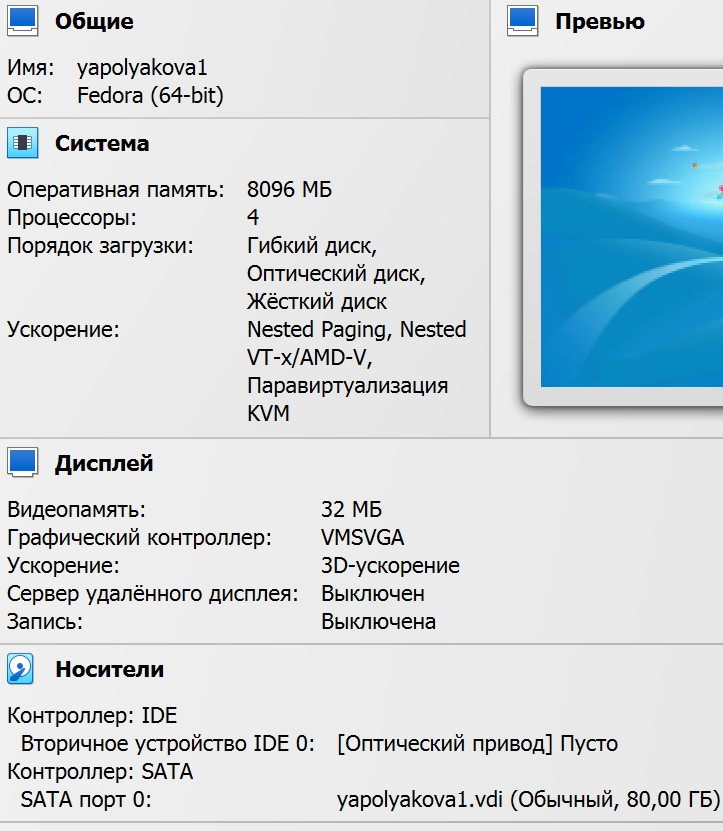{#fig:001 width=25%}

## Установка

Запускаем машину. Если есть проблема с черным экраном, то запускаем через Troubleshooting и базовую графику. Открываем терминал, пишем liveinst, в установщике задаем все 6 настроек, придерживаясь соглашения об именовании. После завершения установки выключаем машину и изымаем образ в Носителях

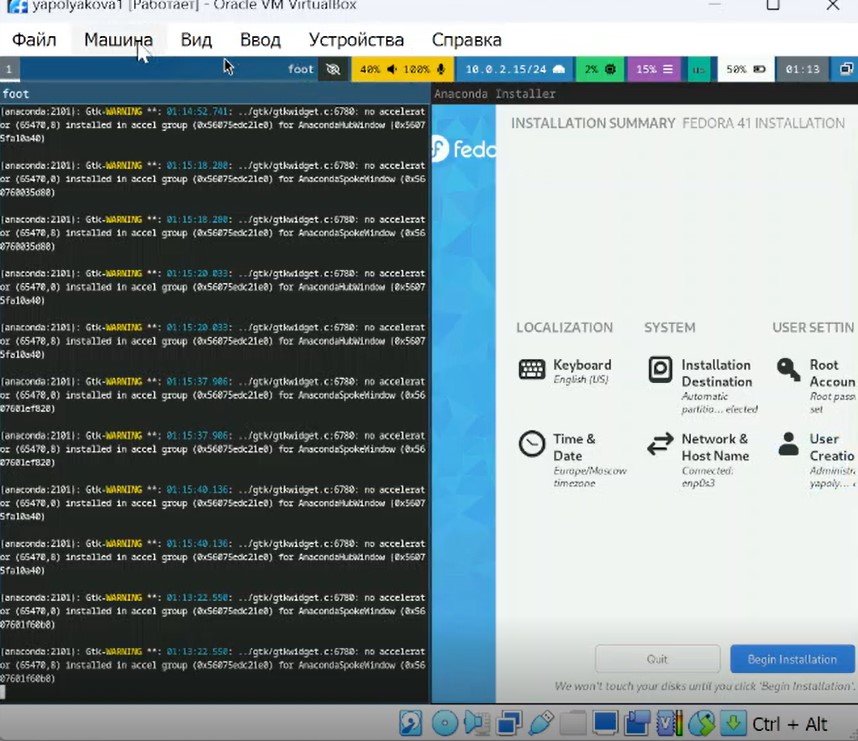{#fig:002 width=25%}

## Обновления

Входим в ОС, в терминале переключаемся на супер-пользователя, устанавливаем средства разработки и обновляем пакеты

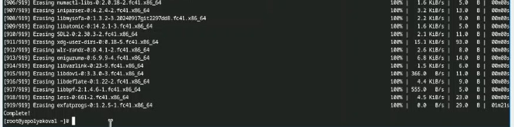{#fig:003 width=70%}

## Повышение комфорта работы

Для удобства ставим tmux и mc. Задаем автоматическое обновление

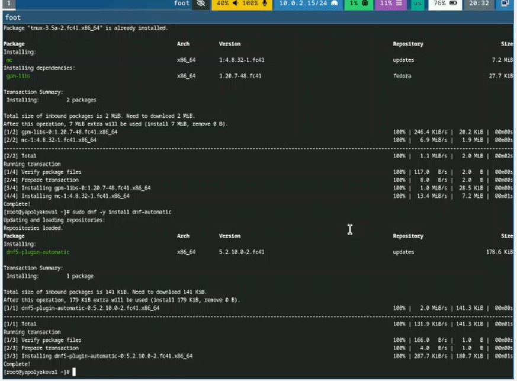{#fig:004 width=50%}

## Отключение SELinux

Отключаем систему безопасности SELinux. В конфигурации меняем enforcing на permissive. Делаем reboot

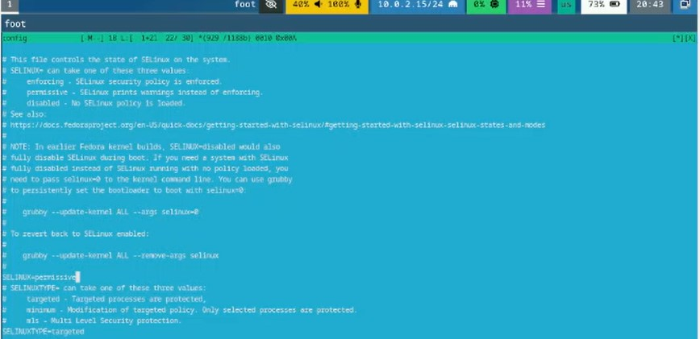{#fig:005 width=70%}

## Настройка раскладки клавиатуры

Настройка раскладки клавиатуры. Создаем конфигурационный файл ~/.config/sway/config.d/95-system-keyboard-config.conf и добавляем в него такую строку:

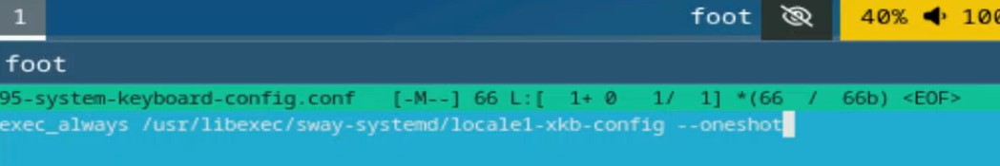{#fig:006 width=70%}

## Редактируем конфигурационный файл

Редактируем конфигурационный файл /etc/X11/xorg.conf.d/00-keyboard.conf:

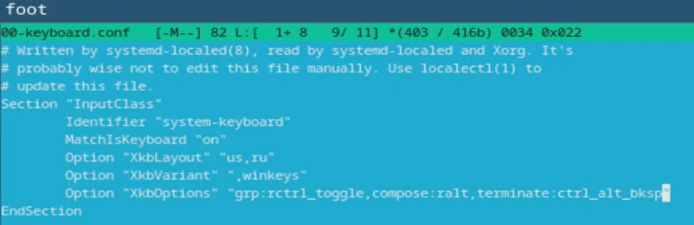{#fig:007 width=70%}

## Установка pandoc

Устанавливаем pandoc через sudo dnf -y install pandoc менеджер пакетов, смотрим какая у него версия. На GitHub находим и устанавливаем соответствующую версию pandoc-crossref. Распаковываем архив и файл без цифры 1 копируем в /usr/local/bin

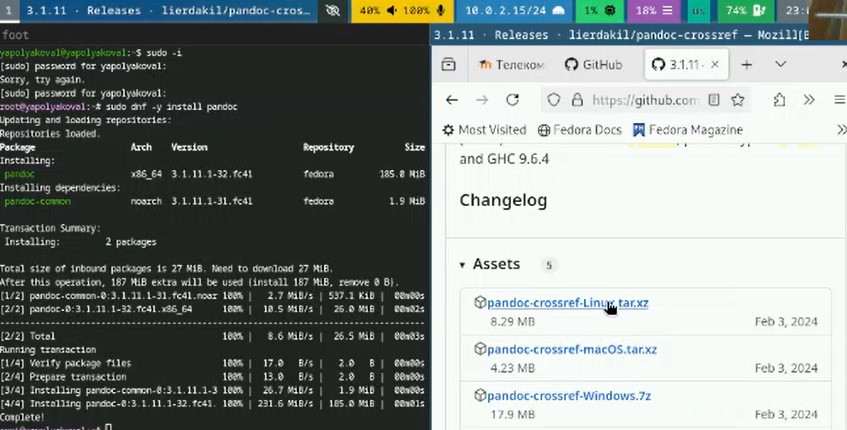{#fig:008 width=60%}

## Установка TeXlive

Устанавливаем TeXlive через sudo dnf -y install texlive-scheme-full и проверяем наличие самых важных элементов 

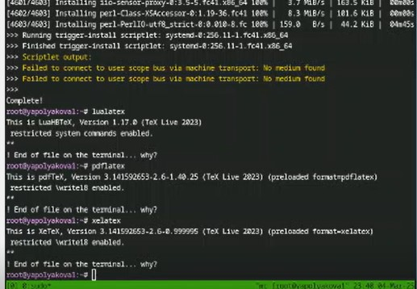{#fig:009 width=50%}

# Домашнее задание

## Вывод dmesg | less

Запускаем, открываем терминал, смотрим вывод команды dmesg | less

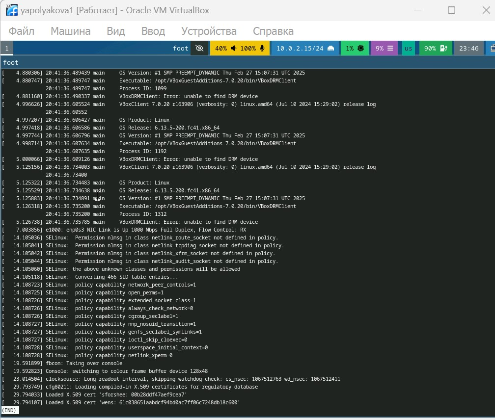{#fig:010 width=50%}

## Получаем конкретную информацию 1

Командой dmesg | grep -i "то, что ищем" получаем информацию о версии Linux, модели процессора и типе гипервизора:

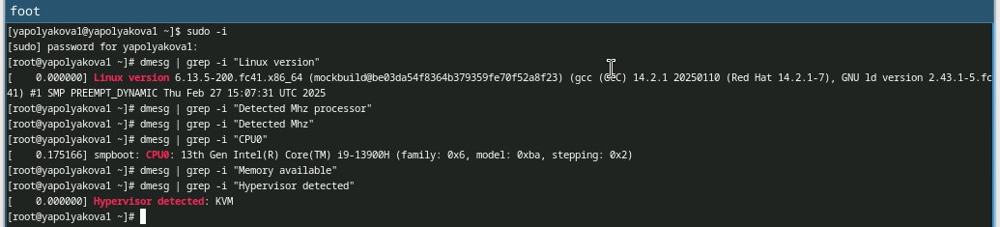{#fig:011 width=70%}

## Получаем конкретную информацию 2

Командой dmesg | grep -i "то, что ищем" получаем информацию о частоте процессора, объеме памяти:

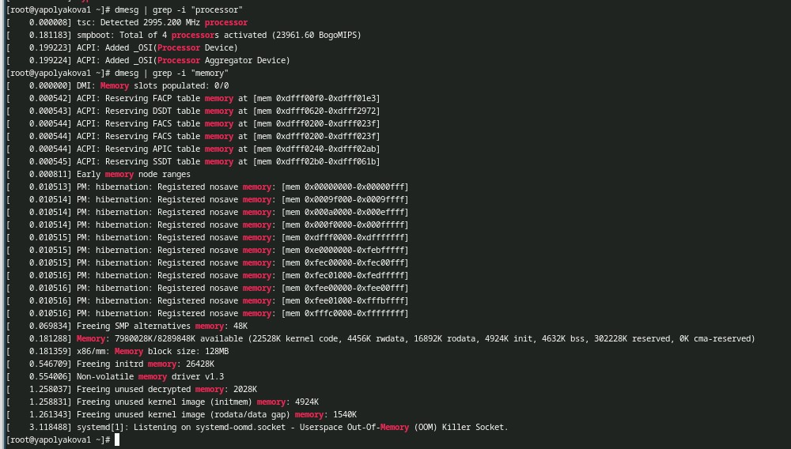{#fig:012 width=50%}

# Контрольные вопросы

## Контрольные вопросы 

1. Учетная запись содержит имя пользователя, зашифрованный пароль п-ля, идентификационный номер п-ля и группы п-лей, домашний каталог, командный интерпретатор.

## Контрольные вопросы 

2. Укажите команды терминала и приведите примеры:

- для получения справки по команде: man название_команды, т.е. man cd
- для перемещения по файловой системе: cd, т.е. cd ~/work/study.....
- для просмотра содержимого каталога: ls, т.е. ls ~/work
- для определения объёма каталога: du имя_каталога, т.е. du ~/work
- для создания: mkdir имя каталога или touch имя файла/ удаления: каталогов rm имя каталога / файлов rm имя файла
- для задания определённых прав на файл / каталог: chmod
- для просмотра истории команд: history

## Контрольные вопросы 

3. Файловая система - порядок, определяющий способ организации, хранения и именования данных на носителях информации в компьютерах. Примеры: FAT32 - стандартная, чаще используется в USB-накопителях и внешних носителях; exFAT - как FAT32, но может оперировать файлами больше 4 Гб; NTFS - одна из самых распространенных систем в Windows, продвинутая; HFS+ - на устройствах Apple; Btrfs - по умолчанию в OpenSUSE и SUSE Linux.

## Контрольные вопросы 

4. Посмотреть, какие файловые системы подмонтированы в ОС можно командой mount.

## Контрольные вопросы 

5. Удалить зависший процесс можно командой kill.

## Вывод

Были приобретены практические навыки установки операционной системы на виртуальную машину, настройки минимально необходимых для дальнейшей работы сервисов.
