---
## Front matter
title: "Лабораторная работа №1"
subtitle: "Установка ОС Linux"
author: "Полякова Юлия Александровна"

## Generic otions
lang: ru-RU
toc-title: "Содержание"

## Bibliography
bibliography: bib/cite.bib
csl: pandoc/csl/gost-r-7-0-5-2008-numeric.csl

## Pdf output format
toc: true # Table of contents
toc-depth: 2
lof: true # List of figures
lot: true # List of tables
fontsize: 12pt
linestretch: 1.5
papersize: a4
documentclass: scrreprt
## I18n polyglossia
polyglossia-lang:
  name: russian
  options:
	- spelling=modern
	- babelshorthands=true
polyglossia-otherlangs:
  name: english
## I18n babel
babel-lang: russian
babel-otherlangs: english
## Fonts
mainfont: IBM Plex Serif
romanfont: IBM Plex Serif
sansfont: IBM Plex Sans
monofont: IBM Plex Mono
mathfont: STIX Two Math
mainfontoptions: Ligatures=Common,Ligatures=TeX,Scale=0.94
romanfontoptions: Ligatures=Common,Ligatures=TeX,Scale=0.94
sansfontoptions: Ligatures=Common,Ligatures=TeX,Scale=MatchLowercase,Scale=0.94
monofontoptions: Scale=MatchLowercase,Scale=0.94,FakeStretch=0.9
mathfontoptions:
## Biblatex
biblatex: true
biblio-style: "gost-numeric"
biblatexoptions:
  - parentracker=true
  - backend=biber
  - hyperref=auto
  - language=auto
  - autolang=other*
  - citestyle=gost-numeric
## Pandoc-crossref LaTeX customization
figureTitle: "Рис."
tableTitle: "Таблица"
listingTitle: "Листинг"
lofTitle: "Список иллюстраций"
lotTitle: "Список таблиц"
lolTitle: "Листинги"
## Misc options
indent: true
header-includes:
  - \usepackage{indentfirst}
  - \usepackage{float} # keep figures where there are in the text
  - \floatplacement{figure}{H} # keep figures where there are in the text
---

# Цель работы

Целью данной работы является приобретение практических навыков установки операционной системы на виртуальную машину, настройки минимально необходимых для дальнейшей работы сервисов.

# Выполнение лабораторной работы

1. Скачиваем образ Fedora Sway Spin с официального сайта, заходим в ранее установленный VirtualBox. Нажимаем Машина -> Создать и настраиваем ее. Устанавливаем имя, образ, затем выделяем память, определяем кол-во процессоров и т.д. Настраиваем до состояния: (рис. [-@fig:001]).

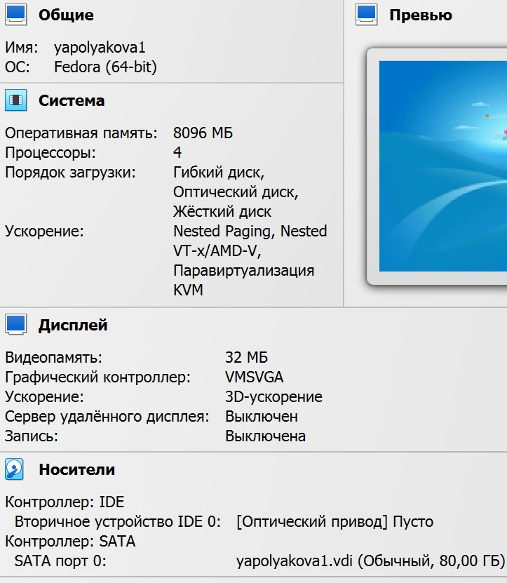{#fig:001 width=50%}

2. Запускаем машину. Если есть проблема с черным экраном, то запускаем через Troubleshooting и базовую графику. Открываем терминал, пишем liveinst, в установщике задаем все 6 настроек, придерживаясь соглашения об именовании. После завершения установки выключаем машину и изымаем образ в Носителях (рис. [-@fig:002])

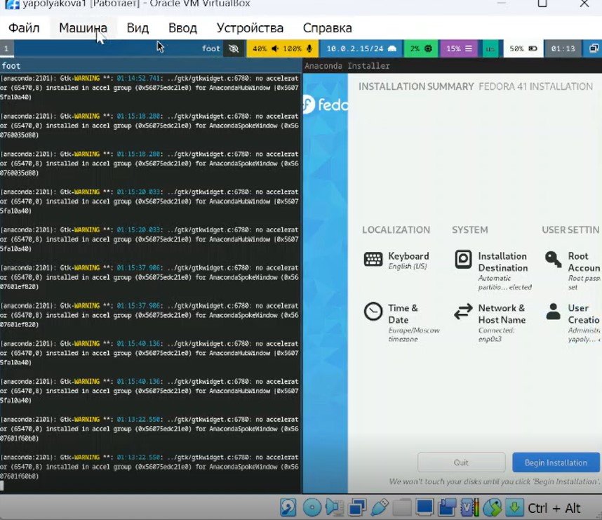{#fig:002 width=60%}

3. Входим в ОС, в терминале переключаемся на супер-пользователя, устанавливаем средства разработки и обновляем пакеты (рис. [-@fig:003])

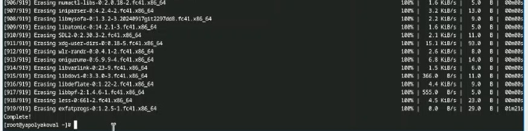{#fig:003 width=70%}

4. Для удобства ставим tmux и mc. Задаем автоматическое обновление (рис. [-@fig:004])

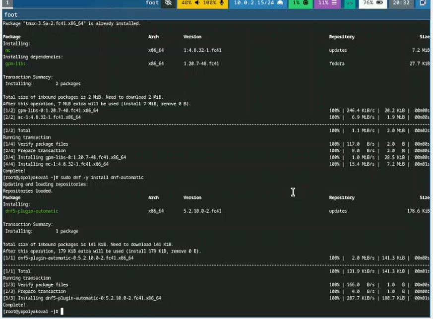{#fig:004 width=50%}

5. Отключаем систему безопасности SELinux. В конфигурации меняем enforcing на permissive. Делаем reboot (рис. [-@fig:005])

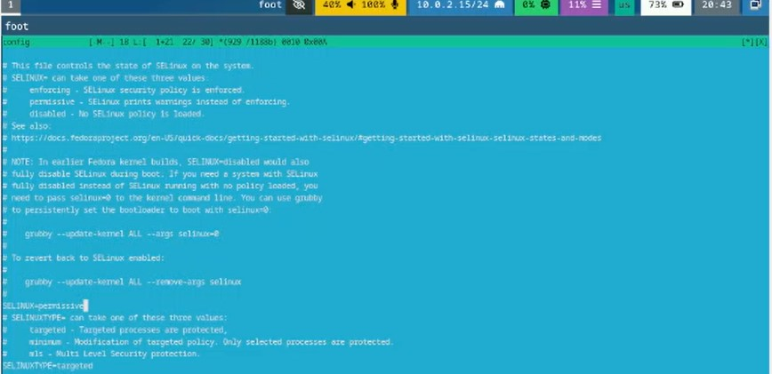{#fig:005 width=70%}

6. Настройка раскладки клавиатуры. Создаем конфигурационный файл ~/.config/sway/config.d/95-system-keyboard-config.conf и добавляем в него такую строку: (рис. [-@fig:006])

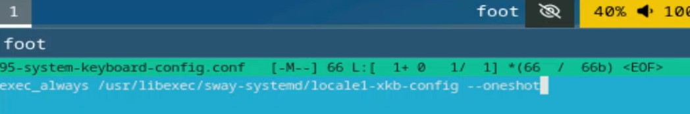{#fig:006 width=70%}

7. Редактируем конфигурационный файл /etc/X11/xorg.conf.d/00-keyboard.conf: (рис. [-@fig:007])

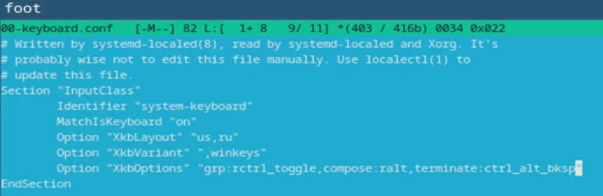{#fig:007 width=70%}

8. Устанавливаем pandoc через sudo dnf -y install pandoc менеджер пакетов, смотрим какая у него версия. На GitHub находим и устанавливаем соответствующую версию pandoc-crossref. Распаковываем архив и файл без цифры 1 копируем в /usr/local/bin (рис. [-@fig:008])

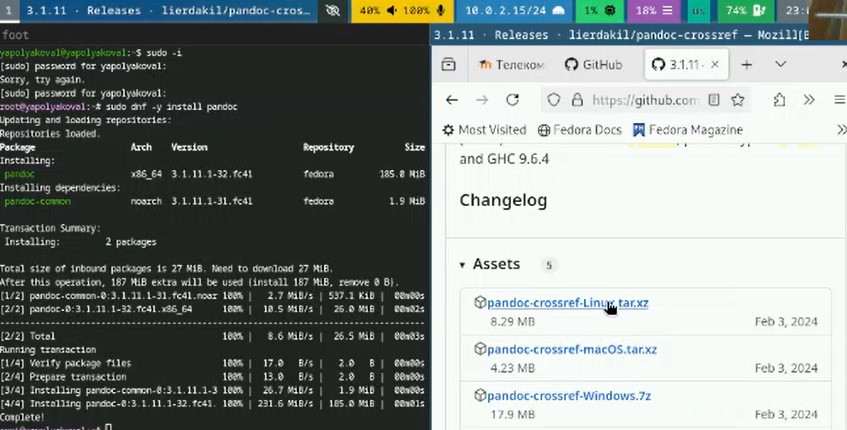{#fig:008 width=60%}

9. Устанавливаем TeXlive через sudo dnf -y install texlive-scheme-full и проверяем наличие самых важных элементов (рис. [-@fig:009])

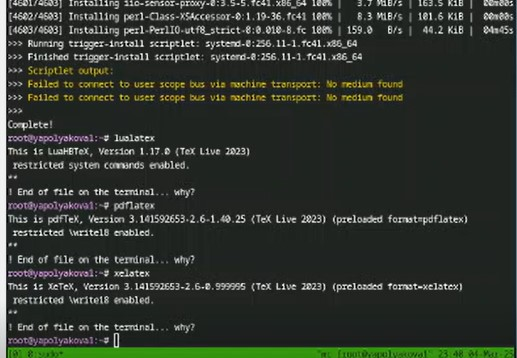{#fig:009 width=60%}

# Домашнее задание

1. Запускаем, открываем терминал, смотрим вывод команды dmesg | less (рис. [-@fig:010])

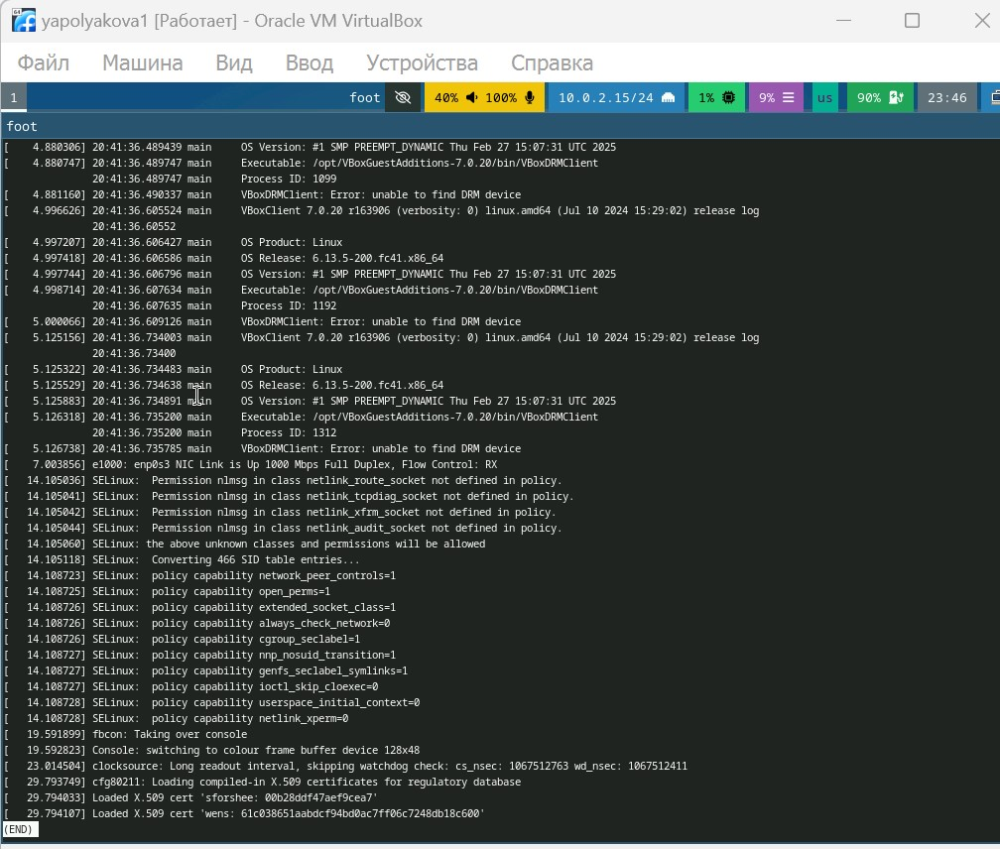{#fig:010 width=50%}

2. Командой dmesg | grep -i "то, что ищем" получаем информацию о версии Linux, модели процессора и типе гипервизора:  (рис. [-@fig:011])

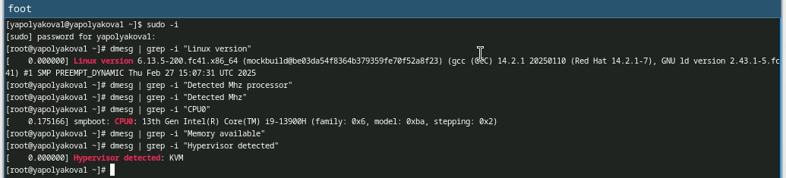{#fig:011 width=70%}

3. Командой dmesg | grep -i "то, что ищем" получаем информацию о частоте процессора, объеме памяти:  (рис. [-@fig:012])

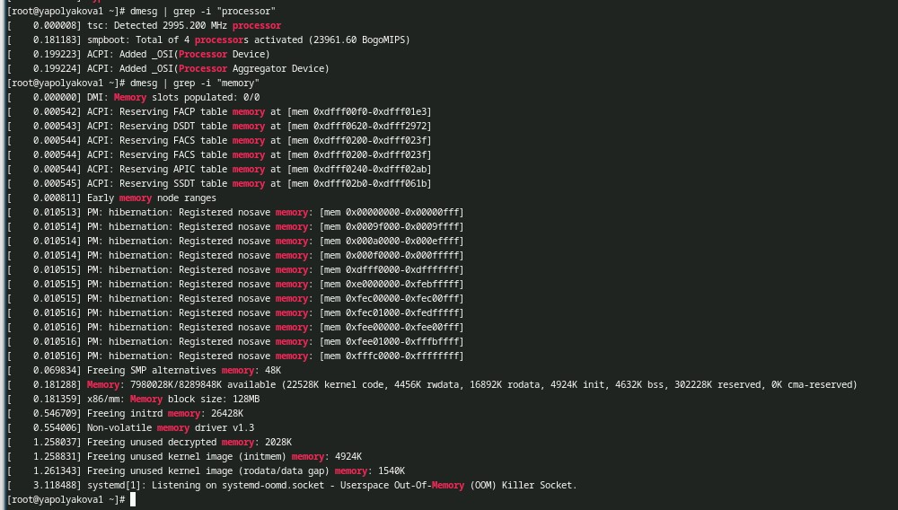{#fig:012 width=50%}

# Контрольные вопросы

1. Учетная запись содержит имя пользователя, зашифрованный пароль п-ля, идентификационный номер п-ля и группы п-лей, домашний каталог, командный интерпретатор.

2. Укажите команды терминала и приведите примеры:

- для получения справки по команде: man название_команды, т.е. man cd
- для перемещения по файловой системе: cd, т.е. cd ~/work/study.....
- для просмотра содержимого каталога: ls, т.е. ls ~/work
- для определения объёма каталога: du имя_каталога, т.е. du ~/work
- для создания: mkdir имя каталога или touch имя файла/ удаления: каталогов rm имя каталога / файлов rm имя файла
- для задания определённых прав на файл / каталог: chmod
- для просмотра истории команд: history

3. Файловая система - порядок, определяющий способ организации, хранения и именования данных на носителях информации в компьютерах. Примеры: FAT32 - стандартная, чаще используется в USB-накопителях и внешних носителях; exFAT - как FAT32, но может оперировать файлами больше 4 Гб; NTFS - одна из самых распространенных систем в Windows, продвинутая; HFS+ - на устройствах Apple; Btrfs - по умолчанию в OpenSUSE и SUSE Linux.

4. Посмотреть, какие файловые системы подмонтированы в ОС можно командой mount.

5. Удалить зависший процесс можно командой kill.

# Вывод

Были приобретены практические навыки установки операционной системы на виртуальную машину, настройки минимально необходимых для дальнейшей работы сервисов.
