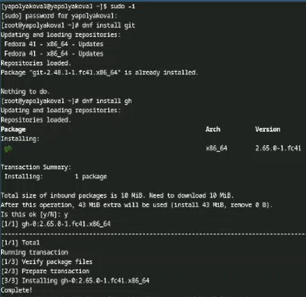

---
## Front matter
lang: ru-RU
title: Лабораторная работа №2
subtitle: Первоначальная настройка git
author:
  - Полякова Ю.А.
institute:
  - Российский университет дружбы народов, Москва, Россия
date: 28 февраля 2007

## i18n babel
babel-lang: russian
babel-otherlangs: english

## Formatting pdf
toc: false
toc-title: Содержание
slide_level: 2
aspectratio: 169
section-titles: true
theme: metropolis
header-includes:
 - \metroset{progressbar=frametitle,sectionpage=progressbar,numbering=fraction}
---

# Информация

## Докладчик

:::::::::::::: {.columns align=center}
::: {.column width="70%"}

  * Полякова Юлия Александровна
  * Студент
  * Российский университет дружбы народов
  * [yulya.polyakova.07@mail.ru](mailto:yulya.polyakova.07@mail.ru)
  * <https://github.com/JuliaMaffin123>

:::
::: {.column width="30%"}

:::
::::::::::::::

# Вводная часть

## Актуальность

- Важно уметь работать со средствами контроля версий
- Это важно для работы над проектом в команде
- Также полезно понимать структуру версий, ветвей и уметь делать "чистые коммиты"

## Объект и предмет исследования

- Средство контроля версий git

## Цели и задачи

- Изучить идеологию и применение средств контроля версий
- Освоить умения по работе с git

## Материалы и методы

- Сайт GitHub
- VCS git
- Ключи ssh и gpg
- Шаблон каталога курса

# Выполнение лабораторной работы

## Установка ПО

Установка git и gh командой dnf install

{#fig:001 width=30%}

## Базовая настройка

Базовая настройка git. Задаем имя и email, настраиваем utf-8, задаем имя начальной ветки и параметры autocrlf и safecrlf

{#fig:002 width=70%}

## Создание ключей ssh

Создание ключей ssh по алгоритмам rsa и ed25519

{#fig:003 width=30%}

## Создание ключа gpg

Создание ключа gpg с типом RSA and RSA, размером 4096 и сроком действия по умолчанию. Также добавляем личную информацию (имя, адрес почты, пустой комментарий)

{#fig:004 width=20%}

## Добавление ключа gpg

Учетная запись в GitHub уже была настроена, поэтому переходим к добавлению ключа. Выводим ключ по его отпечатку и копируем в настройки на сайте

{#fig:005 width=70%}

## Настройка подписей коммитов

Настройка автоматических подписей коммитов git

{#fig:006 width=70%}

## Клонирование репозитория в папку os-intro

Авторизуемся с помощью gh auth login. Создаем папку курса по шаблону, переходим в нее. Создаем в терминале репозиторий по указанному шаблону. Далее клонируем получившийся репозиторий в папку os-intro. На этом моменте возникла сложность с ключом (Permission denied (publickey)), поэтому дополнительно был добавлен на сайт GitHub ключ ssh. После этого был успешно склонирован репозиторий

{#fig:007 width=15%}

## Настройка каталога курса

Настройка каталога курса (удаление лишних файлов, создание необходимых каталогов командой make)

{#fig:008 width=50%}

## Отправление файлов на сервер

Успешное отправление файлов на сервер командами git add . (добавить все файлы), git commit (создание коммита) и git push (непосредственно отправка файлов на сервер)

{#fig:009 width=50%}

# Контрольные вопросы

## Контрольные вопросы 

1. VCS - это инструмент, который помогает разработчикам отслеживать изменения в коде, управлять версиями файлов и координировать работу в команде. Задачи: отслеживание изменений, решение конфликтов, поддержка параллельной разработки, управление версиями, совместная работа и улучшение координации.

## Контрольные вопросы 

2. Хранилище (репозиторий) - место хранения всех версий и служебной информации. Commit - состояние проекта на определенный момент времени или логическая группа измениений, которые пользователь потом отправляет в хранилище. История - сохраниение полной истории изменений. Рабочая копия - текущее состояние файлов проекта, полученных из хранилища и возможно измененных.

## Контрольные вопросы 

3. Централизованные имеют одно основное хранилище всего проекта. Каждый пользователь копирует себе изменения оттуда, а потом загружает свои. Пример: Subversion, CVS, TFS, VAULT, AccuRev. Децентрализованные имеют у каждого пользователя свой вариант репозитория, возможно даже не один. Есть возможность добавлять и забирать изменения из любого репозитория. Пример: Git, Mercurial, Bazaar.

## Контрольные вопросы 

4. Получение нужной версии файлов, размещение новой версии в хранилище, обновление рабочей копии, отслеживание и разрешение конфликтов.

## Контрольные вопросы 

5. То же самое, только с более тщательным контролем, "чистыми коммитами", советуясь с другими пользователями.

## Контрольные вопросы 

6. Отслеживание изменений, добавление новых функций в проект, объединение разных версий кода в один, откат к предыдущей версии, исправление конфликтов.

## Контрольные вопросы 

7. Команды можно разделить на работу с деревом, работу с изменениями, слияние и удаление веток.

## Контрольные вопросы 

8. Например, студент создает удаленный репозиторий, клонирует его себе, пишет программу, делает commit и отправляет изменения в локальном репозитории на удаленный. Его друг внес изменения на удаленном репозитории, а студент в следующий раз их получил с помощью pull

## Контрольные вопросы 

9. С помощью ветвей можно разрабатывать новый функционал независимо от основного кода. Можно делать откат и переключаться между версиями, не боясь что-то потерять.

## Контрольные вопросы 

10. Игнорировать можно не добавляя их add-ом, в случае, если эти файлы не нужны на удаленном репозитории.

## Вывод

Была изучена идеология и применение средств контроля версий. Были освоены умения по работе с git.
