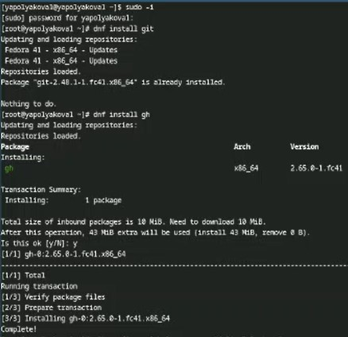
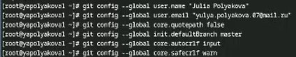
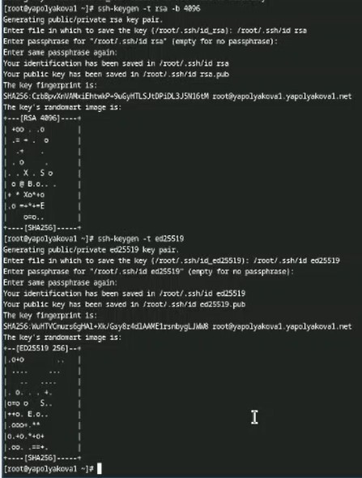
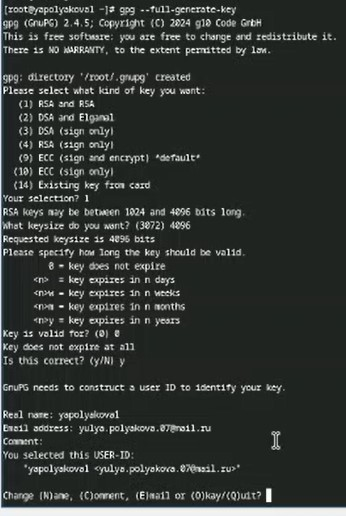
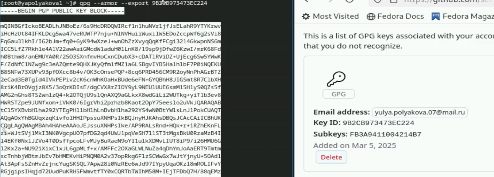
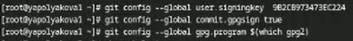
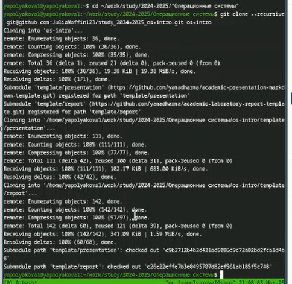
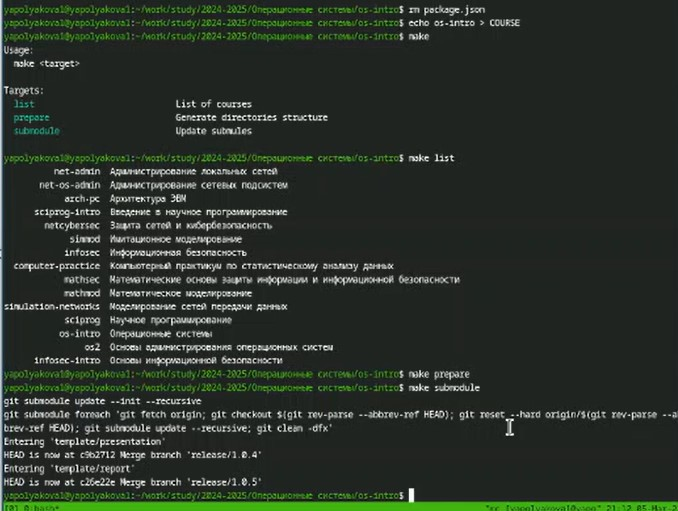
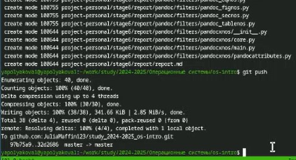

---
## Front matter
title: "Лабораторная работа №2"
subtitle: "Первоначальная настройка git"
author: "Полякова Юлия Александровна"

## Generic otions
lang: ru-RU
toc-title: "Содержание"

## Bibliography
bibliography: bib/cite.bib
csl: pandoc/csl/gost-r-7-0-5-2008-numeric.csl

## Pdf output format
toc: true # Table of contents
toc-depth: 2
lof: true # List of figures
lot: true # List of tables
fontsize: 12pt
linestretch: 1.5
papersize: a4
documentclass: scrreprt
## I18n polyglossia
polyglossia-lang:
  name: russian
  options:
	- spelling=modern
	- babelshorthands=true
polyglossia-otherlangs:
  name: english
## I18n babel
babel-lang: russian
babel-otherlangs: english
## Fonts
mainfont: IBM Plex Serif
romanfont: IBM Plex Serif
sansfont: IBM Plex Sans
monofont: IBM Plex Mono
mathfont: STIX Two Math
mainfontoptions: Ligatures=Common,Ligatures=TeX,Scale=0.94
romanfontoptions: Ligatures=Common,Ligatures=TeX,Scale=0.94
sansfontoptions: Ligatures=Common,Ligatures=TeX,Scale=MatchLowercase,Scale=0.94
monofontoptions: Scale=MatchLowercase,Scale=0.94,FakeStretch=0.9
mathfontoptions:
## Biblatex
biblatex: true
biblio-style: "gost-numeric"
biblatexoptions:
  - parentracker=true
  - backend=biber
  - hyperref=auto
  - language=auto
  - autolang=other*
  - citestyle=gost-numeric
## Pandoc-crossref LaTeX customization
figureTitle: "Рис."
tableTitle: "Таблица"
listingTitle: "Листинг"
lofTitle: "Список иллюстраций"
lotTitle: "Список таблиц"
lolTitle: "Листинги"
## Misc options
indent: true
header-includes:
  - \usepackage{indentfirst}
  - \usepackage{float} # keep figures where there are in the text
  - \floatplacement{figure}{H} # keep figures where there are in the text
---

# Цель работы

Изучить идеологию и применение средств контроля версий. Освоить умения по работе с git.

# Выполнение лабораторной работы

1. Установка git и gh командой dnf install (рис. [-@fig:001]).

{#fig:001 width=70%}

2. Базовая настройка git. Задаем имя и email, настраиваем utf-8, задаем имя начальной ветки и параметры autocrlf и safecrlf (рис. [-@fig:002])

{#fig:002 width=70%}

3. Создание ключей ssh по алгоритмам rsa и ed25519 (рис. [-@fig:003])

{#fig:003 width=70%}

4. Создание ключа gpg с типом RSA and RSA, размером 4096 и сроком действия по умолчанию. Также добавляем личную информацию (имя, адрес почты, пустой комментарий) (рис. [-@fig:004])

{#fig:004 width=70%}

5. Учетная запись в GitHub уже была настроена, поэтому переходим к добавлению ключа. Выводим ключ по его отпечатку и копируем в настройки на сайте (рис. [-@fig:005])

{#fig:005 width=70%}

6. Настройка автоматических подписей коммитов git (рис. [-@fig:006])

{#fig:006 width=70%}

7. Авторизуемся с помощью gh auth login. Создаем папку курса по шаблону, переходим в нее. Создаем в терминале репозиторий по указанному шаблону. Далее клонируем получившийся репозиторий в папку os-intro. На этом моменте возникла сложность с ключом (Permission denied (publickey)), поэтому дополнительно был добавлен на сайт GitHub ключ ssh. После этого был успешно склонирован репозиторий (рис. [-@fig:007])

{#fig:007 width=70%}

8. Настройка каталога курса (удаление лишних файлов, создание необходимых каталогов командой make) (рис. [-@fig:008])

{#fig:008 width=70%}

9. Успешное отправление файлов на сервер командами git add . (добавить все файлы), git commit (создание коммита) и git push (непосредственно отправка файлов на сервер) (рис. [-@fig:009])

{#fig:009 width=70%}

# Контрольные вопросы

1. VCS - это инструмент, который помогает разработчикам отслеживать изменения в коде, управлять версиями файлов и координировать работу в команде. Задачи: отслеживание изменений, решение конфликтов, поддержка параллельной разработки, управление версиями, совместная работа и улучшение координации.

2. Хранилище (репозиторий) - место хранения всех версий и служебной информации. Commit - состояние проекта на определенный момент времени или логическая группа измениений, которые пользователь потом отправляет в хранилище. История - сохраниение полной истории изменений. Рабочая копия - текущее состояние файлов проекта, полученных из хранилища и возможно измененных.

3. Централизованные имеют одно основное хранилище всего проекта. Каждый пользователь копирует себе изменения оттуда, а потом загружает свои. Пример: Subversion, CVS, TFS, VAULT, AccuRev. Децентрализованные имеют у каждого пользователя свой вариант репозитория, возможно даже не один. Есть возможность добавлять и забирать изменения из любого репозитория. Пример: Git, Mercurial, Bazaar.

4. Получение нужной версии файлов, размещение новой версии в хранилище, обновление рабочей копии, отслеживание и разрешение конфликтов.

5. То же самое, только с более тщательным контролем, "чистыми коммитами", советуясь с другими пользователями.

6. Отслеживание изменений, добавление новых функций в проект, объединение разных версий кода в один, откат к предыдущей версии, исправление конфликтов.

7. Команды можно разделить на работу с деревом, работу с изменениями, слияние и удаление веток.

8. Например, студент создает удаленный репозиторий, клонирует его себе, пишет программу, делает commit и отправляет изменения в локальном репозитории на удаленный. Его друг внес изменения на удаленном репозитории, а студент в следующий раз их получил с помощью pull

9. С помощью ветвей можно разрабатывать новый функционал независимо от основного кода. Можно делать откат и переключаться между версиями, не боясь что-то потерять.

10. Игнорировать можно не добавляя их add-ом, в случае, если эти файлы не нужны на удаленном репозитории.

# Выводы

Была изучена идеология и применение средств контроля версий. Были освоены умения по работе с git.

