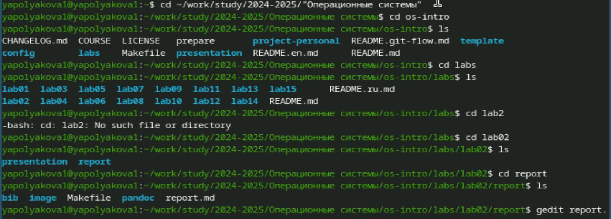
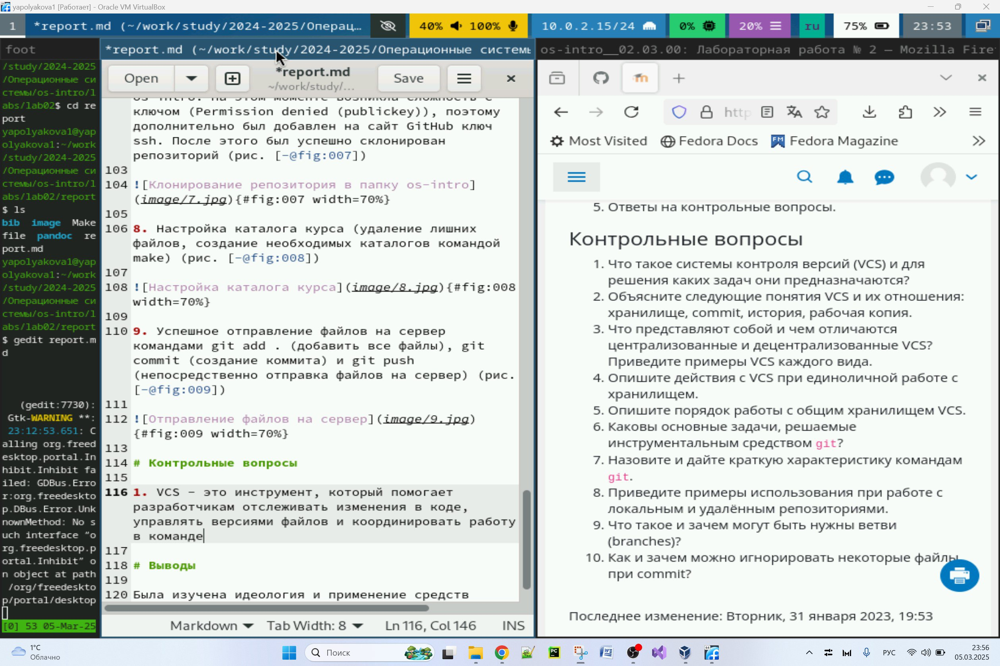
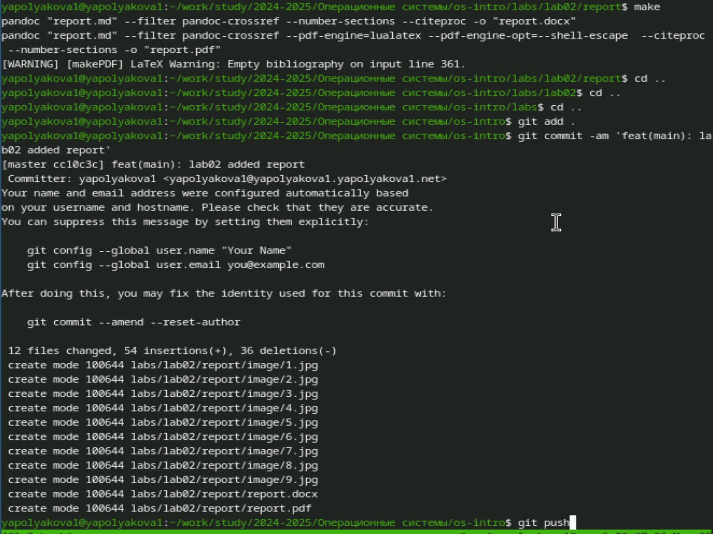

---
## Front matter
lang: ru-RU
title: Лабораторная работа №3
subtitle: Markdown
author:
  - Полякова Ю.А.
institute:
  - Российский университет дружбы народов, Москва, Россия
date: 28 февраля 2007

## i18n babel
babel-lang: russian
babel-otherlangs: english

## Formatting pdf
toc: false
toc-title: Содержание
slide_level: 2
aspectratio: 169
section-titles: true
theme: metropolis
header-includes:
 - \metroset{progressbar=frametitle,sectionpage=progressbar,numbering=fraction}
---

# Информация

## Докладчик

:::::::::::::: {.columns align=center}
::: {.column width="70%"}

  * Полякова Юлия Александровна
  * Студент
  * Российский университет дружбы народов
  * [yulya.polyakova.07@mail.ru](mailto:yulya.polyakova.07@mail.ru)
  * <https://github.com/JuliaMaffin123>

:::
::: {.column width="30%"}

:::
::::::::::::::

# Вводная часть

## Актуальность

- Важно уметь работать с языком разметки Markdown

## Объект и предмет исследования

- Отчет к лабораторной работе №2

## Цели и задачи

- Научиться оформлять отчёты с помощью легковесного языка разметки Markdown.
- Создать отчет к лабораторной работе №2 в Markdown
- Создать его еще в двух форматах командой make

## Материалы и методы

- Процессор `pandoc` для входного формата Markdown
- Результирующие форматы
	- `pdf`
	- `docx`
- Автоматизация процесса создания: `Makefile`

# Выполнение лабораторной работы

## Начало редактирования

Переходим в каталог с отчетом, открываем его с помощью заранее установленного удобного редактора gedit.

{#fig:001 width=70%}

## Заполнение отчета

Заполняем отчет и отвечаем на контрольные вопросы.

{#fig:002 width=50%}

## Загрузка файлов на сервер

Создаем командой make в каталоге report форматы docx и pdf, загружаем все файлы на сервер.

{#fig:003 width=50%}

## Вывод

Мы научились оформлять отчёты с помощью легковесного языка разметки Markdown.
