---
## Front matter
lang: ru-RU
title: Лабораторная работа №5
subtitle: Настройка рабочей среды
author:
  - Полякова Ю.А.
institute:
  - Российский университет дружбы народов, Москва, Россия
date: 28 февраля 2007

## i18n babel
babel-lang: russian
babel-otherlangs: english

## Formatting pdf
toc: false
toc-title: Содержание
slide_level: 2
aspectratio: 169
section-titles: true
theme: metropolis
header-includes:
 - \metroset{progressbar=frametitle,sectionpage=progressbar,numbering=fraction}
---

# Информация

## Докладчик

:::::::::::::: {.columns align=center}
::: {.column width="70%"}

  * Полякова Юлия Александровна
  * Студент
  * Российский университет дружбы народов
  * [yulya.polyakova.07@mail.ru](mailto:yulya.polyakova.07@mail.ru)
  * <https://github.com/JuliaMaffin123>

:::
::: {.column width="30%"}

:::
::::::::::::::

# Вводная часть

## Актуальность

- Умение настраивать рабочую среду довольно полезно
- Это помогает пользователю настроить комфортные для работы условия

## Объект и предмет исследования

- Рабочая среда

## Цели и задачи

- Цель: настроить рабочую среду
- Задачи:
 * Настройка с помощью менеджера паролей pass.
 * Настройка интерфейса с броузером.
 * Использовать chezmoi в настройке.

## Материалы и методы

- Менеджер паролей pass
- Плагин browserpass
- chezmoi

# Выполнение лабораторной работы

## Установка pass

Установка pass командами dnf install pass pass-otp и dnf install gopass под суперпользователем

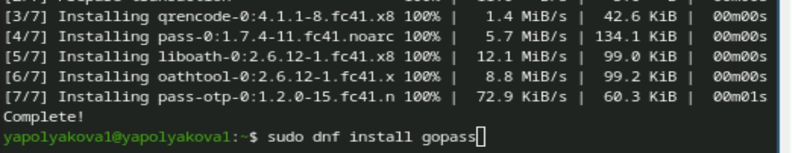{#fig:001 width=70%}

## Список ключей и хранилище

Смотрим список ключей и инициализируем хранилище

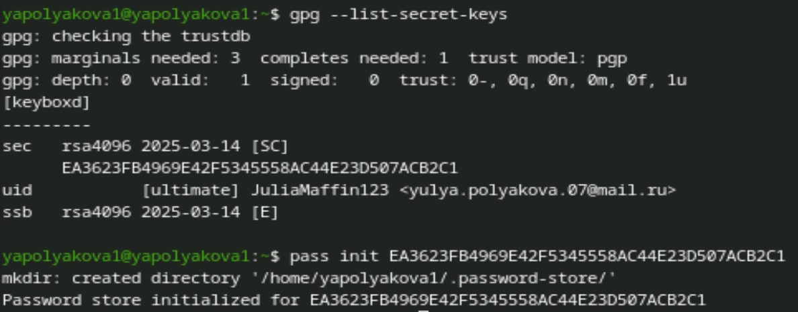{#fig:002 width=70%}

## Структура git

Создадим структуру git

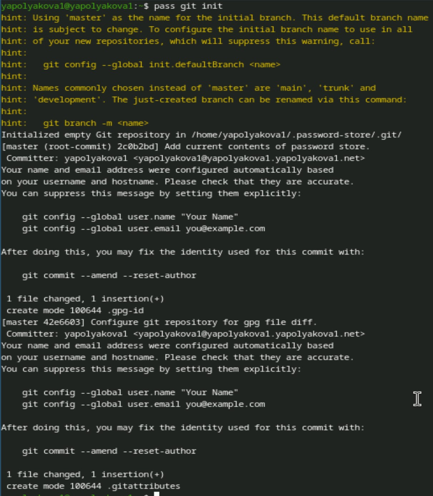{#fig:003 width=25%}

## Адрес репозитория на хостинге

Задаем адрес репозитория (заранее созданного) на хостинге и выполняем синхронизацию

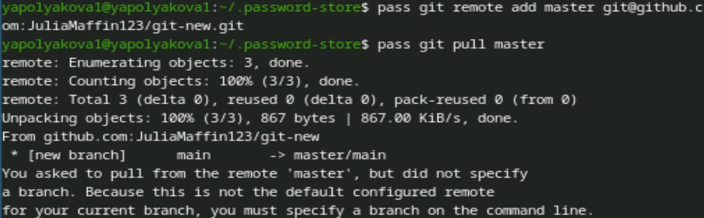{#fig:004 width=70%}

## Завершаем синхронизацию

Завершаем синхронизацию

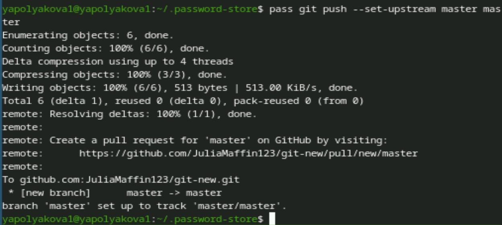{#fig:005 width=65%}

## Проверка статуса синхронизации

Проверяем на прямые изменения и проверяем статус синхронизации

{#fig:006 width=70%}

## Настройка интерфейса с браузером

Настраиваем интерфейс с браузером, устанавливаем плагин browserpass

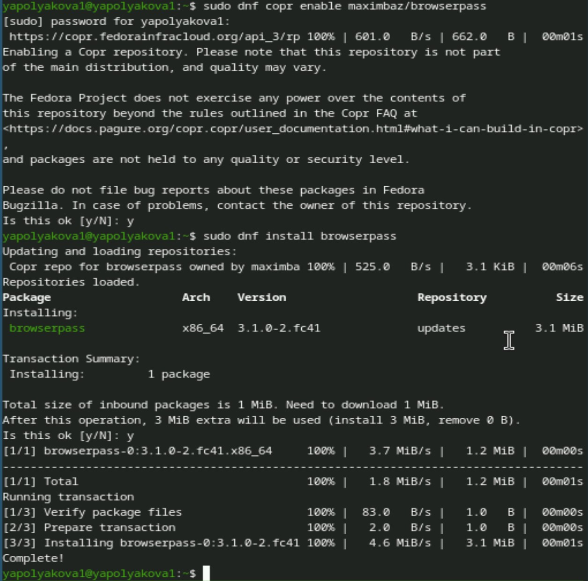{#fig:007 width=25%}

## Добавляем пароль

Добавляем новый пароль, отображаем его

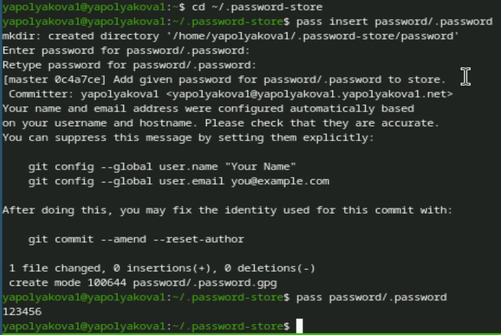{#fig:008 width=40%}

## Генерация пароля

Генерируем новый пароль взамен существующего

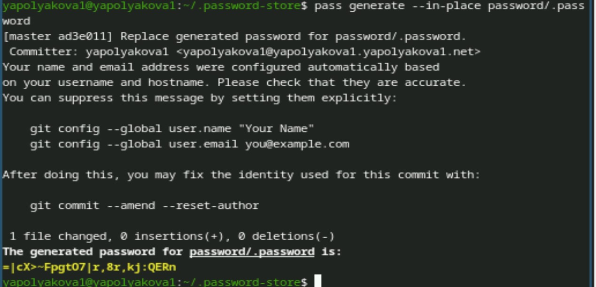{#fig:009 width=50%}

## Установка доп. ПО

Устанавливаем дополнительное программное обеспечение командой sudo dnf -y install

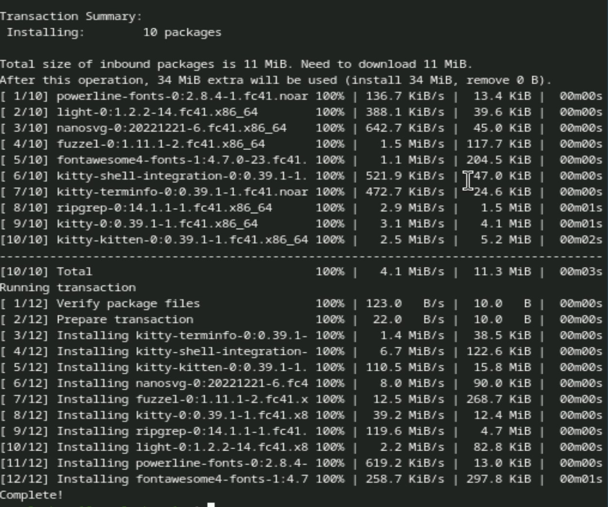{#fig:010 width=25%}

## Установка шрифтов

Устанавливаем шрифты: sudo dnf copr enable peterwu/iosevka, sudo dnf search iosevka и команда на скриншоте

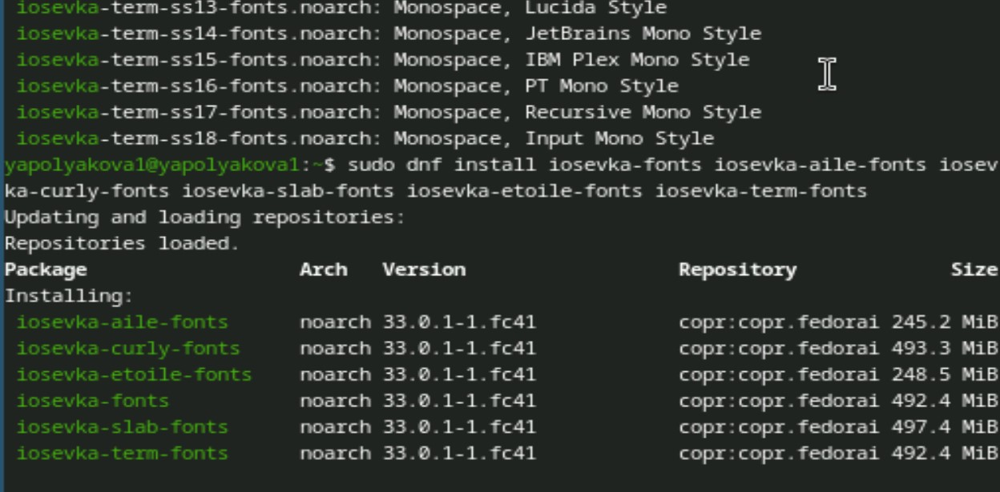{#fig:011 width=50%}

## Установка бинарного файла

Установка бинарного файла с помощью wget

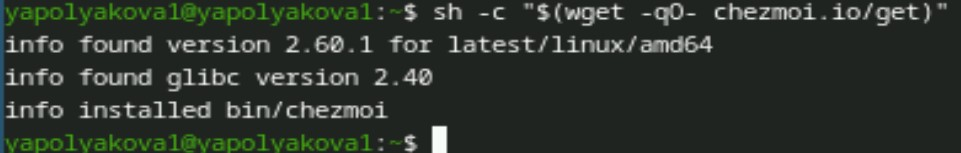{#fig:012 width=70%}

## Создание репозитория, инициализация chezmoi

Создадим свой репозиторий для конфигурационных файлов на основе шаблона. Инициализируем chezmoi с репозиторием dotfiles:

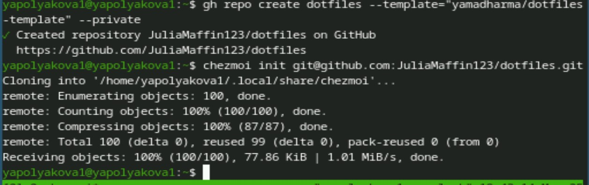{#fig:013 width=70%}

## Принимаем изменения chezmoi

Проверяем, какие изменения внесёт chezmoi в домашний каталог, запустив chezmoi diff. Меня устраивают изменения, внесённые chezmoi, поэтому запускаем chezmoi apply -v

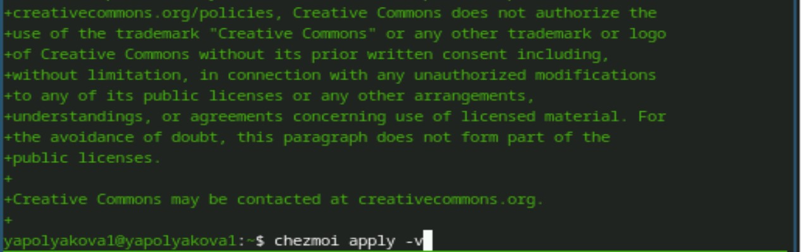{#fig:014 width=70%}

## Инициализируем chezmoi на другой машине

Запускаем другую машину и подключаем chezmoi с помощью wget. Инициализируем chezmoi через ssh

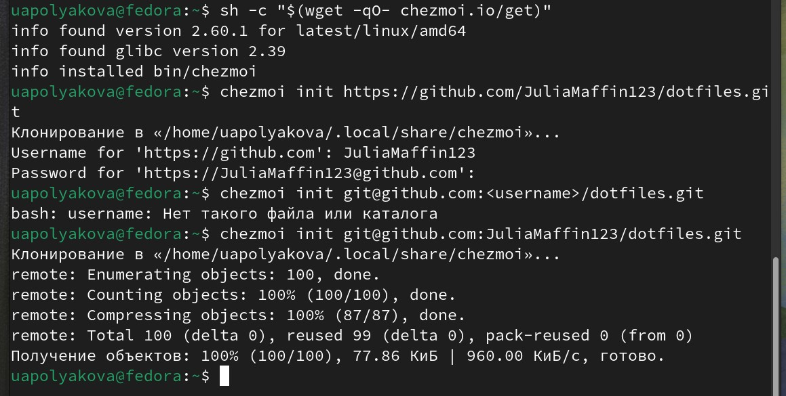{#fig:015 width=60%}

## Проверяем измениения, настраиваем машину одной командой

Также проверяем и принимаем изменения. chezmoi update -v позволяет получить и применить последние изменения. Затем настраиваем новую машину с помощью одной команды

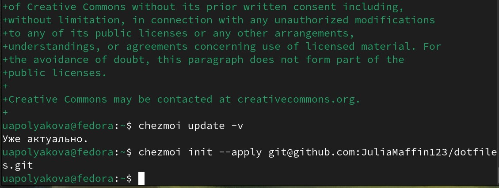{#fig:016 width=70%}

## Ежедневные операции

Проверяем работу ежедневных операций 

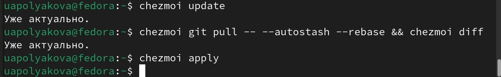{#fig:017 width=70%}

## Автоматические изменения

Автоматическая фиксация и отправление изменений в репозиторий в файле конфигурации

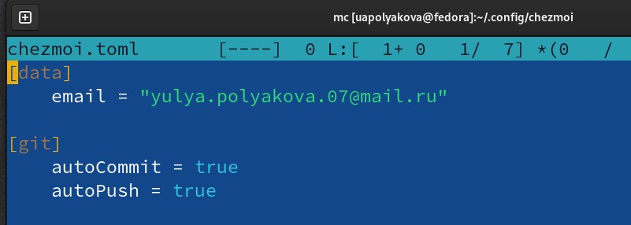{#fig:018 width=70%}

## Вывод

Была настроена рабочая среда.
