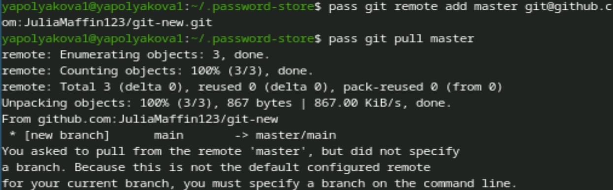

---
## Front matter
title: "Лабораторная работа №5"
subtitle: "Настройка рабочей среды"
author: "Полякова Юлия Александровна"

## Generic otions
lang: ru-RU
toc-title: "Содержание"

## Bibliography
bibliography: bib/cite.bib
csl: pandoc/csl/gost-r-7-0-5-2008-numeric.csl

## Pdf output format
toc: true # Table of contents
toc-depth: 2
lof: true # List of figures
lot: true # List of tables
fontsize: 12pt
linestretch: 1.5
papersize: a4
documentclass: scrreprt
## I18n polyglossia
polyglossia-lang:
  name: russian
  options:
	- spelling=modern
	- babelshorthands=true
polyglossia-otherlangs:
  name: english
## I18n babel
babel-lang: russian
babel-otherlangs: english
## Fonts
mainfont: IBM Plex Serif
romanfont: IBM Plex Serif
sansfont: IBM Plex Sans
monofont: IBM Plex Mono
mathfont: STIX Two Math
mainfontoptions: Ligatures=Common,Ligatures=TeX,Scale=0.94
romanfontoptions: Ligatures=Common,Ligatures=TeX,Scale=0.94
sansfontoptions: Ligatures=Common,Ligatures=TeX,Scale=MatchLowercase,Scale=0.94
monofontoptions: Scale=MatchLowercase,Scale=0.94,FakeStretch=0.9
mathfontoptions:
## Biblatex
biblatex: true
biblio-style: "gost-numeric"
biblatexoptions:
  - parentracker=true
  - backend=biber
  - hyperref=auto
  - language=auto
  - autolang=other*
  - citestyle=gost-numeric
## Pandoc-crossref LaTeX customization
figureTitle: "Рис."
tableTitle: "Таблица"
listingTitle: "Листинг"
lofTitle: "Список иллюстраций"
lotTitle: "Список таблиц"
lolTitle: "Листинги"
## Misc options
indent: true
header-includes:
  - \usepackage{indentfirst}
  - \usepackage{float} # keep figures where there are in the text
  - \floatplacement{figure}{H} # keep figures where there are in the text
---

# Цель работы

Настроить рабочую среду.

# Задание

 * Настройка с помощью менеджера паролей pass.
 * Настройка интерфейса с броузером.
 * Использовать chezmoi в настройке.

# Выполнение лабораторной работы

1. Установка pass командами dnf install pass pass-otp и dnf install gopass под суперпользователем (рис. [-@fig:001]).

{#fig:001 width=70%}

2. Смотрим список ключей и инициализируем хранилище (рис. [-@fig:002])

{#fig:002 width=70%}

3. Создадим структуру git (рис. [-@fig:003])

{#fig:003 width=70%}

4. Задаем адрес репозитория (заранее созданного) на хостинге и выполняем синхронизацию (рис. [-@fig:004])

{#fig:004 width=70%}

5. Завершаем синхронизацию (рис. [-@fig:005])

{#fig:005 width=70%}

6. Проверяем на прямые изменения и проверяем статус синхронизации (рис. [-@fig:006])

{#fig:006 width=70%}

7. Настраиваем интерфейс с браузером, устанавливаем плагин browserpass (рис. [-@fig:007])

{#fig:007 width=70%}

8. Добавляем новый пароль, отображаем его (рис. [-@fig:008])

{#fig:008 width=70%}

9. Генерируем новый пароль взамен существующего (рис. [-@fig:009])

{#fig:009 width=70%}

10. Устанавливаем дополнительное программное обеспечение командой sudo dnf -y install (рис. [-@fig:010])

{#fig:010 width=70%}

11. Устанавливаем шрифты: sudo dnf copr enable peterwu/iosevka, sudo dnf search iosevka и команда на скриншоте (рис. [-@fig:011])

{#fig:011 width=70%}

12. Установка бинарного файла с помощью wget (рис. [-@fig:012])

{#fig:012 width=70%}

13. Создадим свой репозиторий для конфигурационных файлов на основе шаблона. Инициализируем chezmoi с репозиторием dotfiles: (рис. [-@fig:013])

{#fig:013 width=70%}

14. Проверяем, какие изменения внесёт chezmoi в домашний каталог, запустив chezmoi diff. Меня устраивают изменения, внесённые chezmoi, поэтому запускаем chezmoi apply -v (рис. [-@fig:014])

{#fig:014 width=70%}

15. Запускаем другую машину и подключаем chezmoi с помощью wget. Инициализируем chezmoi через ssh (рис. [-@fig:015])

{#fig:015 width=70%}

16. Также проверяем и принимаем изменения. chezmoi update -v позволяет получить и применить последние изменения. Затем настраиваем новую машину с помощью одной команды (рис. [-@fig:016])

{#fig:016 width=70%}

17. Проверяем работу ежедневных операций (рис. [-@fig:017])

{#fig:017 width=70%}

18. Автоматическая фиксация и отправление изменений в репозиторий в файле конфигурации (рис. [-@fig:018])

{#fig:018 width=70%}

# Вывод

Была настроена рабочая среда.

