---
## Front matter
lang: ru-RU
title: Лабораторная работа №6
subtitle: Основы интерфейса взаимодействия пользователя с системой Unix на уровне командной строки
author:
  - Полякова Ю.А.
institute:
  - Российский университет дружбы народов, Москва, Россия
date: 28 февраля 2007

## i18n babel
babel-lang: russian
babel-otherlangs: english

## Formatting pdf
toc: false
toc-title: Содержание
slide_level: 2
aspectratio: 169
section-titles: true
theme: metropolis
header-includes:
 - \metroset{progressbar=frametitle,sectionpage=progressbar,numbering=fraction}
---

# Информация

## Докладчик

:::::::::::::: {.columns align=center}
::: {.column width="70%"}

  * Полякова Юлия Александровна
  * Студент
  * Российский университет дружбы народов
  * [yulya.polyakova.07@mail.ru](mailto:yulya.polyakova.07@mail.ru)
  * <https://github.com/JuliaMaffin123>

:::
::: {.column width="30%"}

:::
::::::::::::::

# Вводная часть

## Актуальность

- Важно получить основные навыки работы с командной строкой

## Объект и предмет исследования

- Командная строка

## Цели и задачи

- Приобретение практических навыков взаимодействия пользователя с системой посредством командной строки.
- Изучить содержимое различных каталогов
- Изучить создание и удаление каталогов

## Материалы и методы

- Командная строка
- Базовые команды взимодействия с командной строкой

# Выполнение лабораторной работы

## Имя домашнего каталога

Определяем полное имя домашнего каталога (команда pwd), переходим в каталог tmp (команда cd /tmp)

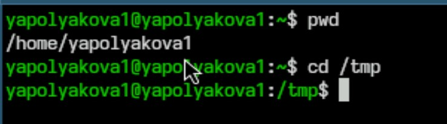{#fig:001 width=70%}

## Команда ls -a

Смотрим содержимое командой ls -a, опция позволяет увидеть скрытые файлы

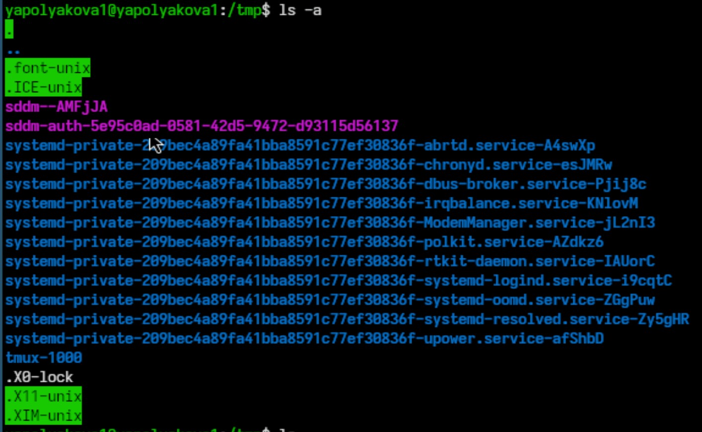{#fig:002 width=50%}

## Команда ls

Смотрим содержимое командой ls

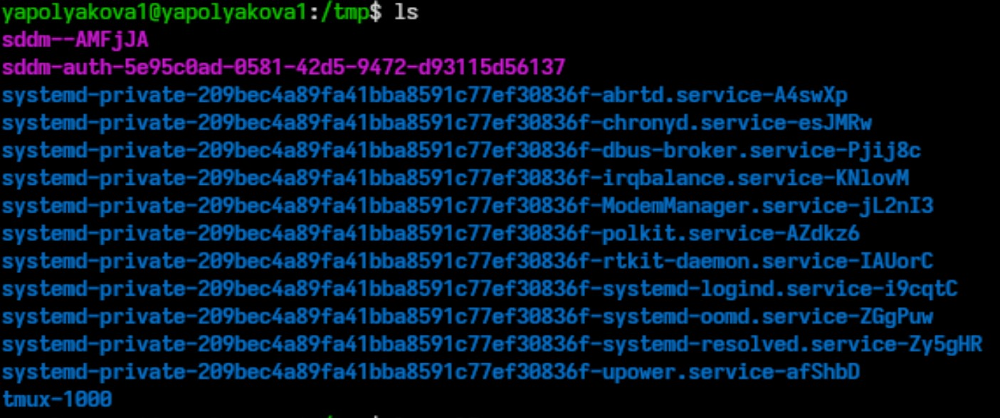{#fig:003 width=70%}

## Команда ls -alF

Смотрим содержимое командой ls -alF, опции позволяют увидеть скрытые файлы и подробную информацию о файлах и каталогах 

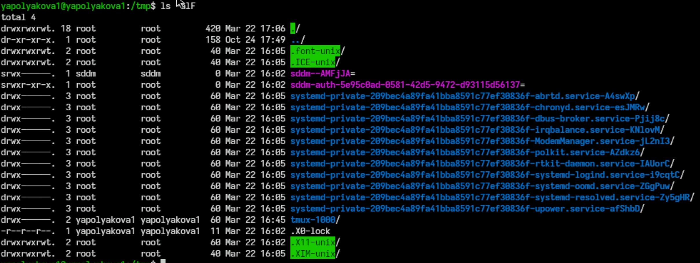{#fig:004 width=70%}

## Содержимое /var/spool и домашнего каталога

Проверяем, есть ли в каталоге /var/spool подкаталог с именем cron. Он действительно есть. Также возвращаемся в домашний каталог и смотрим его содержимое. Только одна папка принадлежит root, все остальные - пользователю

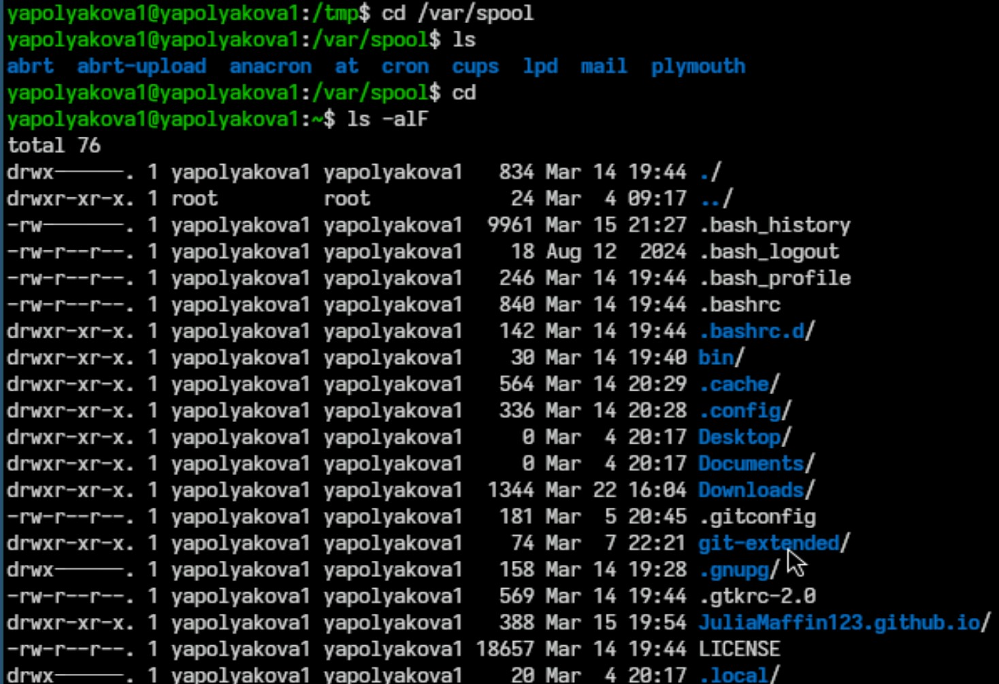{#fig:005 width=40%}

## Создание и удаление каталогов

В домашнем каталоге создаем новый каталог newdir, в нем создаем каталог morefun. В домашнем каталоге одной командой создаем и удаляем каталоги letters, memos, misk. Пробуем удалить newdir командой rm, удаляем каталог morefun. Проверям, что все удалилось

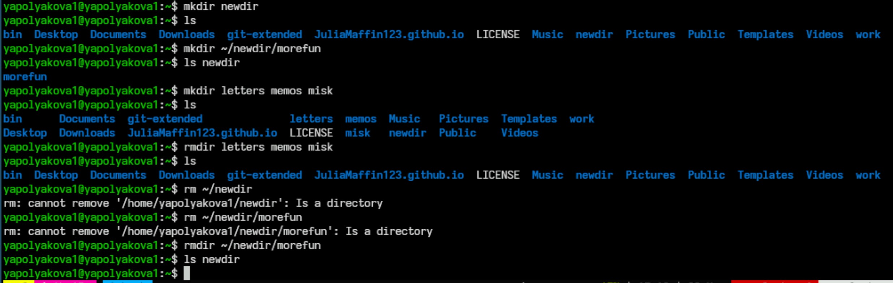{#fig:006 width=70%}

## Опция просмотра каталога и подкаталогов

С помощью команды man определяем опцию команды ls для просмотра содержимого не только указанного каталога, но и подкаталогов, входящих в него. Это -R

{#fig:007 width=70%}

## Опция сортировки по последним изменениям

С помощью команды man определяем набор опций команды ls, позволяющий отсортировать по времени последнего изменения выводимый список содержимого каталога с развёрнутым описанием файлов. Это -t

{#fig:008 width=70%}

## Основные опции cd

Команда man cd, основные опции cd это -P (Позволяет следовать по символическим ссылкам перед тем, как будут обработаны все переходы ".."), -L (После ".."), -e (Ошибка, если папку не удалось найти)

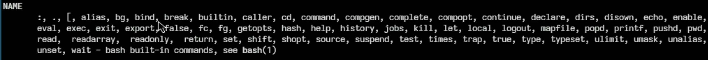{#fig:009 width=70%}

## Основные опции pwd

Команда man pwd, основные опции pwd

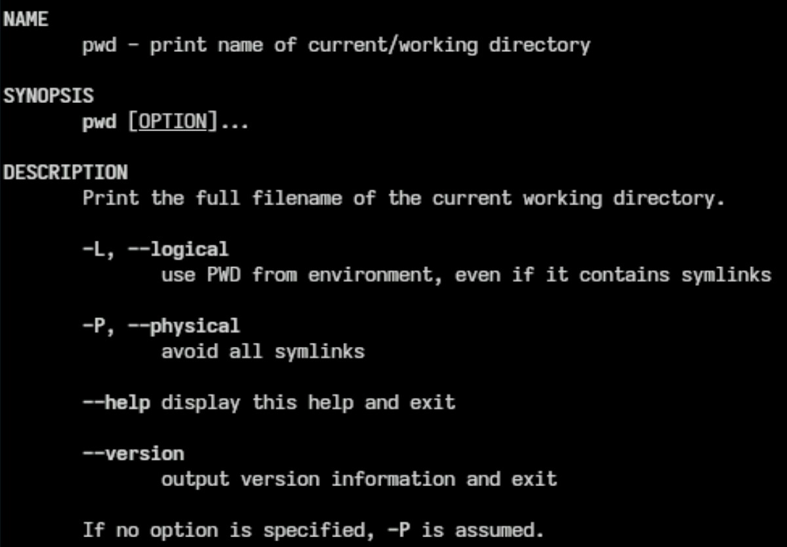{#fig:010 width=40%}

## Основные опции mkdir

Команда man mkdir, основные опции mkdir

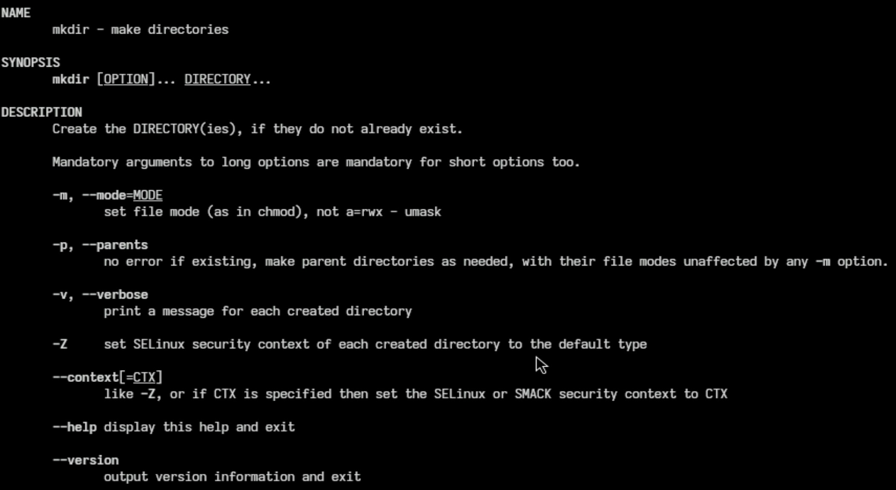{#fig:011 width=60%}

## Основные опции rmdir

Команда man rmdir, основные опции rmdir

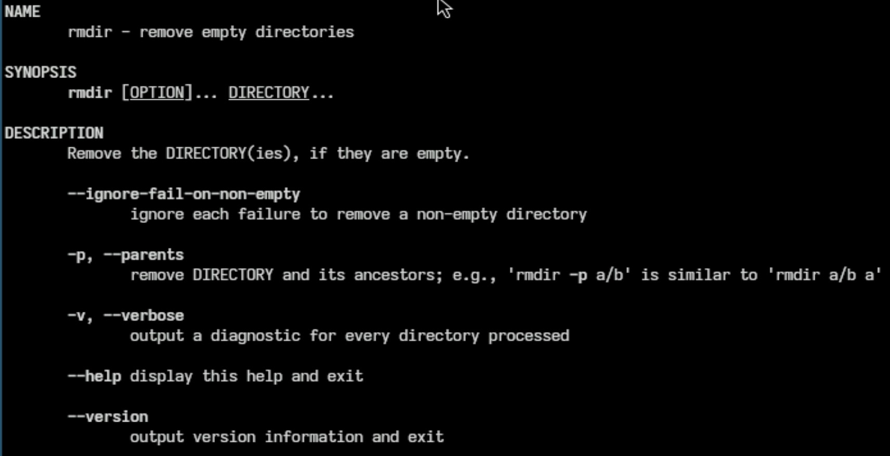{#fig:012 width=60%}

## Основные опции rm

Команда man rm, основные опции rm

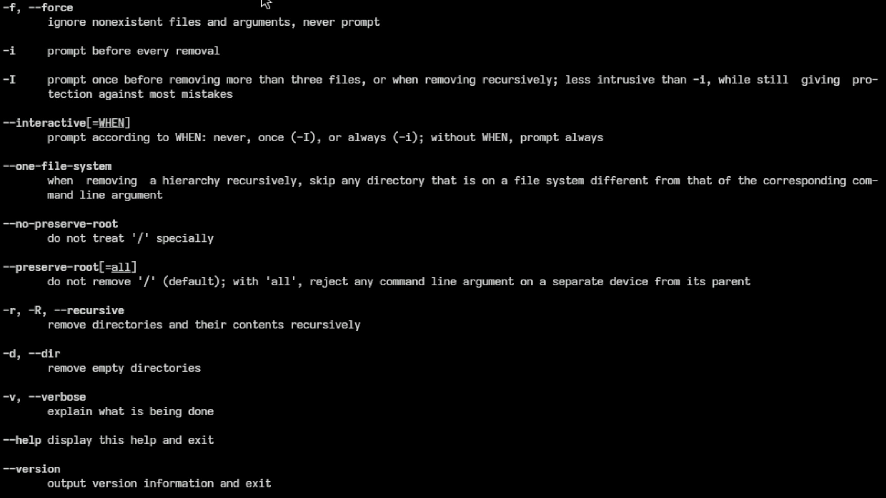{#fig:013 width=60%}

## Использвание history

Используя информацию, полученную при помощи команды history, выполняем модификацию и исполнение нескольких команд из буфера команд.

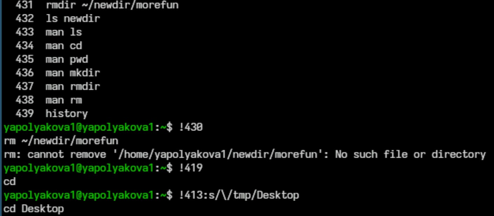{#fig:014 width=65%}

# Контрольные вопросы

## Контрольные вопросы

1. Что такое командная строка? Ответ: Текстовый интерфейс пользователя для взаимодействия с операционной системой компьютера и другим ПО с помощью команд.

## Контрольные вопросы

2. При помощи какой команды можно определить абсолютный путь текущего каталога? Ответ: команда pwd, например, pwd

## Контрольные вопросы

3. При помощи какой команды и каких опций можно определить только тип файлов и их имена в текущем каталоге? Ответ: ls -aF

## Контрольные вопросы

4. Каким образом отобразить информацию о скрытых файлах? Ответ: ls -a

## Контрольные вопросы

5. При помощи каких команд можно удалить файл и каталог? Можно ли это сделать одной и той же командой? Ответ: Это можно сделать одной командой rm, но для каталогов нужно использовать опцию -r, а для пустых каталогов -d. Также для удаления пустых каталогов используется rmdir. Нпример, rm -r ~/newdir или rmdir letters memos misk

## Контрольные вопросы

6. Каким образом можно вывести информацию о последних выполненных пользователем командах? Ответ: команда history

## Контрольные вопросы

7. Как воспользоваться историей команд для их модифицированного выполнения? Ответ: можно выполнить !номер-команды (!413), тогда команда под этим номером тут же выполнится. Также !номер:s/что-меняем/на-что-меняем (!3:s/a/F), тогда команда применится с модификацией.

## Контрольные вопросы

8. Приведите примеры запуска нескольких команд в одной строке. Ответ: cd; ls

## Контрольные вопросы

9. Дайте определение и приведите примера символов экранирования. Ответ: Если в заданном контексте встречаются специальные символы (типа «.», «/», «*» и т.д.), надо перед ними поставить символ экранирования \ (обратный слэш). Пример: !413:s/\/tmp/Desktop

## Контрольные вопросы

10. Охарактеризуйте вывод информации на экран после выполнения команды ls с опцией l. Ответ: Позволяет вывести подробную информацию о файлах и каталогах.

## Контрольные вопросы

11. Что такое относительный путь к файлу? Приведите примеры использования относительного и абсолютного пути при выполнении какой-либо команды. Ответ: Относительный путь - путь из текучего каталога (cd newdir), а использование абсолютного пути это cd ~/newdir

## Контрольные вопросы

12. Как получить информацию об интересующей вас команде? Ответ: с помощью команды man.

## Контрольные вопросы

13. Какая клавиша или комбинация клавиш служит для автоматического дополнениявводимых команд? Ответ: клавиша Tab

## Вывод

Были приобретены практические навыки взаимодействия пользователя с системой посредством командной строки.
