---
## Front matter
title: "Лабораторная работа №6"
subtitle: "Основы интерфейса взаимодействия пользователя с системой Unix на уровне командной строки"
author: "Полякова Юлия Александровна"

## Generic otions
lang: ru-RU
toc-title: "Содержание"

## Bibliography
bibliography: bib/cite.bib
csl: pandoc/csl/gost-r-7-0-5-2008-numeric.csl

## Pdf output format
toc: true # Table of contents
toc-depth: 2
lof: true # List of figures
lot: true # List of tables
fontsize: 12pt
linestretch: 1.5
papersize: a4
documentclass: scrreprt
## I18n polyglossia
polyglossia-lang:
  name: russian
  options:
	- spelling=modern
	- babelshorthands=true
polyglossia-otherlangs:
  name: english
## I18n babel
babel-lang: russian
babel-otherlangs: english
## Fonts
mainfont: IBM Plex Serif
romanfont: IBM Plex Serif
sansfont: IBM Plex Sans
monofont: IBM Plex Mono
mathfont: STIX Two Math
mainfontoptions: Ligatures=Common,Ligatures=TeX,Scale=0.94
romanfontoptions: Ligatures=Common,Ligatures=TeX,Scale=0.94
sansfontoptions: Ligatures=Common,Ligatures=TeX,Scale=MatchLowercase,Scale=0.94
monofontoptions: Scale=MatchLowercase,Scale=0.94,FakeStretch=0.9
mathfontoptions:
## Biblatex
biblatex: true
biblio-style: "gost-numeric"
biblatexoptions:
  - parentracker=true
  - backend=biber
  - hyperref=auto
  - language=auto
  - autolang=other*
  - citestyle=gost-numeric
## Pandoc-crossref LaTeX customization
figureTitle: "Рис."
tableTitle: "Таблица"
listingTitle: "Листинг"
lofTitle: "Список иллюстраций"
lotTitle: "Список таблиц"
lolTitle: "Листинги"
## Misc options
indent: true
header-includes:
  - \usepackage{indentfirst}
  - \usepackage{float} # keep figures where there are in the text
  - \floatplacement{figure}{H} # keep figures where there are in the text
---

# Цель работы

Приобретение практических навыков взаимодействия пользователя с системой посредством командной строки.

# Задание

 * Определить полное имя домашнего каталога.
 * Изучить содержимое различных каталогов.
 * Изучить создание и удаление каталогов.
 * С помощью команды man определить, какую опцию команды ls нужно использовать для просмотра содержимое не только указанного каталога, но и подкаталогов, входящих в него.
 * С помощью команды man определить набор опций команды ls, позволяющий отсортировать по времени последнего изменения выводимый список содержимого каталога с развёрнутым описанием файлов.
 * Использовать команду man для просмотра описания следующих команд: cd, pwd, mkdir, rmdir, rm.
 * Используя информацию, полученную при помощи команды history, выполнить модификацию и исполнение нескольких команд из буфера команд.

# Выполнение лабораторной работы

1. Определяем полное имя домашнего каталога (команда pwd), переходим в каталог tmp (команда cd /tmp) (рис. [-@fig:001]).

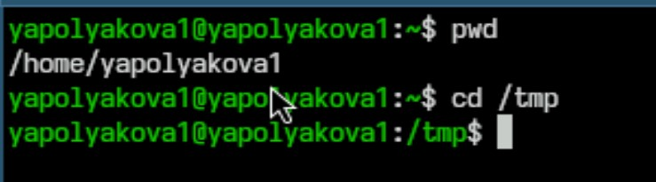{#fig:001 width=70%}

2. Смотрим содержимое командой ls -a, опция позволяет увидеть скрытые файлы (рис. [-@fig:002])

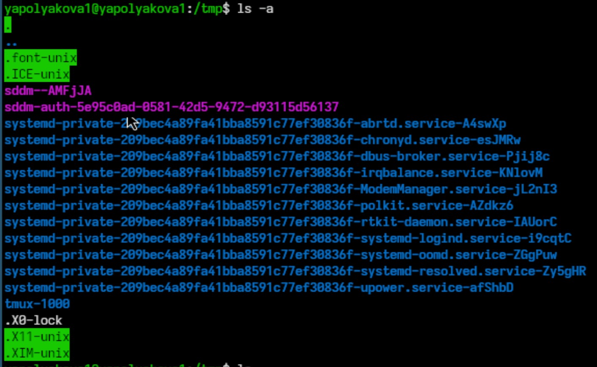{#fig:002 width=70%}

3. Смотрим содержимое командой ls (рис. [-@fig:003])

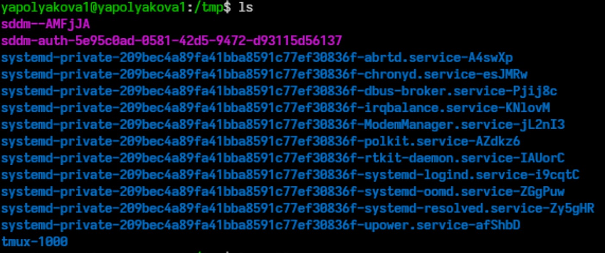{#fig:003 width=70%}

4. Смотрим содержимое командой ls -alF, опции позволяют увидеть скрытые файлы и подробную информацию о файлах и каталогах (рис. [-@fig:004])

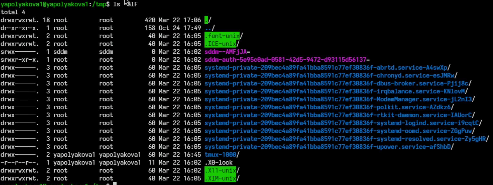{#fig:004 width=70%}

5. Проверяем, есть ли в каталоге /var/spool подкаталог с именем cron. Он действительно есть. Также возвращаемся в домашний каталог и смотрим его содержимое. Только одна папка принадлежит root, все остальные - пользователю (рис. [-@fig:005])

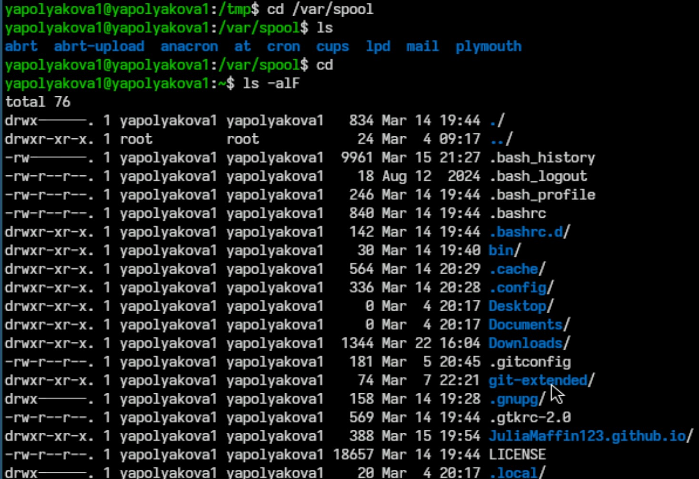{#fig:005 width=70%}

6. В домашнем каталоге создаем новый каталог newdir, в нем создаем каталог morefun. В домашнем каталоге одной командой создаем и удаляем каталоги letters, memos, misk. Пробуем удалить newdir командой rm, удаляем каталог morefun. Проверям, что все удалилось (рис. [-@fig:006])

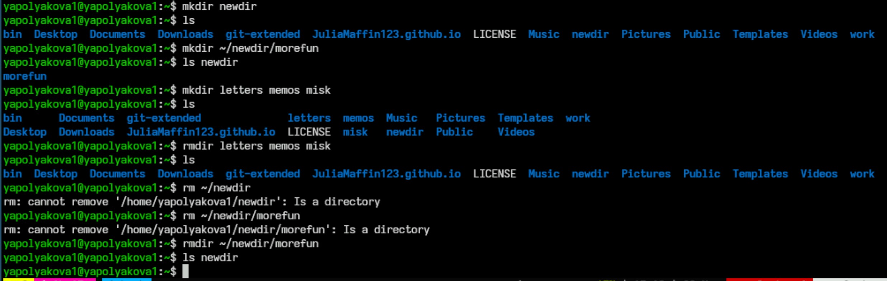{#fig:006 width=70%}

7. С помощью команды man определяем опцию команды ls для просмотра содержимого не только указанного каталога, но и подкаталогов, входящих в него. Это -R (рис. [-@fig:007])

{#fig:007 width=70%}

8. С помощью команды man определяем набор опций команды ls, позволяющий отсортировать по времени последнего изменения выводимый список содержимого каталога с развёрнутым описанием файлов. Это -t (рис. [-@fig:008])

{#fig:008 width=70%}

9. Команда man cd, основные опции cd это -P (Позволяет следовать по символическим ссылкам перед тем, как будут обработаны все переходы ".."), -L (После ".."), -e (Ошибка, если папку не удалось найти) (рис. [-@fig:009])

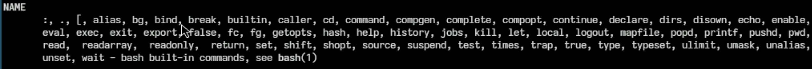{#fig:009 width=70%}

10. Команда man pwd, основные опции pwd (рис. [-@fig:010])

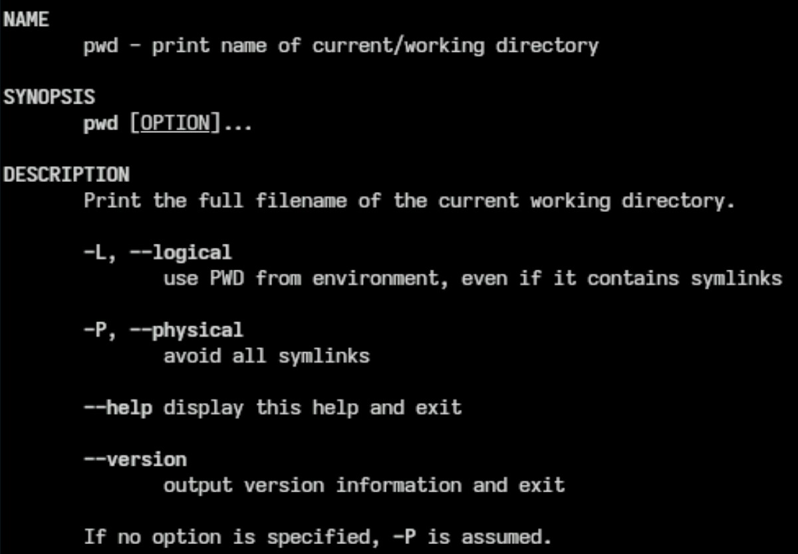{#fig:010 width=70%}

11. Команда man mkdir, основные опции mkdir (рис. [-@fig:011])

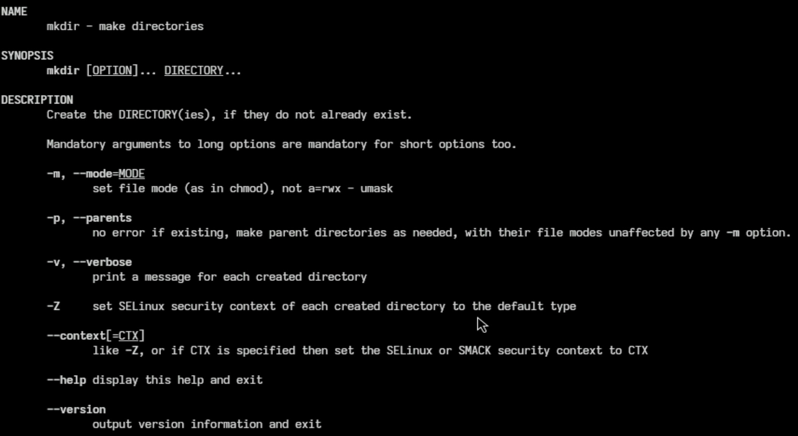{#fig:011 width=70%}

12. Команда man rmdir, основные опции rmdir (рис. [-@fig:012])

{#fig:012 width=70%}

13. Команда man rm, основные опции rm (рис. [-@fig:013])

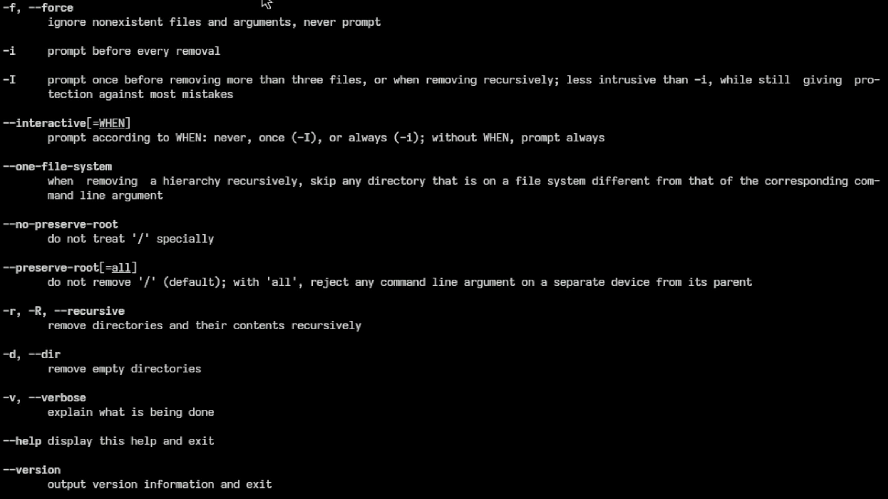{#fig:013 width=70%}

14. Используя информацию, полученную при помощи команды history, выполняем модификацию и исполнение нескольких команд из буфера команд. (рис. [-@fig:014])

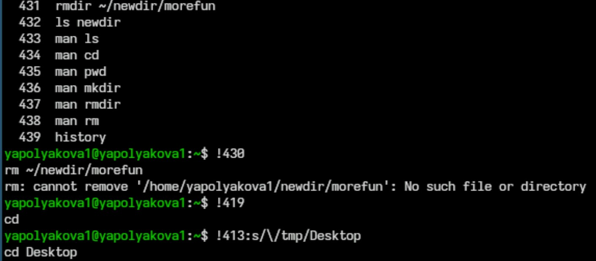{#fig:014 width=70%}

# Контрольные вопросы

1. Что такое командная строка? Ответ: Текстовый интерфейс пользователя для взаимодействия с операционной системой компьютера и другим ПО с помощью команд.

2. При помощи какой команды можно определить абсолютный путь текущего каталога? Ответ: команда pwd, например, pwd

3. При помощи какой команды и каких опций можно определить только тип файлов и их имена в текущем каталоге? Ответ: ls -aF

4. Каким образом отобразить информацию о скрытых файлах? Ответ: ls -a

5. При помощи каких команд можно удалить файл и каталог? Можно ли это сделать одной и той же командой? Ответ: Это можно сделать одной командой rm, но для каталогов нужно использовать опцию -r, а для пустых каталогов -d. Также для удаления пустых каталогов используется rmdir. Нпример, rm -r ~/newdir или rmdir letters memos misk

6. Каким образом можно вывести информацию о последних выполненных пользователем командах? Ответ: команда history

7. Как воспользоваться историей команд для их модифицированного выполнения? Ответ: можно выполнить !номер-команды (!413), тогда команда под этим номером тут же выполнится. Также !номер:s/что-меняем/на-что-меняем (!3:s/a/F), тогда команда применится с модификацией.

8. Приведите примеры запуска нескольких команд в одной строке. Ответ: cd; ls

9. Дайте определение и приведите примера символов экранирования. Ответ: Если в заданном контексте встречаются специальные символы (типа «.», «/», «*» и т.д.), надо перед ними поставить символ экранирования \ (обратный слэш). Пример: !413:s/\/tmp/Desktop

10. Охарактеризуйте вывод информации на экран после выполнения команды ls с опцией l. Ответ: Позволяет вывести подробную информацию о файлах и каталогах.

11. Что такое относительный путь к файлу? Приведите примеры использования относительного и абсолютного пути при выполнении какой-либо команды. Ответ: Относительный путь - путь из текучего каталога (cd newdir), а использование абсолютного пути это cd ~/newdir

12. Как получить информацию об интересующей вас команде? Ответ: с помощью команды man.

13. Какая клавиша или комбинация клавиш служит для автоматического дополнениявводимых команд? Ответ: клавиша Tab

# Вывод

Были приобретены практические навыки взаимодействия пользователя с системой посредством командной строки.

