---
## Front matter
title: "Лабораторная работа №7"
subtitle: "Анализ файловой системы Linux. Команды для работы с файлами и каталогами"
author: "Полякова Юлия Александровна"

## Generic otions
lang: ru-RU
toc-title: "Содержание"

## Bibliography
bibliography: bib/cite.bib
csl: pandoc/csl/gost-r-7-0-5-2008-numeric.csl

## Pdf output format
toc: true # Table of contents
toc-depth: 2
lof: true # List of figures
lot: true # List of tables
fontsize: 12pt
linestretch: 1.5
papersize: a4
documentclass: scrreprt
## I18n polyglossia
polyglossia-lang:
  name: russian
  options:
	- spelling=modern
	- babelshorthands=true
polyglossia-otherlangs:
  name: english
## I18n babel
babel-lang: russian
babel-otherlangs: english
## Fonts
mainfont: IBM Plex Serif
romanfont: IBM Plex Serif
sansfont: IBM Plex Sans
monofont: IBM Plex Mono
mathfont: STIX Two Math
mainfontoptions: Ligatures=Common,Ligatures=TeX,Scale=0.94
romanfontoptions: Ligatures=Common,Ligatures=TeX,Scale=0.94
sansfontoptions: Ligatures=Common,Ligatures=TeX,Scale=MatchLowercase,Scale=0.94
monofontoptions: Scale=MatchLowercase,Scale=0.94,FakeStretch=0.9
mathfontoptions:
## Biblatex
biblatex: true
biblio-style: "gost-numeric"
biblatexoptions:
  - parentracker=true
  - backend=biber
  - hyperref=auto
  - language=auto
  - autolang=other*
  - citestyle=gost-numeric
## Pandoc-crossref LaTeX customization
figureTitle: "Рис."
tableTitle: "Таблица"
listingTitle: "Листинг"
lofTitle: "Список иллюстраций"
lotTitle: "Список таблиц"
lolTitle: "Листинги"
## Misc options
indent: true
header-includes:
  - \usepackage{indentfirst}
  - \usepackage{float} # keep figures where there are in the text
  - \floatplacement{figure}{H} # keep figures where there are in the text
---

# Цель работы

Ознакомление с файловой системой Linux, её структурой, именами и содержанием каталогов. Приобретение практических навыков по применению команд для работы с файлами и каталогами, по управлению процессами (и работами), по проверке использования диска и обслуживанию файловой системы.

# Задание

 * Выполнить примеры, приведённые в первой части описания лабораторной работы.
 * Выполнить действия по созданию, перемещению и переименованию файлов и каталогов.
 * Определить опции команды chmod, необходимые, чтобы присвоить перечисленным в условии файлам выделенные права доступа.
 * Выполнить упражнения, связанные с доступом к файлам и каталогам.
 * Прочитать man по командам mount, fsck, mkfs, kill и кратко их охарактеризовать, приведя примеры.

# Выполнение лабораторной работы

1. Выполним примеры на копирование файлов и каталогов. 1) touch abc1; cp abc1 april; cp abc1 may - копирование файла в текущем каталоге. 2) mkdir monthly; cp april may monthly - копирование нескольких файлов в каталог. 3) cp monthly/may monthly/june; ls monthly - копирование файлов в произвольном каталоге. 4) mkdir monthly.00; cp -r monthly monthly.00 - копирование каталогов в текущем каталоге. 5) cp -r monthly.00 /tmp - копирование каталогов в произвольном каталоге. (рис. [-@fig:001]).

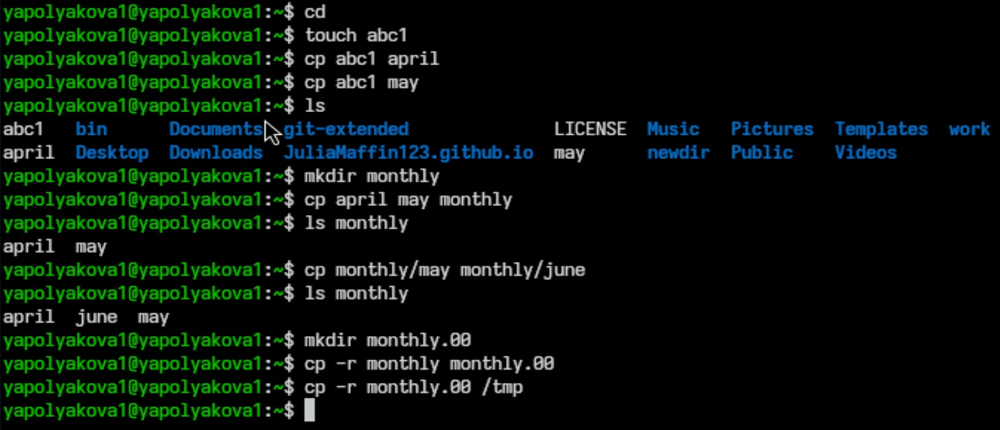{#fig:001 width=70%}

2. Выполним примеры на перемещение и переименование файлов и каталогов. 1) mv april july - переименование файлов в текущем каталоге. 2) mv july monthly.00; ls monthly.00 - перемещение файлов в другой каталог. 3) mv monthly.00 monthly.01 - переименование каталогов в текущем каталоге. 4) mkdir reports; mv monthly.01 reports - перемещение каталога в другой каталог. 5) mv reports/monthly.01 reports/monthly - переименование каталога, не являющегося текущим. (рис. [-@fig:002])

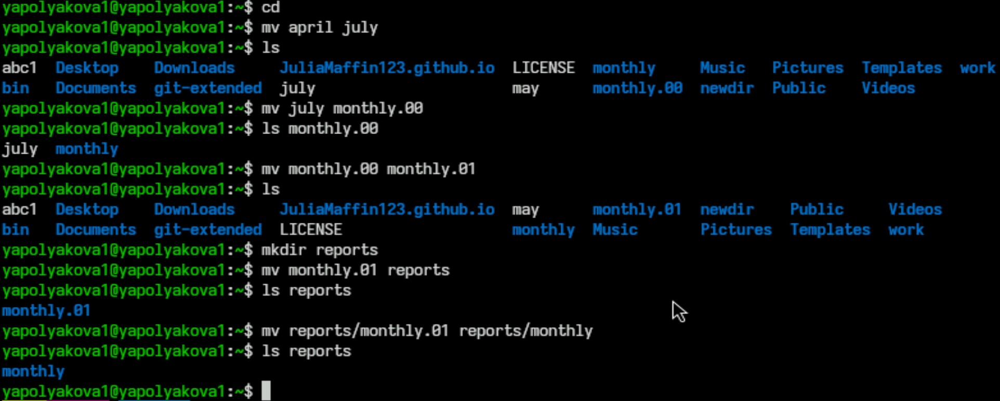{#fig:002 width=70%}

3. Выполним примеры изменения прав доступа к файлам и каталогам. 1) touch may; ls -l may; chmod u+x may; ls -l may - создаем файл ~/may с правом выполнения для владельца. 2) chmod u-x may; ls -l may - лишаем владельца файла ~/may права на выполнение. 3) mkdir monthly; chmod g-r,o-r monthly - создаем каталог monthly с запретом на чтение для членов группы и всех остальных пользователей. (рис. [-@fig:003])

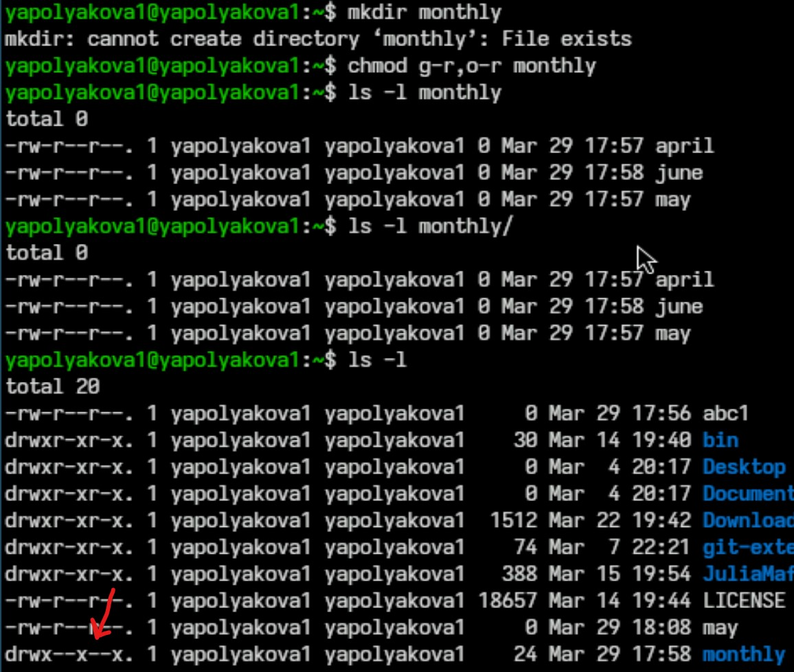{#fig:003 width=70%}

4. Пример 4) touch abc1; chmod g+w abc1 - создаем файл ~/abc1 с правом записи для членов группы. (рис. [-@fig:004])

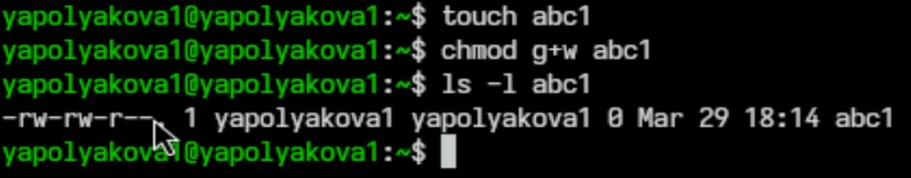{#fig:004 width=70%}

5. Задание 2.1. Скопируйте файл /usr/include/sys/io.h в домашний каталог и назовите его equipment. Команда: cp /usr/include/sys/io.h; mv io.h equipment.
Задание 2.2. В домашнем каталоге создайте директорию ~/ski.plases. Команда: mkdir ~/ski.plases
Задание 2.3. Переместите файл equipment в каталог ~/ski.plases. Команда: mkdir equipment ~/ski.plases
Задание 2.4. Переименуйте файл ~/ski.plases/equipment в ~/ski.plases/equiplist. Команда: mv ~/ski.plases/equipment ~/ski.plases/equiplist (рис. [-@fig:005])

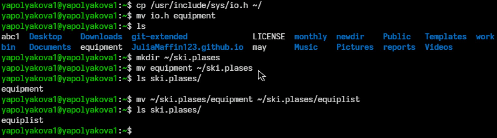{#fig:005 width=70%}

6. Задание 2.5. Создайте в домашнем каталоге файл abc1 и скопируйте его в каталог ~/ski.plases, назовите его equiplist2.  Команда: touch abc1; cp abc1 ~/ski.plases; mv ~/ski.plases/abc1 ~/ski.plases/equiplist2
Задание 2.6. Создайте каталог с именем equipment в каталоге ~/ski.plases. Команда: mkdir ~/ski.plases/equipment
Задание 2.7. Переместите файлы ~/ski.plases/equiplist и equiplist2 в каталог ~/ski.plases/equipment. Команда: mv ~/ski.plases/equiplist ~/ski.plases/equiplist2 ~/ski.plases/equipment/
Задание 2.8. Создайте и переместите каталог ~/newdir в каталог ~/ski.plases и назовите его plans. Команда: mkdir newdir; mv newdir ~/ski.plases/plans (рис. [-@fig:006])

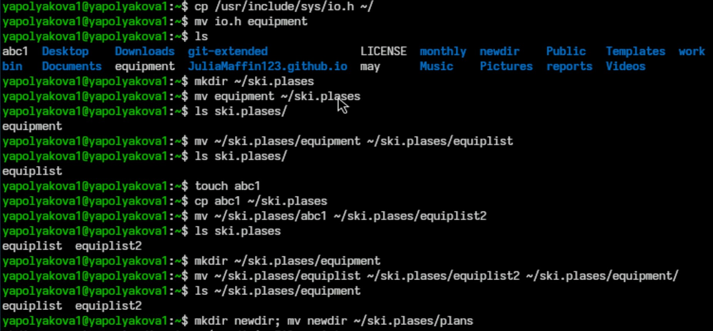{#fig:006 width=70%}

7. Определяем опции команды chmod, необходимые для того, чтобы присвоить перечисленным в условии файлам выделенные права доступа, считая, что в начале таких прав нет: 3.1. g-x,o-x; 3.2. g-r,o-r; 3.3. 544; 3.4. g+w (рис. [-@fig:007])

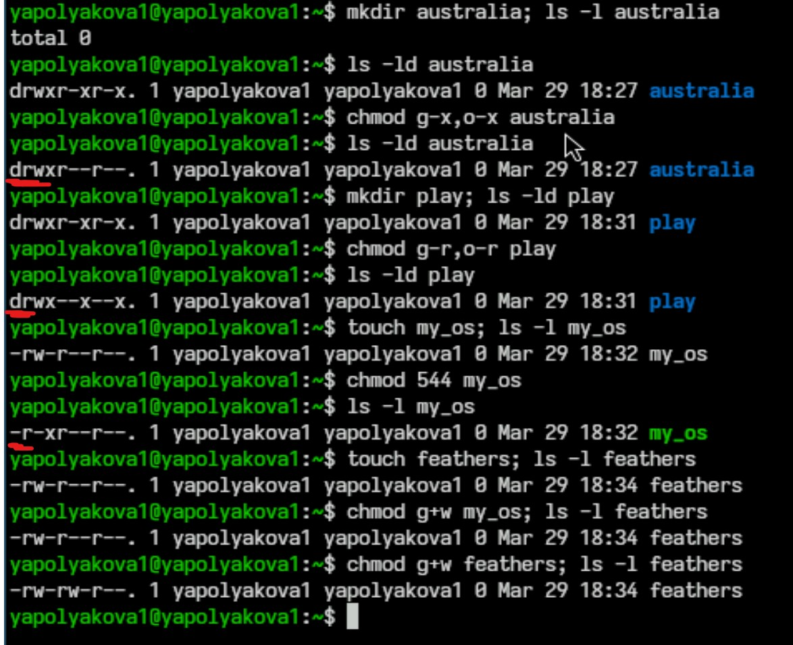{#fig:007 width=70%}

8. Задание 4.1. Просмотрите содержимое файла /etc/password. Команда: cat /etc/password
Задание 4.2. Скопируйте файл ~/feathers в файл ~/file.old. Команда: cp ~/feathers ~/file.old
Задание 4.3. Переместите файл ~/file.old в каталог ~/play. Команда: mv ~/file.old ~/play
Задание 4.4. Скопируйте каталог ~/play в каталог ~/fun. Команда: cp -r ~/play ~/fun/
Задание 4.5. Переместите каталог ~/fun в каталог ~/play и назовите его games. Команда: mv ~/fun ~/play/games (рис. [-@fig:008])

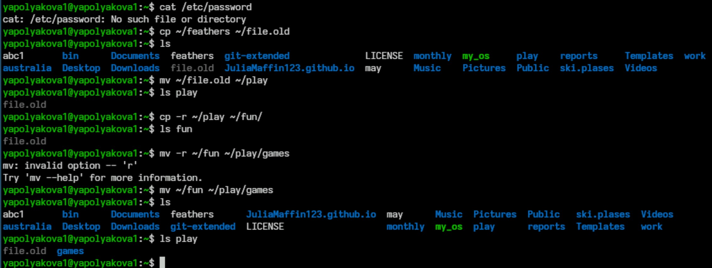{#fig:008 width=70%}

9. Задание 4.6. Лишите владельца файла ~/feathers права на чтение. Команда: chmod u-r ~/feathers
Задание 4.7. Что произойдёт, если вы попытаетесь просмотреть файл ~/feathers командой cat? Ответ: доступ будет запрещен
Задание 4.8. Что произойдёт, если вы попытаетесь скопировать файл ~/feathers? Ответ: доступ будет запрещен
Задание 4.9. Дайте владельцу файла ~/feathers право на чтение. Команда: chmod u+r ~/feathers (рис. [-@fig:009])

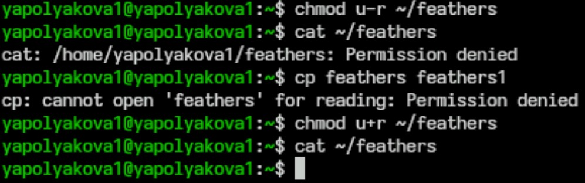{#fig:009 width=70%}

10. Задание 4.10. Лишите владельца каталога ~/play права на выполнение. Команда: chmod u-x ~/play
Задание 4.11. Перейдите в каталог ~/play. Что произошло? Команда: cd ~/play. Доступ был запрещен.
Задание 4.12. Дайте владельцу каталога ~/play право на выполнение. Команда: chmod u+x ~/play (рис. [-@fig:010])

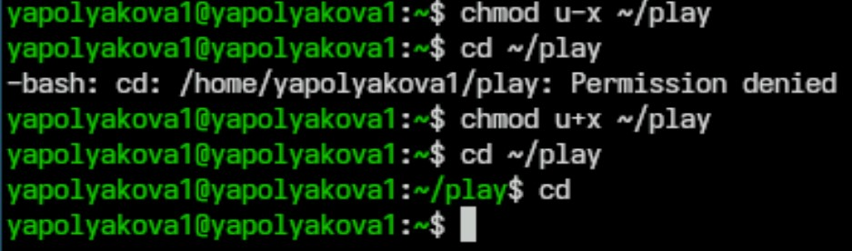{#fig:010 width=70%}

11. Команда man mount, mount - команда для монтирования файловых систем. Када файловая система монтируется она страновится доступной для чтения и записи в указанной точке монтирования. Пример: sudo mount /dev/sda1 /mnt - монтирует файловую систему на устройстве /dev/sda1 в точку /mnt (рис. [-@fig:011])

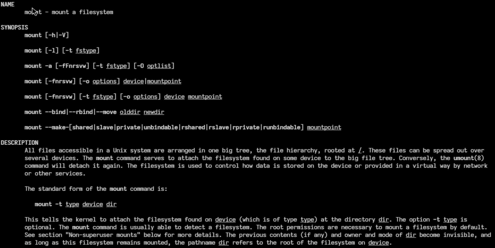{#fig:011 width=70%}

12. Команда man fsck, fsck проверяет целостность файловой системы и исправляет обнаруженные ошибки. Пример: fsck -A - проверка ошибок во всех разделах системы (рис. [-@fig:012])

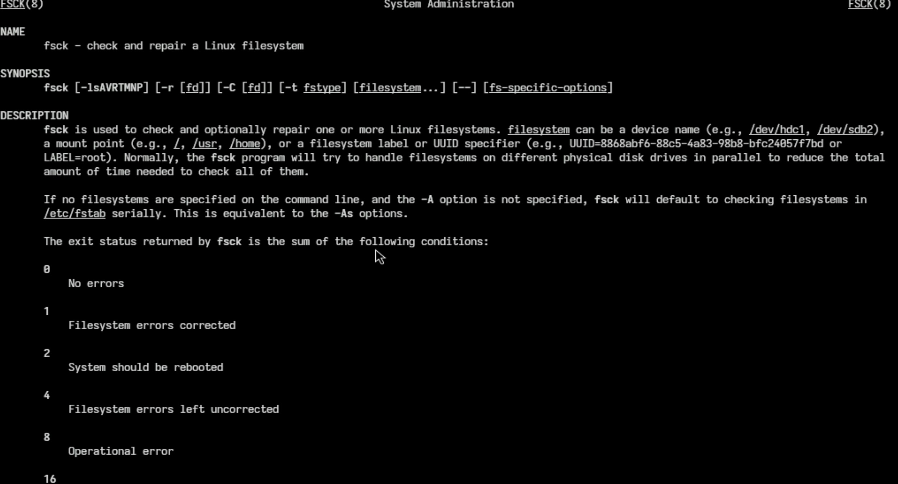{#fig:012 width=70%}

13. Команда man mkfs, mkfs создает файловую систему. Пример: mkfs -t ext4 /dev/sda1 - создает файловую систему ext4 в разделе /dev/sda1 (рис. [-@fig:013])

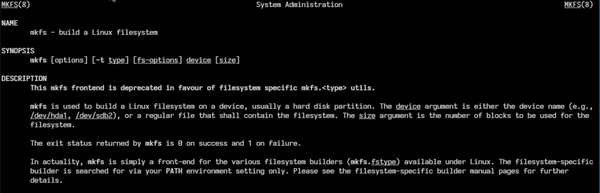{#fig:013 width=70%}

14. Команда man kill, kill - для завершения процессов вручную, посылает сигнал завершения выбранному процессу. Пример: kill 279 - чтобы остановить процесс с идентификатором 279 (рис. [-@fig:014])

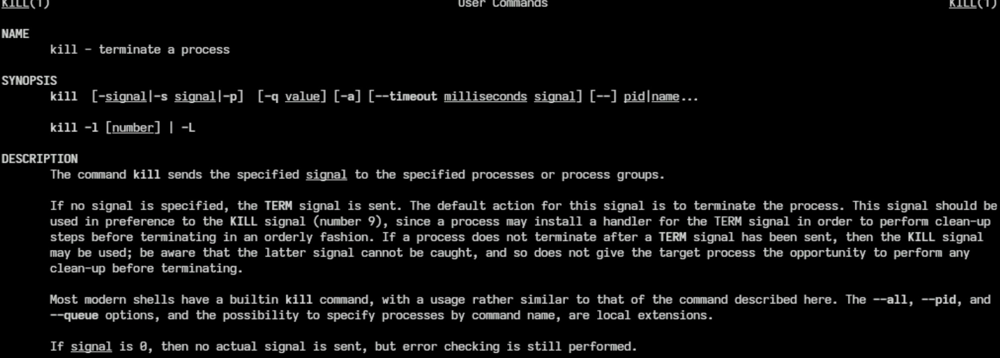{#fig:014 width=70%}

# Контрольные вопросы

1. Дайте характеристику каждой файловой системе, существующей на жёстком диске компьютера, на котором вы выполняли лабораторную работу.

Это btrfs и ext4. Файловая система BTRFS (B-Tree Filesystem) — это современная файловая система, разработанная для использования в операционных системах Linux. Она построена по принципу копирования при записи (Copy on Write): при чтении области данных используется общая копия, в случае изменения данных — создаётся новая копия.
Файловая система Ext4 — это собственная файловая система Linux, созданная для преодоления проблем Ext3. Она использует базовые принципы Ext3, но имеет ряд нововведений, например, увеличена скорость работы, увеличен максимальный размер файла и добавлена поддержка накопителей объёмом до 1 Экзабайта.

2. Приведите общую структуру файловой системы и дайте характеристику каждой ди-
ректории первого уровня этой структуры.

Упрощённо структуру файловой системы Btrfs можно описать так: на низком уровне располагаются блочные устройства, которые представляют собой одно или несколько раздельных физических адресных пространств. Посредством специальных структур блоки физической памяти объединяются в единое виртуальное адресное пространство. Далее идут метаданные и экстенты, адресация которых происходит уже на логическом уровне. На этом же уровне реализуется избыточность (аналог RAID 0, 1, 5, 6, 10). Предпоследний уровень — субтома (Subvolumes). На этом уровне происходит инкапсуляция нижних слоёв, что позволяет отображать данные в привычном виде — файлы и папки. На верхнем уровне находятся данные пользователя уже в обычном виде. Btrfs не использует суперблок и другие привычные элементы файловой системы, так как такая структура более эффективно использует дисковое свободное пространство накопителя и увеличивает производительность файловой системы.

Общая структура файловой системы Ext4 включает следующие основные составляющие: 1) Суперблок. Находится в самом начале файловой системы (обычно в первых 1024 байтах раздела). Система автоматически создаёт несколько копий суперблока, так как без него она не сможет функционировать. В суперблоке хранится базовая информация о файловой системе. 2) Глобальная таблица дескрипторов группы блоков. В ней описаны первый и последний блоки для каждой группы блоков, а также информация, где именно в каждой группе начинается таблица inodes, начало блоков данных и т. д. 3) Битовая карта блока. Это специальная таблица, в которой указано, какие блоки в группе использованы, а какие свободны. Эта информация используется во время распределения информации в блоке. 4) Битовая карта inodes. Эта таблица аналогична битовой карте блока, только в ней отображается информация о свободных inodes, которые могут быть использованы для записи новых файлов. 5) Блоки данных. Выделенные физические блоки памяти, в которых хранятся данные пользователя. 1

3. Какая операция должна быть выполнена, чтобы содержимое некоторой файловой
системы было доступно операционной системе? Ответ: mount

4. Назовите основные причины нарушения целостности файловой системы. Как устра-
нить повреждения файловой системы?

Некоторые основные причины нарушения целостности файловой системы в Linux: Случайное удаление файлов. Неисправности оборудования. Вредоносные программы и вирусы. Ошибка обновлений и настройка системы. Проблемы с логическими разделами и форматирование. Сбои в работе RAID-массивов. Ошибки пользователей при выполнении административных задач.

Для устранения повреждений файловой системы в Linux можно использовать утилиту fsck (File System Check). Она проверяет целостность файловой системы и исправляет обнаруженные ошибки. Некоторые рекомендации по использованию fsck: Делать резервные копии перед проверкой. Не запускать fsck на смонтированных разделах. Использовать флаг -n для первичного анализа.

5. Как создаётся файловая система? Ответ: Файловая система в Linux создаётся с помощью команды mkfs. Она организует иерархию каталогов, подкаталогов и файлов на отформатированном запоминающем устройстве (разделе на жёстком диске, USB-накопителе или другом носителе информации).

6. Дайте характеристику командам для просмотра текстовых файлов.

Некоторые команды для просмотра текстовых файлов в Linux и их характеристика: 1) cat. Выводит содержимое файла на экран. Это самый простой и часто используемый способ для вывода содержимого текстовых файлов. Однако выводить большие файлы через cat не всегда удобно. 2) nl. Действует аналогично команде cat, но выводит ещё и номера строк в столбце слева. Команду nl удобно применять для просмотра программного кода или поиска строк в файлах конфигурации. 3) less. Выводит содержимое файла, но отображает его только в рамках текущего окна в режиме просмотра. Можно прокручивать текст файла клавишами стрелок или перелистывать страницы клавишами w и z. Чтобы выйти из режима просмотра используется клавиша q. 4) head. Выводит на экран только первые 10 строк файла. Используя опцию -n, можно задать количество строк, которое нужно вывести. 5) tail. Аналогична команде head, но выводит последние 10 строк файла. С помощью команды tail можно увидеть изменения, сделанные в файле в реальном времени.

7. Приведите основные возможности команды cp в Linux.Ответ: 1) Рекурсивное копирование директорий со всем содержимым (опция -r или --recursive). 2) Подробный вывод информации о процессе копирования (опция -v или --verbose). 3) Запрос подтверждения перед копированием файлов (опция -i или --interactive). 4) Копирование только новых или обновлённых файлов (опция -u или --update). 5) Сохранение всех атрибутов файлов (владелец, права, временные метки) (опция -p или --preserve). 6) Создание резервной копии для существующих файлов (опция -b или --backup). 7) Принудительная перезапись существующих файлов назначения (опция -f). 8) Обработка разреженных файлов. По умолчанию cp создаёт разреженные файлы только если файл-источник разрежен, но можно настроить это поведение так, чтобы все файлы, содержащие последовательности нулей, делались разреженными (опция --sparse). 

8. Приведите основные возможности команды mv в Linux. Ответ: 1) Перемещение файлов и каталогов из одного места в другое. Можно перемещать несколько файлов одновременно. 2) Переименование файлов и каталогов. Если в качестве аргументов заданы имена двух файлов, то имя первого файла будет изменено на имя второго. 3) Создание резервных копий существующих файлов, которые будут перезаписаны или удалены. 4) Перемещение отсутствующих в целевой директории файлов. Если в определённую директорию нужно переместить ряд файлов, однако некоторые из них уже имеются в данном каталоге, используется опция -n. 5) Подробный вывод информации о перемещаемых или переименовываемых файлах. Для этого используется опция -v. 6) Перемещение файлов на основе шаблона. С помощью команды mv можно перемещать файлы на основе расширения файлов или части имени файла. 

9. Что такое права доступа? Как они могут быть изменены? Ответ: Права доступа в Linux — это система, которая регулирует взаимодействие пользователей с файлами и папками. Они устанавливают, кто имеет возможность читать (просматривать), изменять (записывать), выполнять (исполнять) файлы и программы. Чтобы изменить права доступа к файлу или папке в Linux, используется команда chmod. Она позволяет устанавливать или изменять права чтения, записи и выполнения для владельца файла, группы и остальных пользователей.

# Вывод

Мы ознакомились с файловой системой Linux, её структурой, именами и содержанием каталогов. Также приобрели практические навыки по применению команд для работы с файлами и каталогами, по управлению процессами (и работами), по проверке использования диска и обслуживанию файловой системы.
