---
## Front matter
lang: ru-RU
title: Лабораторная работа №8
subtitle: Поиск файлов. Перенаправление ввода-вывода. Просмотр запущенных процессов
author:
  - Полякова Ю.А.
institute:
  - Российский университет дружбы народов, Москва, Россия
date: 28 февраля 2007

## i18n babel
babel-lang: russian
babel-otherlangs: english

## Formatting pdf
toc: false
toc-title: Содержание
slide_level: 2
aspectratio: 169
section-titles: true
theme: metropolis
header-includes:
 - \metroset{progressbar=frametitle,sectionpage=progressbar,numbering=fraction}
---

# Информация

## Докладчик

:::::::::::::: {.columns align=center}
::: {.column width="70%"}

  * Полякова Юлия Александровна
  * Студент
  * Российский университет дружбы народов
  * [yulya.polyakova.07@mail.ru](mailto:yulya.polyakova.07@mail.ru)
  * <https://github.com/JuliaMaffin123>

:::
::: {.column width="30%"}

:::
::::::::::::::

# Вводная часть

## Актуальность

- Полезно знать, как фильтровать файлы и работать с процессами

## Объект и предмет исследования

- Потоки ввода вывода
- Процессы и их идентификаторы
- Конвейер

## Цели и задачи

- Ознакомление с инструментами поиска файлов и фильтрации текстовых данных.
- Приобретение практических навыков:
	- по управлению процессами (и заданиями),
	- по проверке использования диска и обслуживанию файловых систем.

## Материалы и методы

- Операции > и >>
- Команды find и grep
- Команды для работы с процессами

# Выполнение лабораторной работы

## Запись названий файлов из различных каталогов в файл

Предварительно входим в систему под своим именем. Записываем в файл file.txt названия файлов, содержащихся в каталоге /etc. Дописываем в этот же файл названия файлов, содержащихся в домашнем каталоге. Проверяем правильность командами head и tail

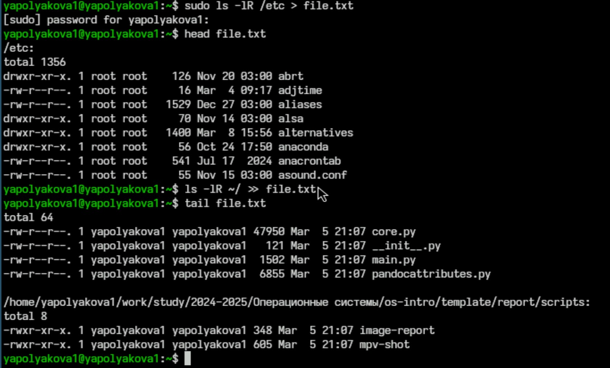{#fig:001 width=50%}

## Вывод имен файсов с расширеним .conf

Выводим имена всех файлов из file.txt, имеющих расширение .conf 

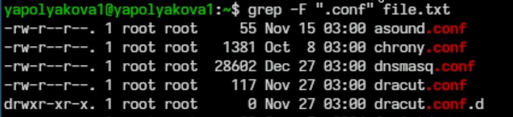{#fig:002 width=70%}

## Запись ранее выведенных имен в файл

Записываем их в новый текстовый файл conf.txt. 

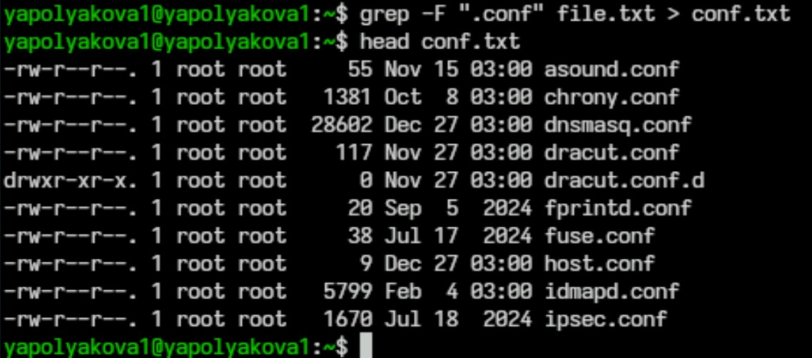{#fig:003 width=60%}

## Имена на "с" 1-ый вариант

Определяем, какие файлы в домашнем каталоге имеют имена, начинающиеся с символа "c"

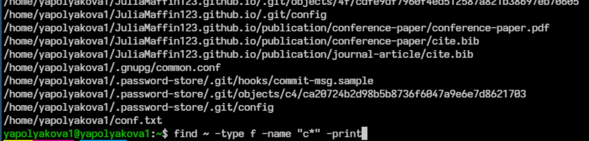{#fig:004 width=70%}

## Имена на "с" 2-ой вариант

Второй способ определить, какие файлы в домашнем каталоге имеют имена, начинающиеся с символа "c"

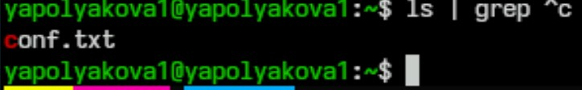{#fig:005 width=70%}

## Имена на "h" в etc

Выводим на экран имена файлов из каталога /etc, начинающиеся с символа h.

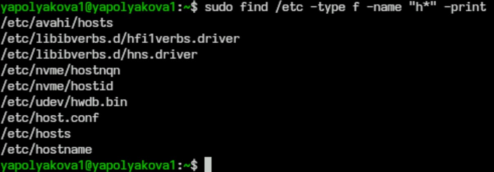{#fig:006 width=70%}

## Заполение logfile в фоновом режиме

Запускаем в фоновом режиме процесс, который будет записывать в файл ~/logfile файлы, имена которых начинаются с log. 7. Удаляем файл ~/logfile.

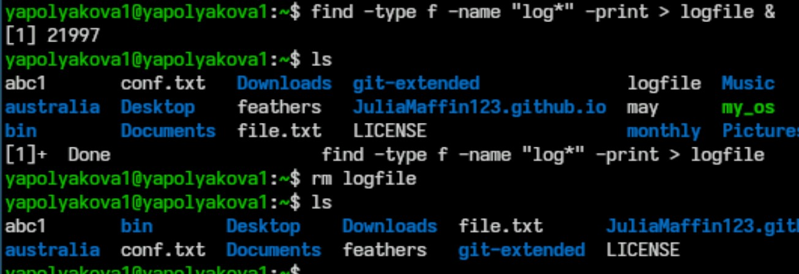{#fig:007 width=70%}

## Определение идентификатора фонового процесса

Запускаем из консоли в фоновом режиме редактор gedit. 9. Определяем идентификатор процесса gedit, используя команду ps, конвейер и фильтр grep. Приводим другие примеры определения

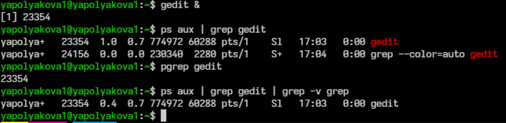{#fig:008 width=70%}

## Завершение gedit с помощью kill

Читаем справку (man) команды kill, после чего используем эту команду для завершения процесса gedit.

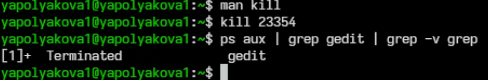{#fig:009 width=70%}

## Команды df и du

Выполняем команды df и du, предварительно получив более подробную информацию о них, с помощью команды man

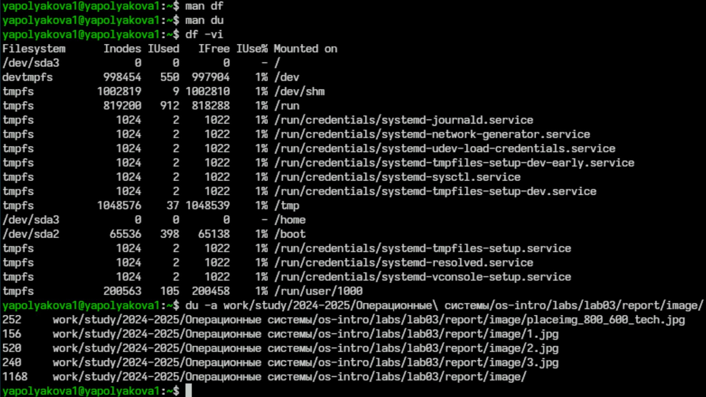{#fig:010 width=50%}

## Команда find, вывод имен директорий

Воспользовавшись справкой команды find, выводим имена всех директорий, имеющихся в домашнем каталоге.

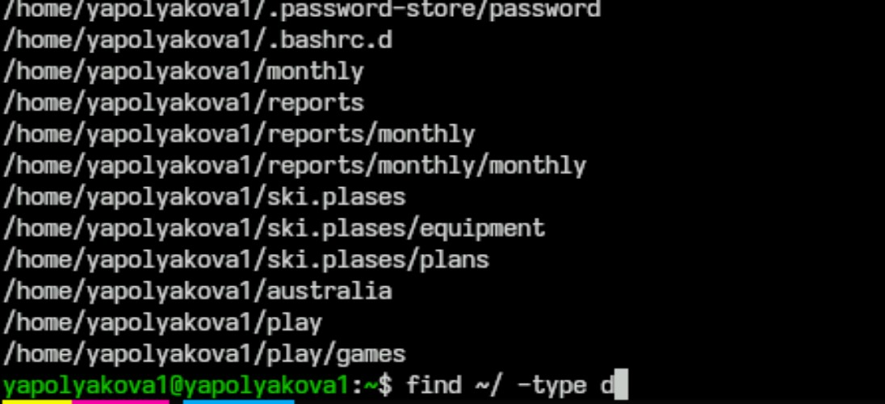{#fig:011 width=60%}

# Контрольные вопросы

## Контрольные вопросы

1. Какие потоки ввода вывода вы знаете?

В системе по умолчанию открыто три специальных потока:
 
 * stdin — стандартный поток ввода (по умолчанию: клавиатура), файловый дескриптор 0.
 * stdout — стандартный поток вывода (по умолчанию: консоль), файловый дескриптор 1.
 * stderr — стандартный поток вывод сообщений об ошибках (по умолчанию: консоль), файловый дескриптор 2.
 * stdprn - стандартный поток печати (по умолчанию: текущий принтер в системе).В настоящее время этот поток почти не используется, поскольку проще и безопаснее перенаправить стандартный поток вывода на принтер, чем разделять потоки отдельно для экрана и отдельно для принтера. 

## Контрольные вопросы

2. Объясните разницу между операцией > и >>.

Операция «>» позволяет записать данные в файл, а «>>» — записать их с добавлением.

## Контрольные вопросы

3. Что такое конвейер?

Конвейер (pipe) служит для объединения простых команд или утилит в цепочки, в которых результат работы предыдущей команды передаётся последующей. Синтаксис следующий: команда 1 | команда 2 (означает, что вывод команды 1 передастся на ввод команде 2).

Конвейеры можно группировать в цепочки и выводить с помощью перенаправления в файл, например: ls -la |sort > sortilg\_list (вывод команды ls -la передаётся команде сортировки sort\verb, которая пишет результат в файл sorting\_list\verb).

## Контрольные вопросы

4. Что такое процесс? Чем это понятие отличается от программы?

Процесс — это непосредственное выполнение инструкций компьютерной программы на процессоре ЭВМ. Также процессом называют выполняющуюся программу и все её элементы: адресное пространство, глобальные переменные, регистры, стек, открытые файлы и так далее.

Программа — это набор инструкций, написанных для выполнения задачи и хранящихся в памяти. Она является пассивной сущностью, поскольку находится во вторичной памяти. 

## Контрольные вопросы

5. Что такое PID и GID?

PID — идентификатор процесса в системе Linux. Каждый процесс имеет уникальный на данный момент времени идентификатор PID. Поменять PID процесса невозможно. Значения PID 0 и 1 зарезервированы: процесс с PID==0 не используется, PID==1 — принадлежит программе init.

GID — идентификатор группы. Это число, которое системы используют для отличия групп друг от друга. В отличие от файла, процесс может принадлежать нескольким группам одновременно.

## Контрольные вопросы

6. Что такое задачи и какая команда позволяет ими управлять?

Задачи в Linux — это процессы, которые выполняются в фоновом режиме или на переднем плане. Они могут быть отдельной программой или частью более крупной программы.

Команда для управления задачами в Linux — jobs. Она позволяет взаимодействовать с системными заданиями через терминал, а также проверять их состояния и выводить список с подробной информацией.

## Контрольные вопросы

7. Найдите информацию об утилитах top и htop. Каковы их функции?

Top — это утилита командной строки Linux, которая позволяет отслеживать запущенные процессы. Она предустановлена во всех современных дистрибутивах Linux. Некоторые функции top:

 * Сортировка процессов.
 * Вывод абсолютного пути к папке процессов. Для этого нужно нажать клавишу с.
 * Изменение интервала обновления экрана. По умолчанию обновления экрана происходит каждые 3 секунды. 
 * Завершение процессов. Можно завершить процесс по его PID. Для этого нужно нажать клавишу k и ввести PID.
 * Проверка загруженности процессорных ядер. Для этого нужно нажать клавишу 1.

## Контрольные вопросы

Htop — это утилита для мониторинга процессов и ресурсов системы в Linux. Некоторые функции htop:

 * Сортировка процессов по различным параметрам.
 * Вертикальная и горизонтальная прокрутка списка процессов с помощью клавиш стрелок.
 * Диалог для изменения настроек без перезапуска программы.
 * Отправка сигнала одному или нескольким выбранным процессам без ввода pid.
 * Изменение приоритета процессов. Просмотр открытых процессом файлов.
 * Просмотр процессов, запущенных от имени одного пользователя. Вывод процессов в виде дерева.
 * Показ потоков процессов пользователя и потоков ядра. Htop также поддерживает управление с помощью клавиатуры и мыши.

## Контрольные вопросы

8. Назовите и дайте характеристику команде поиска файлов. Приведите примеры использования этой команды. Команда find используется для поиска и отображения на экран имён файлов, соответствующих заданной строке символов. Формат команды: find путь \[-опции\] Путь определяет каталог, начиная с которого по всем подкаталогам будет вестись поиск. Примеры:

 * Вывести на экран имена файлов из вашего домашнего каталога и его подкаталогов, начинающихся на f: find ~ -name "f\*" -print (Здесь ~ — обозначение домашнего каталога, -name — после указывается имя файла, который нужно найти, "f\*" — строка символов, определяющая имя файла, -print — опция, задающая вывод результатов поиска на экран.)
 * Найти в домашнем каталоге файлы, имена которых заканчиваются символом ~ и удалить их: find ~ -name "*~" -exec rm "{}" \ (Здесь опция -exec rm "{}" \; задаёт применение команды rm ко всем файлам, имена которых соответствуют указанной после опции -name строке символов)

## Контрольные вопросы

9. Можно ли по контексту (содержанию) найти файл? Если да, то как?

Для поиска файлов по контексту в Linux можно использовать команду grep. Она позволяет указать строку или регулярное выражение для поиска. Наример, найти все файлы в папке /home/user, содержащие строку «hello»: grep -r "hello" /home/user

## Контрольные вопросы

10. Как определить объем свободной памяти на жёстком диске?

Чтобы определить объём свободной памяти на жёстком диске, можно использовать команду df. Например, df -vi

## Контрольные вопросы

11. Как определить объем вашего домашнего каталога?

Объем домашнего каталога можно определить командой du -sh ~/

## Контрольные вопросы

12. Как удалить зависший процесс?

Узнать его индентификатор командой ps aux | grep название-процесса, затем применить команду kill с идентификатором.

## Вывод

Мы ознакомились с инструментами поиска файлов и фильтрации текстовых данных. Также приобрели практические навыки: по управлению процессами (и заданиями), по проверке использования диска и обслуживанию файловых систем.
