---
## Front matter
title: "Лабораторная работа №8"
subtitle: "Поиск файлов. Перенаправление ввода-вывода. Просмотр запущенных процессов"
author: "Полякова Юлия Александровна"

## Generic otions
lang: ru-RU
toc-title: "Содержание"

## Bibliography
bibliography: bib/cite.bib
csl: pandoc/csl/gost-r-7-0-5-2008-numeric.csl

## Pdf output format
toc: true # Table of contents
toc-depth: 2
lof: true # List of figures
lot: true # List of tables
fontsize: 12pt
linestretch: 1.5
papersize: a4
documentclass: scrreprt
## I18n polyglossia
polyglossia-lang:
  name: russian
  options:
	- spelling=modern
	- babelshorthands=true
polyglossia-otherlangs:
  name: english
## I18n babel
babel-lang: russian
babel-otherlangs: english
## Fonts
mainfont: IBM Plex Serif
romanfont: IBM Plex Serif
sansfont: IBM Plex Sans
monofont: IBM Plex Mono
mathfont: STIX Two Math
mainfontoptions: Ligatures=Common,Ligatures=TeX,Scale=0.94
romanfontoptions: Ligatures=Common,Ligatures=TeX,Scale=0.94
sansfontoptions: Ligatures=Common,Ligatures=TeX,Scale=MatchLowercase,Scale=0.94
monofontoptions: Scale=MatchLowercase,Scale=0.94,FakeStretch=0.9
mathfontoptions:
## Biblatex
biblatex: true
biblio-style: "gost-numeric"
biblatexoptions:
  - parentracker=true
  - backend=biber
  - hyperref=auto
  - language=auto
  - autolang=other*
  - citestyle=gost-numeric
## Pandoc-crossref LaTeX customization
figureTitle: "Рис."
tableTitle: "Таблица"
listingTitle: "Листинг"
lofTitle: "Список иллюстраций"
lotTitle: "Список таблиц"
lolTitle: "Листинги"
## Misc options
indent: true
header-includes:
  - \usepackage{indentfirst}
  - \usepackage{float} # keep figures where there are in the text
  - \floatplacement{figure}{H} # keep figures where there are in the text
---

# Цель работы

Ознакомление с инструментами поиска файлов и фильтрации текстовых данных. Приобретение практических навыков: по управлению процессами (и заданиями), по проверке использования диска и обслуживанию файловых систем.

# Задание

 * Переопределить вывод команд в файлы
 * Найти файлы по шаблону имени
 * Запустить различные процессы в фоновом режиме
 * Определить идентификатор фонового процесса и завершить процесс
 * Прочитать man по некоторым командам и выполнить их
 * Ответить на контрольные вопросы

# Выполнение лабораторной работы

1. Предварительно входим в систему под своим именем. Записываем в файл file.txt названия файлов, содержащихся в каталоге /etc. Дописываем в этот же файл названия файлов, содержащихся в домашнем каталоге. Проверяем правильность командами head и tail (рис. [-@fig:001]).

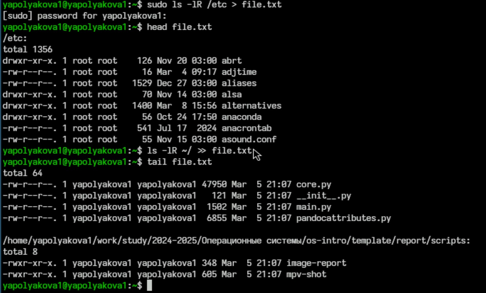{#fig:001 width=70%}

2. Выводим имена всех файлов из file.txt, имеющих расширение .conf (рис. [-@fig:002])

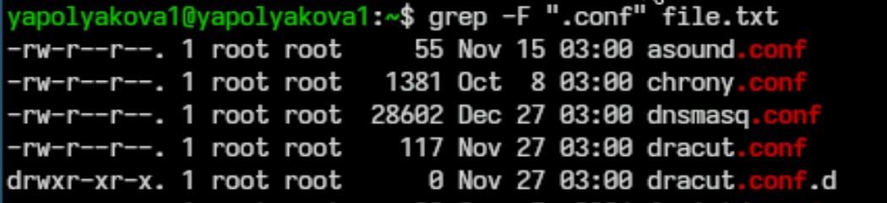{#fig:002 width=70%}

3. Записываем их в новый текстовый файл conf.txt. (рис. [-@fig:003])

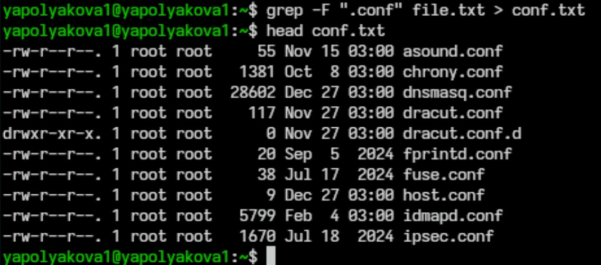{#fig:003 width=70%}

4. Определяем, какие файлы в домашнем каталоге имеют имена, начинающиеся с символа "c" (рис. [-@fig:004])

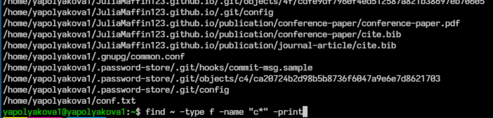{#fig:004 width=70%}

Второй способ определить, какие файлы в домашнем каталоге имеют имена, начинающиеся с символа "c" (рис. [-@fig:005])

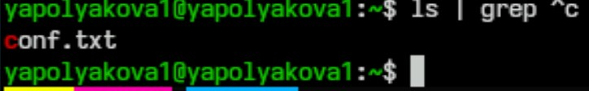{#fig:005 width=70%}

5. Выводим на экран имена файлов из каталога /etc, начинающиеся с символа h. (рис. [-@fig:006])

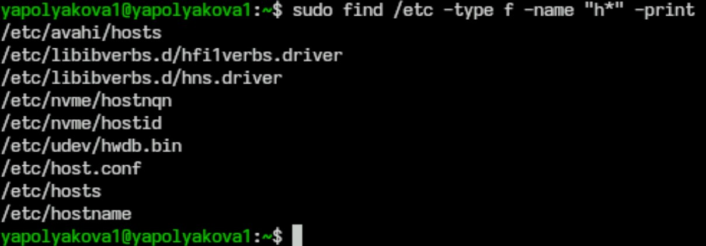{#fig:006 width=70%}

6. Запускаем в фоновом режиме процесс, который будет записывать в файл ~/logfile файлы, имена которых начинаются с log. 7. Удаляем файл ~/logfile. (рис. [-@fig:007])

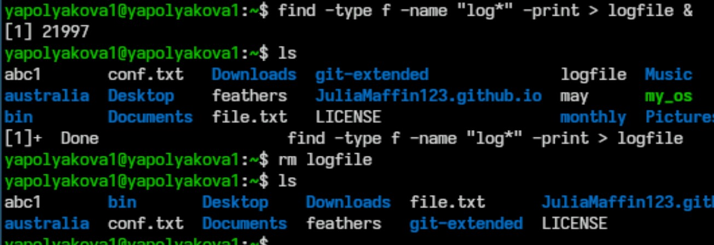{#fig:007 width=70%}

8. Запускаем из консоли в фоновом режиме редактор gedit. 9. Определяем идентификатор процесса gedit, используя команду ps, конвейер и фильтр grep. Приводим другие примеры определения (рис. [-@fig:008])

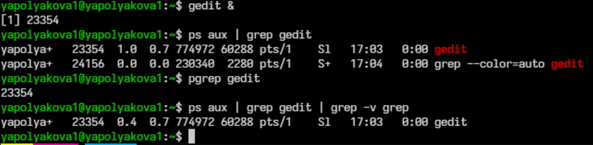{#fig:008 width=70%}

10. Читаем справку (man) команды kill, после чего используем эту команду для завершения процесса gedit. (рис. [-@fig:009])

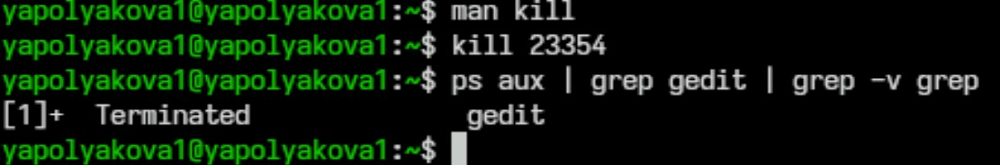{#fig:009 width=70%}

11. Выполняем команды df и du, предварительно получив более подробную информацию о них, с помощью команды man (рис. [-@fig:010])

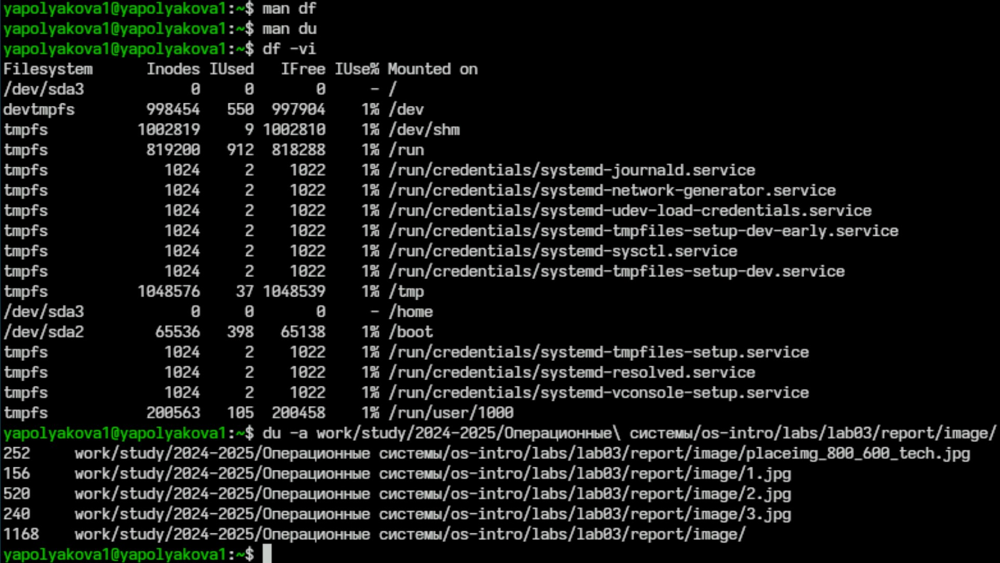{#fig:010 width=70%}

12. Воспользовавшись справкой команды find, выводим имена всех директорий, имеющихся в домашнем каталоге. (рис. [-@fig:011])

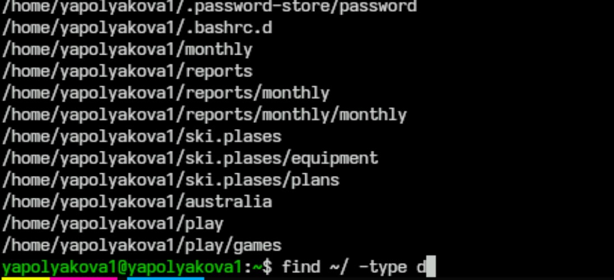{#fig:011 width=70%}

# Контрольные вопросы

1. Какие потоки ввода вывода вы знаете?

Стандартный поток печати (обозначение: stdprn и др.). Используется для вывода результатов работы программы на печать. По умолчанию этот поток закреплён за текущим принтером в системе, подключённым к порту LPT1. В настоящее время этот поток почти не используется, поскольку чаще проще и безопаснее перенаправить стандартный поток вывода на принтер, чем разделять потоки отдельно для экрана и отдельно для принтера.

В системе по умолчанию открыто три специальных потока:
 
 * stdin — стандартный поток ввода (по умолчанию: клавиатура), файловый дескриптор 0. Используется для ввода символьных данных в программу.
 * stdout — стандартный поток вывода (по умолчанию: консоль), файловый дескриптор 1. Используется для вывода символьной информации, полученной в результате работы программы в штатном режиме.
 * stderr — стандартный поток вывод сообщений об ошибках (по умолчанию: консоль), файловый дескриптор 2. Используется для вывода символьных диагностических сообщений, ошибок и предупреждений, возникших в результате работы программы.
 * stdprn - стандартный поток печати (по умолчанию: текущий принтер в системе). Используется для вывода результатов работы программы на печать. В настоящее время этот поток почти не используется, поскольку чаще проще и безопаснее перенаправить стандартный поток вывода на принтер, чем разделять потоки отдельно для экрана и отдельно для принтера. 

2. Объясните разницу между операцией > и >>.

Операция «>» позволяет записать данные в файл, а «>>» — записать их с добавлением.

3. Что такое конвейер?

Конвейер (pipe) служит для объединения простых команд или утилит в цепочки, в которых результат работы предыдущей команды передаётся последующей. Синтаксис следующий: команда 1 | команда 2 (означает, что вывод команды 1 передастся на ввод команде 2).

Конвейеры можно группировать в цепочки и выводить с помощью перенаправления в файл, например: ls -la |sort > sortilg\_list (вывод команды ls -la передаётся команде сортировки sort\verb, которая пишет результат в файл sorting\_list\verb).

4. Что такое процесс? Чем это понятие отличается от программы?

Процесс — это непосредственное выполнение инструкций компьютерной программы на процессоре ЭВМ. Также процессом называют выполняющуюся программу и все её элементы: адресное пространство, глобальные переменные, регистры, стек, открытые файлы и так далее.

Программа — это набор инструкций, написанных для выполнения задачи и хранящихся в памяти. Она является пассивной сущностью, поскольку находится во вторичной памяти. 

5. Что такое PID и GID?

PID — идентификатор процесса в системе Linux. Каждый процесс имеет уникальный на данный момент времени идентификатор PID. Поменять PID процесса невозможно. Значения PID 0 и 1 зарезервированы: процесс с PID==0 не используется, PID==1 — принадлежит программе init.

GID — идентификатор группы. Это число, которое системы используют для отличия групп друг от друга. В отличие от файла, процесс может принадлежать нескольким группам одновременно.

6. Что такое задачи и какая команда позволяет ими управлять?
Задачи в Linux — это процессы, которые выполняются в фоновом режиме или на переднем плане. Они могут быть отдельной программой или частью более крупной программы.
Команда для управления задачами в Linux — jobs. Она позволяет взаимодействовать с системными заданиями через терминал, а также проверять их состояния и выводить список с подробной информацией.

7. Найдите информацию об утилитах top и htop. Каковы их функции?

Top — это утилита командной строки Linux, которая позволяет отслеживать запущенные процессы. Она предустановлена во всех современных дистрибутивах Linux.

Некоторые функции top:

 * Сортировка процессов. Можно отсортировать список по использованию памяти, CPU, идентификатору процесса или времени работы.
 * Вывод абсолютного пути к папке процессов. Для этого нужно нажать клавишу с.
 * Изменение интервала обновления экрана. По умолчанию обновления экрана происходит каждые 3 секунды. Можно изменить данный параметр в соответствии со своими потребностями.
 * Завершение процессов. Можно завершить процесс по его PID. Для этого нужно нажать клавишу k и ввести соответствующее значение PID.
 * Проверка загруженности процессорных ядер. Можно узнать уровень загрузки отдельных ядер процессора. Для этого нужно нажать клавишу 1.

Htop — это утилита для мониторинга процессов и ресурсов системы в Linux.

Некоторые функции htop:

 * Сортировка процессов по различным параметрам, таким как загрузка процессора, использование оперативной памяти, время выполнения и другие.
 * Вертикальная и горизонтальная прокрутка списка процессов с помощью клавиш стрелок.
 * Диалог для изменения настроек без перезапуска программы. Например, можно выбрать параметры процессов для показа, поменять цветовую схему.
 * Отправка сигнала одному или нескольким выбранным процессам без ввода pid.
 * Изменение приоритета процессов.
 * Просмотр открытых процессом файлов.
 * Просмотр процессов, запущенных от имени одного пользователя.
 * Вывод процессов в виде дерева.
 * Показ потоков процессов пользователя и потоков ядра.
 * Htop также поддерживает управление с помощью клавиатуры и мыши.

8. Назовите и дайте характеристику команде поиска файлов. Приведите примеры использования этой команды.

Команда find используется для поиска и отображения на экран имён файлов, соответствующих заданной строке символов. Формат команды: find путь \[-опции\] Путь определяет каталог, начиная с которого по всем подкаталогам будет вестись поиск.

Примеры:

 * Вывести на экран имена файлов из вашего домашнего каталога и его подкаталогов, начинающихся на f: find ~ -name "f\*" -print (Здесь ~ — обозначение домашнего каталога, -name — после этой опции указывается имя файла, который нужно найти, "f\*" — строка символов, определяющая имя файла, -print — опция, задающая вывод результатов поиска на экран.)
 * Вывести на экран имена файлов в каталоге /etc, начинающихся с символа p: find /etc -name "p*" -print
 * Найти в домашнем каталоге файлы, имена которых заканчиваются символом ~ и удалить их: find ~ -name "*~" -exec rm "{}" \ (Здесь опция -exec rm "{}" \; задаёт применение команды rm ко всем файлам, име-
на которых соответствуют указанной после опции -name строке символов)

9. Можно ли по контексту (содержанию) найти файл? Если да, то как?

Для поиска файлов по контексту в Linux можно использовать команду grep. Она позволяет указать строку или регулярное выражение для поиска. Наример, найти все файлы в папке /home/user, содержащие строку «hello»: grep -r "hello" /home/user

10. Как определить объем свободной памяти на жёстком диске?

Чтобы определить объём свободной памяти на жёстком диске, можно использовать команду df. Например, df -vi

11. Как определить объем вашего домашнего каталога?

Объем домашнего каталога можно определить командой du -sh ~/

12. Как удалить зависший процесс?

Узнать его индентификатор командой ps aux | grep название-процесса, затем применить команду kill с идентификатором.

# Вывод

Мы ознакомились с инструментами поиска файлов и фильтрации текстовых данных. Также приобрели практические навыки: по управлению процессами (и заданиями), по проверке использования диска и обслуживанию файловых систем.
