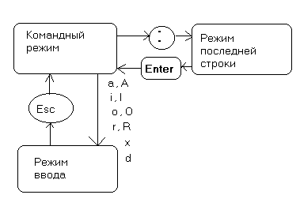

---
## Front matter
lang: ru-RU
title: Лабораторная работа №10
subtitle: Текстовой редактор vi
author:
  - Полякова Ю.А.
institute:
  - Российский университет дружбы народов, Москва, Россия
  - Преподаватель Кулябов Д. С., д.ф.\-м.н., профессор
date: 28 февраля 2007

## i18n babel
babel-lang: russian
babel-otherlangs: english

## Formatting pdf
toc: false
toc-title: Содержание
slide_level: 2
aspectratio: 169
section-titles: true
theme: metropolis
header-includes:
 - \metroset{progressbar=frametitle,sectionpage=progressbar,numbering=fraction}
---

# Информация

## Докладчик

:::::::::::::: {.columns align=center}
::: {.column width="70%"}

  * Полякова Юлия Александровна
  * Студент
  * Российский университет дружбы народов
  * [yulya.polyakova.07@mail.ru](mailto:yulya.polyakova.07@mail.ru)
  * <https://github.com/JuliaMaffin123>

:::
::: {.column width="30%"}

:::
::::::::::::::

# Вводная часть

## Актуальность

- Знание редактора vi и умение работать с ним - полезный навык.

## Объект и предмет исследования

- Текстовой редактор vi

## Цели и задачи

- Цель: Получить практические навыки работы с редактором vi, установленным по умолчанию практически во всех дистрибутивах.

- Задачи:
	- Ознакомиться с теоретическим материалом.
	- Ознакомиться с редактором vi.
	- Выполнить упражнения, используя команды vi.

## Материалы и методы

- Текстовой редактор vi

# Выполнение лабораторной работы

## Создание каталога

Создаем каталог ~/work/os/lab06 и переходим в него

{#fig:001 width=70%}

## Создание файла и запись в него

Вызываем vi и создаем файл hello.sh командой vi hello.sh. Нажимаем клавишу "i", переходя в режим вставки, записываем в файл указанный в задании текст

{#fig:002 width=40%}

## Сохранение и завершение работы

Нажимаем клавишу "Esc", для перехода в командный режим, нажимаем ":" для перехода в режим последней строки. Нажимаем w (записать) и q (выйти), а затем нажимаем клавишу Enter для сохранения текста и завершения работы.

{#fig:003 width=40%}

## Изменение доступа

Делаем файл исполняемым

{#fig:004 width=70%}

## Редактирование существующего файла

Вызываем vi на редактирование файла vi ~/work/os/lab06/hello.sh Устанавливаем курсор в конец слова HELL второй строки. Переходим в режим вставки и заменяем на HELLO. Нажимаем Esc для возврата в командный режим.

{#fig:005 width=40%}

## Меняем LOCAL

Устанавливаем курсор на четвертую строку и стираем слово LOCAL (команда dw). Переходим в режим вставки и набираем local, нажимаем Esc для возврата в командный режим.

{#fig:006 width=40%}

## Добавляем последнюю строку

Устанавливаем курсор на последней строке файла. Вставляем после неё строку, содержащую следующий текст: echo $HELLO. Нажимаем Esc для перехода в командный режим.

{#fig:007 width=40%}

## Удаление строки

Удаляем последнюю строку в командном режиме (dd)

{#fig:008 width=40%}

## Отмена изменений

Вводим команду отмены изменений u для отмены последней команды.

{#fig:009 width=40%}

## Завершение работы

Вводим символ : для перехода в режим последней строки. Записываем произведённые изменения и выходим из vi.

{#fig:010 width=40%}

# Контрольные вопросы

## Контрольные вопросы

1. Дайте краткую характеристику режимам работы редактора vi.

 * командный режим — для ввода команд редактирования и навигации по редактируемому файлу;
 * режим вставки — для ввода содержания редактируемого файла;
 * режим последней (или командной) строки — для записи изменений в файл и выхода из редактора.

Переход в командный режим клавиша Esc. Для выхода из редактора vi необходимо перейти в режим последней строки: в командном режиме нажать :, затем:

 * набрать символы wq, если перед выходом из редактора требуется записать изменения в файл;
 * набрать символ q (или q! если требуется выйти из редактора без сохранения).

## Контрольные вопросы

2. Как выйти из редактора, не сохраняя произведённые изменения?

Набрать q! в командном режиме последней строки.

## Контрольные вопросы

3. Назовите и дайте краткую характеристику командам позиционирования.

 * 0 (ноль) — переход в начало строки;
 * $ — переход в конец строки;
 * G — переход в конец файла;
 * nG — переход на строку с номером n.

## Контрольные вопросы

4. Что для редактора vi является словом?

Слова разделяются пробелами или табуляцией. При использовании прописных W и B под разделителями понимаются только пробел, табуляция и возврат каретки. При использовании строчных w и b под разделителями понимаются также любые знаки пунктуации.

## Контрольные вопросы

5. Каким образом из любого места редактируемого файла перейти в начало (конец) файла?

Перейти в начало: 0G, то есть на строку с номером ноль. В конец - просто G.

## Контрольные вопросы

6. Назовите и дайте краткую характеристику основным группам команд редактирования.

Вставка текста:

 * а — вставить текст после курсора;
 * А — вставить текст в конец строки;
 * i — вставить текст перед курсором;
 * ni — вставить текст n раз;
 * I — вставить текст в начало строки.

## Контрольные вопросы

Вставка строки:

 * о — вставить строку под курсором;
 * О — вставить строку над курсором.

## Контрольные вопросы

Удаление текста:

 * x — удалить один символ в буфер;
 * dw — удалить одно слово в буфер;
 * d$ — удалить в буфер текст от курсора до конца строки;
 * d0 — удалить в буфер текст от начала строки до позиции курсора;
 * dd — удалить в буфер одну строку;
 * ndd — удалить в буфер n строк.

## Контрольные вопросы

Отмена и повтор произведённых изменений:

 * u — отменить последнее изменение;
 * . — повторить последнее изменение.

## Контрольные вопросы

Копирование текста в буфер:

 * Y — скопировать строку в буфер;
 * nY — скопировать n строк в буфер;
 * yw — скопировать слово в буфер.

## Контрольные вопросы

Вставка текста из буфера:

 * p — вставить текст из буфера после курсора;
 * P — вставить текст из буфера перед курсором.

## Контрольные вопросы

Замена текста:

 * cw — заменить слово;
 * ncw — заменить n слов;
 * c$ — заменить текст от курсора до конца строки;
 * r — заменить слово;
 * R — заменить текст.

## Контрольные вопросы

Поиск текста:

 * / текст — произвести поиск вперёд по тексту указанной строки символов текст;
 * ? текст — произвести поиск назад по тексту указанной строки символов текст.

## Контрольные вопросы

7. Необходимо заполнить строку символами $. Каковы ваши действия?

Можно использвать ni (вставить текст n раз).

## Контрольные вопросы

8. Как отменить некорректное действие, связанное с процессом редактирования?

Команда u

## Контрольные вопросы

9. Назовите и дайте характеристику основным группам команд режима последней строки.

Копирование и перемещение текста:

 * : n,md — удалить строки с n по m;
 * : i,jmk — переместить строки с i по j, начиная со строки k;
 * : i,jtk — копировать строки с i по j в строку k;
 * : i,jw имя-файла — записать строки с i по j в файл с именем имя-файла.

## Контрольные вопросы

Запись в файл и выход из редактора:

 * : w — записать изменённый текст в файл, не выходя из vi;
 * : w имя-файла — записать изменённый текст в новый файл с именем имя-файла;
 * : w ! имя-файла — записать изменённый текст в файл с именем имя-файла;
 * : w q — записать изменения в файл и выйти из vi;
 * : q — выйти из редактора vi;
 * : q ! — выйти из редактора без записи;
 * : e ! — вернуться в командный режим, отменив все изменения, произведённые со времени последней записи.

## Контрольные вопросы

Опции редактора vi позволяют настроить рабочую среду. Для задания опций используется команда set (в режиме последней строки):

 * : set all — вывести полный список опций;
 * : set nu — вывести номера строк;
 * : set list — вывести невидимые символы;
 * : set ic — не учитывать при поиске, является ли символ прописным или строчным.

Если вы хотите отказаться от использования опции, то в команде set перед именем опции надо поставить no.

## Контрольные вопросы

10. Как определить, не перемещая курсора, позицию, в которой заканчивается строка?

Использовать $ — переход в конец строки.

## Контрольные вопросы

11. Выполните анализ опций редактора vi (сколько их, как узнать их назначение и т.д.).

Опций достаточно много, их можно изучить командой man vi

## Контрольные вопросы

12. Как определить режим работы редактора vi?

В самом низу файла по состоянию последней строки. Если там Insert, то это режим записи, если пусто - командный режим, если : - режим последней строки.

## Контрольные вопросы

13. Постройте граф взаимосвязи режимов работы редактора vi.

{#fig:011 width=50%}

## Вывод

Мы получили практические навыки работы с редактором vi, установленным по умолчанию практически во всех дистрибутивах.
