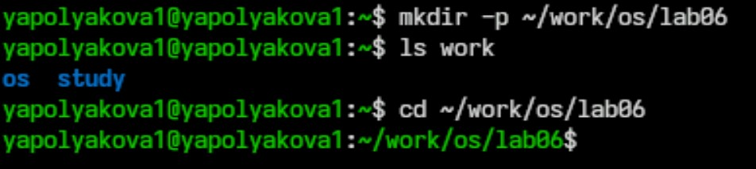
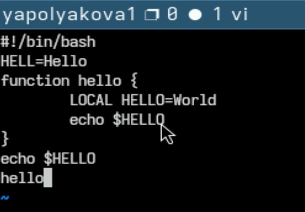
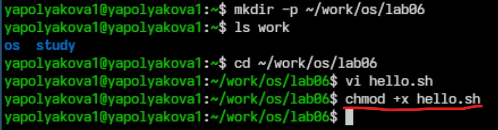
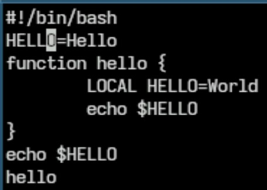
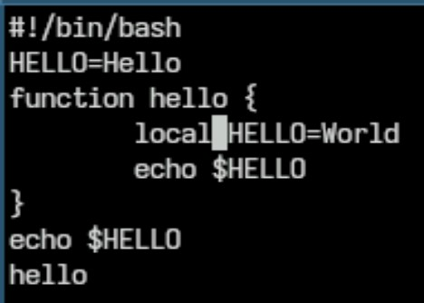
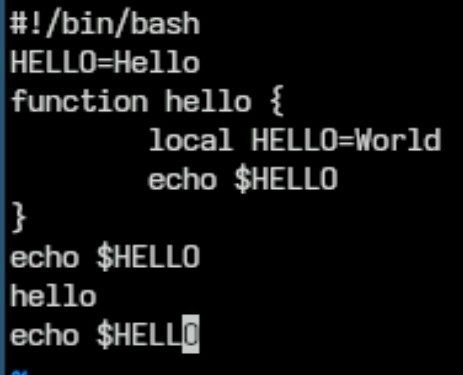
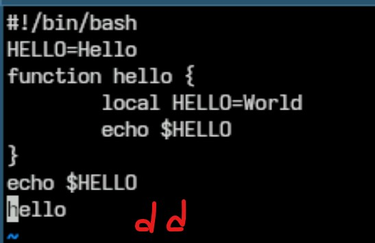
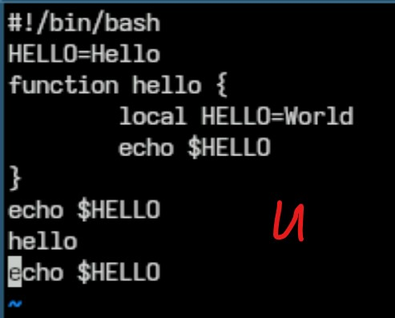
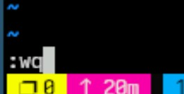

---
## Front matter
title: "Лабораторная работа №10"
subtitle: "Текстовой редактор vi"
author: "Полякова Юлия Александровна"

## Generic otions
lang: ru-RU
toc-title: "Содержание"

## Bibliography
bibliography: bib/cite.bib
csl: pandoc/csl/gost-r-7-0-5-2008-numeric.csl

## Pdf output format
toc: true # Table of contents
toc-depth: 2
lof: true # List of figures
lot: true # List of tables
fontsize: 12pt
linestretch: 1.5
papersize: a4
documentclass: scrreprt
## I18n polyglossia
polyglossia-lang:
  name: russian
  options:
	- spelling=modern
	- babelshorthands=true
polyglossia-otherlangs:
  name: english
## I18n babel
babel-lang: russian
babel-otherlangs: english
## Fonts
mainfont: IBM Plex Serif
romanfont: IBM Plex Serif
sansfont: IBM Plex Sans
monofont: IBM Plex Mono
mathfont: STIX Two Math
mainfontoptions: Ligatures=Common,Ligatures=TeX,Scale=0.94
romanfontoptions: Ligatures=Common,Ligatures=TeX,Scale=0.94
sansfontoptions: Ligatures=Common,Ligatures=TeX,Scale=MatchLowercase,Scale=0.94
monofontoptions: Scale=MatchLowercase,Scale=0.94,FakeStretch=0.9
mathfontoptions:
## Biblatex
biblatex: true
biblio-style: "gost-numeric"
biblatexoptions:
  - parentracker=true
  - backend=biber
  - hyperref=auto
  - language=auto
  - autolang=other*
  - citestyle=gost-numeric
## Pandoc-crossref LaTeX customization
figureTitle: "Рис."
tableTitle: "Таблица"
listingTitle: "Листинг"
lofTitle: "Список иллюстраций"
lotTitle: "Список таблиц"
lolTitle: "Листинги"
## Misc options
indent: true
header-includes:
  - \usepackage{indentfirst}
  - \usepackage{float} # keep figures where there are in the text
  - \floatplacement{figure}{H} # keep figures where there are in the text
---

# Цель работы

Познакомиться с операционной системой Linux. Получить практические навыки работы с редактором vi, установленным по умолчанию практически во всех дистрибутивах.

# Задание

 * Ознакомиться с теоретическим материалом.
 * Ознакомиться с редактором vi.
 * Выполнить упражнения, используя команды vi.

# Выполнение лабораторной работы

1. Создаем каталог ~/work/os/lab06 и переходим в него (рис. [-@fig:001]).

{#fig:001 width=70%}

2. Вызываем vi и создаем файл hello.sh командой vi hello.sh. Нажимаем клавишу "i", переходя в режим вставки, записываем в файл указанный в задании текст (рис. [-@fig:002])

{#fig:002 width=70%}

3. Нажимаем клавишу "Esc", для перехода в командный режим, нажимаем ":" для перехода в режим последней строки. Нажимаем w (записать) и q (выйти), а затем нажимаем клавишу Enter для сохранения текста и завершения работы. (рис. [-@fig:003])

{#fig:003 width=70%}

4. Делаем файл исполняемым (рис. [-@fig:004])

{#fig:004 width=70%}

5. Вызываем vi на редактирование файла vi ~/work/os/lab06/hello.sh Устанавливаем курсор в конец слова HELL второй строки. Переходим в режим вставки и заменяем на HELLO. Нажимаем Esc для возврата в командный режим. (рис. [-@fig:005])

{#fig:005 width=70%}

6. Устанавливаем курсор на четвертую строку и стираем слово LOCAL (команда dw). Переходим в режим вставки и набираем local, нажимаем Esc для возврата в командный режим. (рис. [-@fig:006])

{#fig:006 width=70%}

7. Устанавливаем курсор на последней строке файла. Вставляем после неё строку, содержащую следующий текст: echo $HELLO. Нажимаем Esc для перехода в командный режим. (рис. [-@fig:007])

{#fig:007 width=70%}

8. Удаляем последнюю строку в командном режиме (dd) (рис. [-@fig:008])

{#fig:008 width=70%}

9. Вводим команду отмены изменений u для отмены последней команды. (рис. [-@fig:009])

{#fig:009 width=70%}

10. Вводим символ : для перехода в режим последней строки. Записываем произведённые изменения и выходим из vi. (рис. [-@fig:010])

{#fig:010 width=70%}

# Контрольные вопросы

1. Дайте краткую характеристику режимам работы редактора vi.

Редактор vi имеет три режима работы:

 * командный режим — предназначен для ввода команд редактирования и навигации по редактируемому файлу;
 * режим вставки — предназначен для ввода содержания редактируемого файла;
 * режим последней (или командной) строки — используется для записи изменений в файл и выхода из редактора.

Переход в командный режим осуществляется нажатием клавиши Esc. Для выхода из редактора vi необходимо перейти в режим последней строки: находясь в командном режиме, нажать : — двоеточие, затем:

 * набрать символы wq, если перед выходом из редактора требуется записать изменения в файл;
 * набрать символ q (или q!), если требуется выйти из редактора без сохранения.

2. Как выйти из редактора, не сохраняя произведённые изменения?

Набрать q! в командном режиме последней строки.

3. Назовите и дайте краткую характеристику командам позиционирования.

 * 0 (ноль) — переход в начало строки;
 * $ — переход в конец строки;
 * G — переход в конец файла;
 * nG — переход на строку с номером n.

4. Что для редактора vi является словом?

Слова разделяются пробелами или табуляцией. При использовании прописных W и B под разделителями понимаются только пробел, табуляция и возврат каретки. При использовании строчных w и b под разделителями понимаются также любые знаки пунктуации.

5. Каким образом из любого места редактируемого файла перейти в начало (конец) файла?

Перейти в начало: 0G, то есть на строку с номером ноль. В конец - просто G.

6. Назовите и дайте краткую характеристику основным группам команд редактирования.

Вставка текста:

 * а — вставить текст после курсора;
 * А — вставить текст в конец строки;
 * i — вставить текст перед курсором;
 * ni — вставить текст n раз;
 * I — вставить текст в начало строки.

Вставка строки:

 * о — вставить строку под курсором;
 * О — вставить строку над курсором.

Удаление текста:

 * x — удалить один символ в буфер;
 * dw — удалить одно слово в буфер;
 * d$ — удалить в буфер текст от курсора до конца строки;
 * d0 — удалить в буфер текст от начала строки до позиции курсора;
 * dd — удалить в буфер одну строку;
 * ndd — удалить в буфер n строк.

Отмена и повтор произведённых изменений:

 * u — отменить последнее изменение;
 * . — повторить последнее изменение.

Копирование текста в буфер:

 * Y — скопировать строку в буфер;
 * nY — скопировать n строк в буфер;
 * yw — скопировать слово в буфер.

Вставка текста из буфера:

 * p — вставить текст из буфера после курсора;
 * P — вставить текст из буфера перед курсором.

Замена текста:

 * cw — заменить слово;
 * ncw — заменить n слов;
 * c$ — заменить текст от курсора до конца строки;
 * r — заменить слово;
 * R — заменить текст.

Поиск текста:

 * / текст — произвести поиск вперёд по тексту указанной строки символов текст;
 * ? текст — произвести поиск назад по тексту указанной строки символов текст.

7. Необходимо заполнить строку символами $. Каковы ваши действия?

Можно использвать ni (вставить текст n раз).

8. Как отменить некорректное действие, связанное с процессом редактирования?

Команда u

9. Назовите и дайте характеристику основным группам команд режима последней строки.

Копирование и перемещение текста:

 * : n,md — удалить строки с n по m;
 * : i,jmk — переместить строки с i по j, начиная со строки k;
 * : i,jtk — копировать строки с i по j в строку k;
 * : i,jw имя-файла — записать строки с i по j в файл с именем имя-файла.

Запись в файл и выход из редактора:

 * : w — записать изменённый текст в файл, не выходя из vi;
 * : w имя-файла — записать изменённый текст в новый файл с именем имя-файла;
 * : w ! имя-файла — записать изменённый текст в файл с именем имя-файла;
 * : w q — записать изменения в файл и выйти из vi;
 * : q — выйти из редактора vi;
 * : q ! — выйти из редактора без записи;
 * : e ! — вернуться в командный режим, отменив все изменения, произведённые со времени последней записи.

Опции редактора vi позволяют настроить рабочую среду. Для задания опций используется команда set (в режиме последней строки):

 * : set all — вывести полный список опций;
 * : set nu — вывести номера строк;
 * : set list — вывести невидимые символы;
 * : set ic — не учитывать при поиске, является ли символ прописным или строчным.

Если вы хотите отказаться от использования опции, то в команде set перед именем опции надо поставить no.

10. Как определить, не перемещая курсора, позицию, в которой заканчивается строка?

Использовать $ — переход в конец строки.

11. Выполните анализ опций редактора vi (сколько их, как узнать их назначение и т.д.).

Опций достаточно много, их можно изучить командой man vi

12. Как определить режим работы редактора vi?

В самом низу файла по состоянию последней строки. Если там Insert, то это режим записи, если пусто - командный режим, если : - режим последней строки.

13. Постройте граф взаимосвязи режимов работы редактора vi. (рис. [-@fig:011])

{#fig:011 width=70%}

# Вывод

Мы познакомились с операционной системой Linux, а также получили практические навыки работы с редактором vi, установленным по умолчанию практически во всех дистрибутивах.
