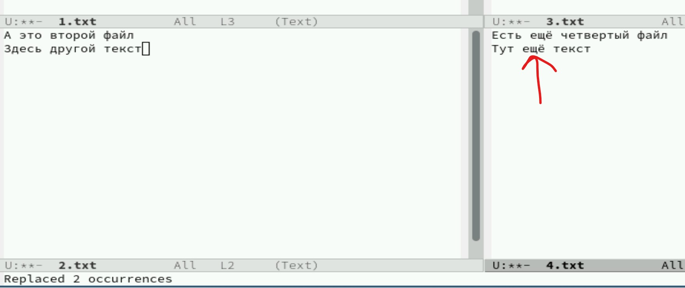

---
## Front matter
lang: ru-RU
title: Лабораторная работа №11
subtitle: Текстовой редактор emacs
author:
  - Полякова Ю.А.
institute:
  - Российский университет дружбы народов, Москва, Россия
  - Преподаватель Кулябов Д. С., д.ф.\-м.н., профессор
date: 28 февраля 2007

## i18n babel
babel-lang: russian
babel-otherlangs: english

## Formatting pdf
toc: false
toc-title: Содержание
slide_level: 2
aspectratio: 169
section-titles: true
theme: metropolis
header-includes:
 - \metroset{progressbar=frametitle,sectionpage=progressbar,numbering=fraction}
---

# Информация

## Докладчик

:::::::::::::: {.columns align=center}
::: {.column width="70%"}

  * Полякова Юлия Александровна
  * Студент
  * Российский университет дружбы народов
  * [yulya.polyakova.07@mail.ru](mailto:yulya.polyakova.07@mail.ru)
  * <https://github.com/JuliaMaffin123>

:::
::: {.column width="30%"}

:::
::::::::::::::

# Вводная часть

## Актуальность

- Умнение работать с таким редактором довольно полезное для общего развития

## Объект и предмет исследования

- Текстовой редактор emacs

## Цели и задачи

- Цель: Познакомиться с операционной системой Linux. Получить практические навыки работы с редактором Emacs.
- Задачи:
	- Ознакомиться с теоретическим материалом.
	- Ознакомиться с редактором emacs.
	- Выполнить упражнения.
	- Ответить на контрольные вопросы.

## Материалы и методы

- Текстовой редактор emacs
- Командная строка

# Выполнение лабораторной работы

## Создание и заполнение файла

Открываем emacs, написав в командной строке emacs. Создаем файл lab07.sh с помощью комбинации Ctrl-x Ctrl-f (C-x C-f). Набираем предложенный текст

{#fig:001 width=65%}

## Сохранение файла

Сохранияем файл с помощью комбинации Ctrl-x Ctrl-s (C-x C-s).

{#fig:002 width=70%}

## Результат процедур редактирования текста

Проделываем с текстом стандартные процедуры редактирования, каждое действие должно осуществляем комбинацией клавиш. Вырезаем одной командой целую строку (С-k), я вырезала echo $HELLO. Вставляем эту строку в конец файла (C-y). Выделяем область текста (C-space и я использовала стрелки), я выделила две строки hello и echo $HELLO. Копируем область в буфер обмена (Alt-w). Вставляем область в конец файла. Вновь выделяем эту область и на этот раз вырезаем её (C-w). Отменяем последнее действие (C-/). Результат на рисунке

{#fig:003 width=20%}

## Перемещение курсора клавишами

Учимся использовать команды по перемещению курсора. Перемещаем курсор в начало строки (C-a). Перемещаем курсор в конец строки (C-e). Перемещаем курсор в начало буфера (Alt-<). Перемещаем курсор в конец буфера (Alt->).

{#fig:004 width=40%}

## Список активных буферов

Выводим список активных буферов на экран (C-x C-b)

{#fig:005 width=65%}

## Перемещаемся в открытое окно

Перемещаемся во вновь открытое окно (C-x o) со списком открытых буферов

{#fig:006 width=65%}

## Другой буфер

Переключаемся на другой буфер (C-x b)

{#fig:007 width=45%}

## Закрытие окна

Закрываем это окно (C-x 0)

{#fig:008 width=45%}

## Переключение без вывода списка

Переключаемся между буферами, но уже без вывода их списка на экран (C-x b).

{#fig:009 width=30%}

## Деление на 4 окна

Делим фрейм на 4 части: делим на два окна по вертикали (C-x 3), а затем каждое из этих окон на две части по горизонтали (C-x 2) (переключаемся между окнами C-x o). В каждом из четырёх созданных окон открываем новый буфер (C-x C-f) и вводим несколько строк текста.

{#fig:010 width=50%}

## Режим поиска

Переключаемся в режим поиска (C-s) и ищем несколько слов, присутствующих в тексте.

{#fig:011 width=70%}

## Переключение между результатами

Переключаемся между результатами поиска, нажимая C-s. Выходим из режима поиска, нажав C-g

{#fig:012 width=70%}

## Поиск с заменой

Заменяем "еще" на "ещё", используем режим поиска и замены (M-%), вводим текст, который следует найти и заменить, нажимаем Enter, затем вводим текст для замены. После того как будут подсвечены результаты поиска, нажимаем ! для подтверждения замены.

{#fig:013 width=70%}

## Иной режим поиска

Пробуем другой режим поиска, нажав M-s o. Он отличается от предыдущих тем, что выводит результат поиска в отдельном окне. Он показывает кол-во совпадений, имя файла и место в файле

{#fig:014 width=40%}

# Контрольные вопросы

## Контрольные вопросы

1. Краткая характеристика Emacs

Emacs — мощный расширяемый текстовый редактор с открытым исходным кодом, известный своей гибкостью и возможностями кастомизации. Поддерживает широкий спектр функций от простого редактирования текста до сложных операций программирования, организации рабочего процесса и даже электронной почты.

## Контрольные вопросы

2. Особенности сложности для новичков:

 * Многочисленные комбинации клавиш: основная функциональность требует запоминания множества сочетаний клавиш (C-x, C-s и др.).
 * Строгая структура команд: некоторые команды требуют точного набора символов.
 * Высокая степень настраиваемости: большое количество настроек и конфигураций делает начальное освоение непростой задачей.
 * Необходимость изучения базовых концептов, таких как буферы, окна, режимы.

## Контрольные вопросы

3. Буфер и окно в терминологии Emacs'а:

Буфер — это контейнер для хранения содержимого документа (текста), независимо от отображаемого окна. Окно же представляет собой область экрана, в которой отображается содержимое одного или нескольких буферов одновременно. Один буфер может отображаться сразу в нескольких окнах, а одно окно может показывать разные участки одного буфера.

## Контрольные вопросы

4. Можно ли открыть больше 10 буферов в одном окне?

Да, можно. Количество открытых буферов никак не ограничено количеством окон. Каждый буфер хранится отдельно, а окно лишь показывает определённый участок текущего активного буфера.

## Контрольные вопросы

5. Какие буферы создаются по умолчанию при запуске Emacs?

При старте Emacs автоматически создаёт два основных буфера:

 * \*scratch\*: специальный буфер для временного ввода и тестирования выражений Elisp.
 * \*Messages\*: здесь выводятся информационные сообщения и предупреждения системы.

## Контрольные вопросы

6. Комбинации клавиш:

Чтобы ввести последовательность C-c |, нажимаем сначала сочетание Ctrl+C, отпускаем, потом вводим символ вертикальной черты ("|"). Для последовательности C-c C-| выполняем аналогично, только вторую часть вводим удерживая Control и Shift: Ctrl+C → отпускаем → снова нажимаем Ctrl+Shift+"|".

## Контрольные вопросы

7. Разделение окна на две части:

Используя команду C-x 2 разделяет активное окно горизонтально пополам. Команда C-x 3 делит окно вертикально на две части.

## Контрольные вопросы

8. Файл конфигурации Emacs:

Настройки сохраняются в файле .emacs.d/init.el. Этот файл находится в домашнем каталоге пользователя и хранит всю необходимую конфигурацию и расширения.

## Контрольные вопросы

9. Клавиша Escape (или Meta):

Клавиша Esc (Meta) используется для запуска различных команд Emacs. Её часто применяют совместно с другими клавишами для активации специализированных действий. Эту клавишу можно переназначить путём изменения соответствующего макроса в настройках файла init.el.

## Контрольные вопросы

10. Удобство Emacs vs Vi/Vim:

Выбор между Emacs и Vim зависит от личных предпочтений и целей использования. Например, если важна высокая степень настройки и возможность автоматизации процессов разработки, Emacs станет лучшим выбором благодаря своей мощной экосистеме плагинов и встроенному языку сценариев (Elisp). Если важнее скорость навигации по тексту и минимальные усилия на обучение клавиатурных сокращений, то Vim может показаться предпочтительнее. Оба инструмента имеют сильные стороны, и выбор идеального решения индивидуален. Удобнее мне показался emacs, так как он наиболее приближен к привычным редакторам, например, к Блокноту или gedit.

## Вывод

Были получены практические навыки работы с редактором Emacs.
