---
## Front matter
title: "Лабораторная работа №11"
subtitle: "Текстовой редактор emacs"
author: "Полякова Юлия Александровна"

## Generic otions
lang: ru-RU
toc-title: "Содержание"

## Bibliography
bibliography: bib/cite.bib
csl: pandoc/csl/gost-r-7-0-5-2008-numeric.csl

## Pdf output format
toc: true # Table of contents
toc-depth: 2
lof: true # List of figures
lot: true # List of tables
fontsize: 12pt
linestretch: 1.5
papersize: a4
documentclass: scrreprt
## I18n polyglossia
polyglossia-lang:
  name: russian
  options:
	- spelling=modern
	- babelshorthands=true
polyglossia-otherlangs:
  name: english
## I18n babel
babel-lang: russian
babel-otherlangs: english
## Fonts
mainfont: IBM Plex Serif
romanfont: IBM Plex Serif
sansfont: IBM Plex Sans
monofont: IBM Plex Mono
mathfont: STIX Two Math
mainfontoptions: Ligatures=Common,Ligatures=TeX,Scale=0.94
romanfontoptions: Ligatures=Common,Ligatures=TeX,Scale=0.94
sansfontoptions: Ligatures=Common,Ligatures=TeX,Scale=MatchLowercase,Scale=0.94
monofontoptions: Scale=MatchLowercase,Scale=0.94,FakeStretch=0.9
mathfontoptions:
## Biblatex
biblatex: true
biblio-style: "gost-numeric"
biblatexoptions:
  - parentracker=true
  - backend=biber
  - hyperref=auto
  - language=auto
  - autolang=other*
  - citestyle=gost-numeric
## Pandoc-crossref LaTeX customization
figureTitle: "Рис."
tableTitle: "Таблица"
listingTitle: "Листинг"
lofTitle: "Список иллюстраций"
lotTitle: "Список таблиц"
lolTitle: "Листинги"
## Misc options
indent: true
header-includes:
  - \usepackage{indentfirst}
  - \usepackage{float} # keep figures where there are in the text
  - \floatplacement{figure}{H} # keep figures where there are in the text
---

# Цель работы

Познакомиться с операционной системой Linux. Получить практические навыки работы с редактором Emacs.

# Задание

1. Ознакомиться с теоретическим материалом.
2. Ознакомиться с редактором emacs.
3. Выполнить упражнения.
4. Ответить на контрольные вопросы.

# Выполнение лабораторной работы

1. Открываем emacs, написав в командной строке emacs. Создаем файл lab07.sh с помощью комбинации Ctrl-x Ctrl-f (C-x C-f). Набираем предложенный текст (рис. [-@fig:001]).

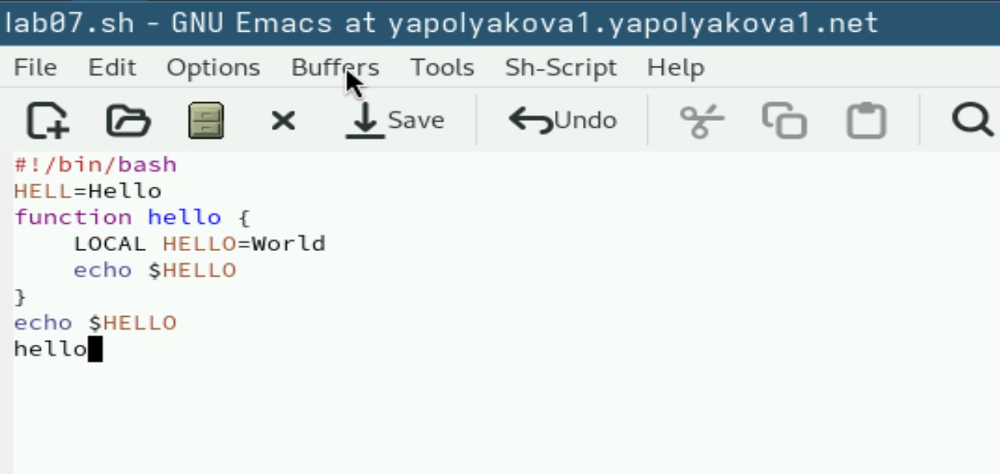{#fig:001 width=70%}

2. Сохранияем файл с помощью комбинации Ctrl-x Ctrl-s (C-x C-s). (рис. [-@fig:002])

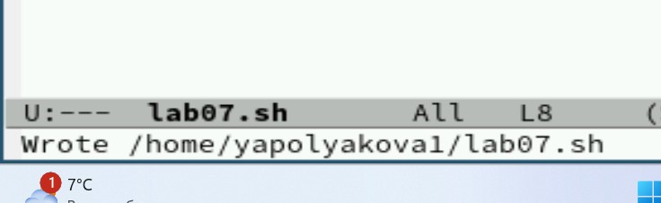{#fig:002 width=70%}

3. Проделываем с текстом стандартные процедуры редактирования, каждое действие должно осуществляем комбинацией клавиш. Вырезаем одной командой целую строку (С-k), я вырезала echo $HELLO. Вставляем эту строку в конец файла (C-y). Выделяем область текста (C-space и я использовала стрелки), я выделила две строки hello и echo $HELLO. Копируем область в буфер обмена (Alt-w). Вставляем область в конец файла. Вновь выделяем эту область и на этот раз вырезаем её (C-w). Отменяем последнее действие (C-/). Результат на рисунке (рис. [-@fig:003])

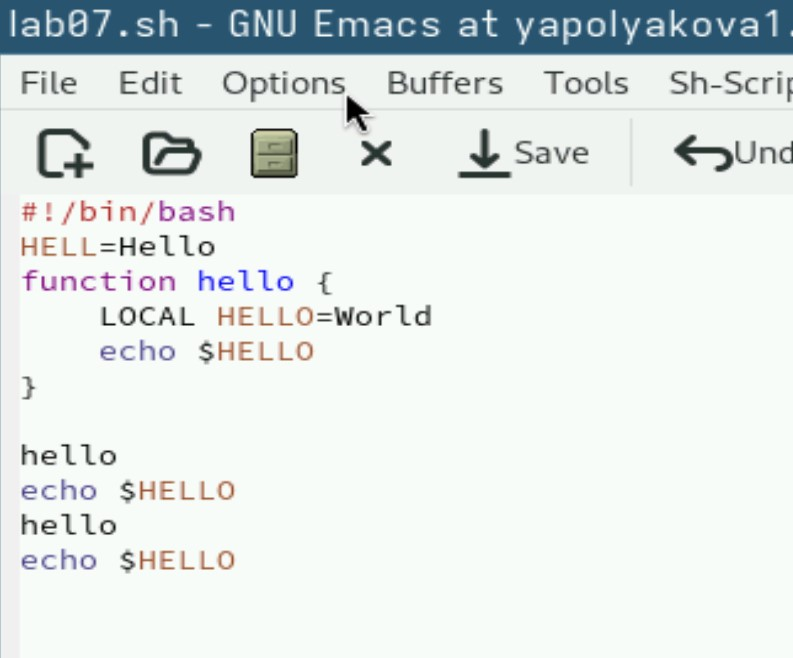{#fig:003 width=70%}

4. Учимся использовать команды по перемещению курсора. Перемещаем курсор в начало строки (C-a). Перемещаем курсор в конец строки (C-e). Перемещаем курсор в начало буфера (Alt-<). Перемещаем курсор в конец буфера (Alt->). (рис. [-@fig:004])

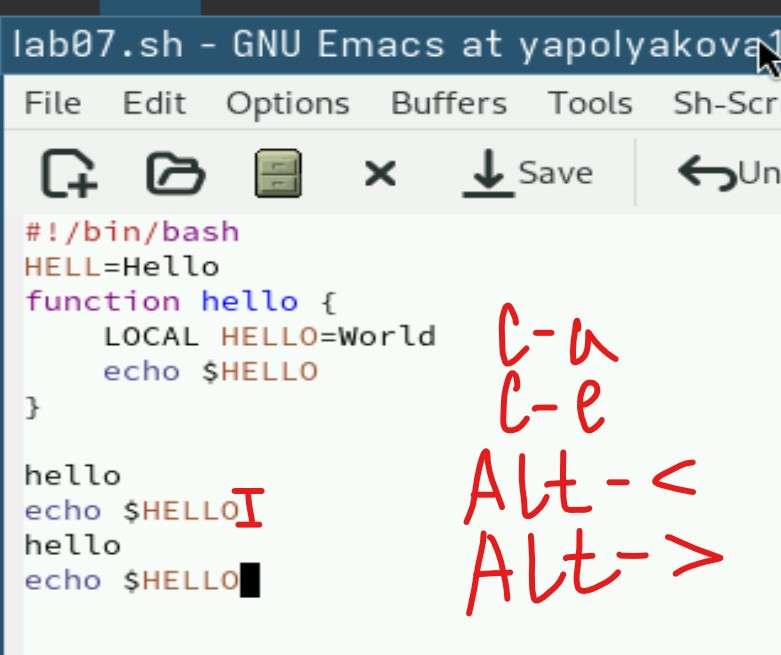{#fig:004 width=70%}

5. Выводим список активных буферов на экран (C-x C-b) (рис. [-@fig:005])

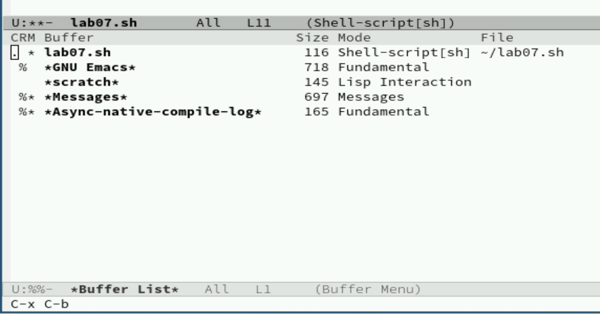{#fig:005 width=70%}

6. Перемещаемся во вновь открытое окно (C-x o) со списком открытых буферов (рис. [-@fig:006])

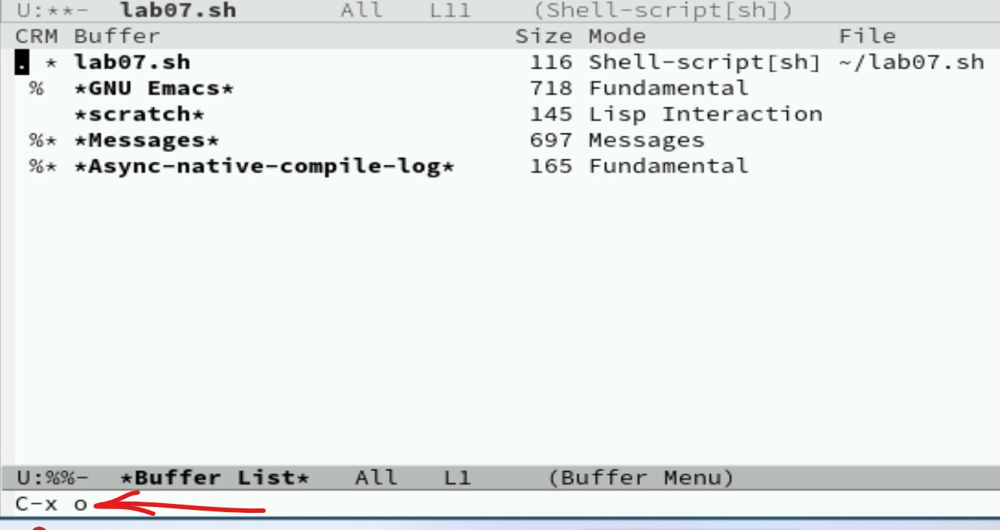{#fig:006 width=70%}

7. Переключаемся на другой буфер (C-x b) (рис. [-@fig:007])

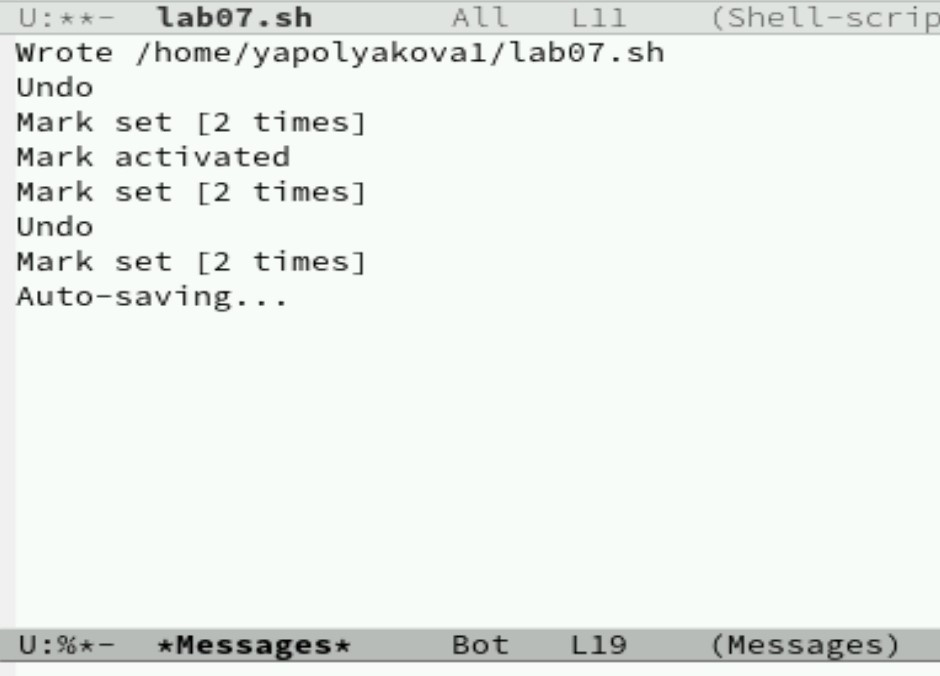{#fig:007 width=70%}

8. Закрываем это окно (C-x 0) (рис. [-@fig:008])

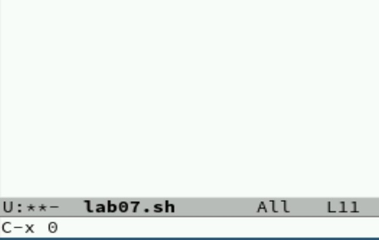{#fig:008 width=70%}

9. Переключаемся между буферами, но уже без вывода их списка на экран (C-x b). (рис. [-@fig:009])

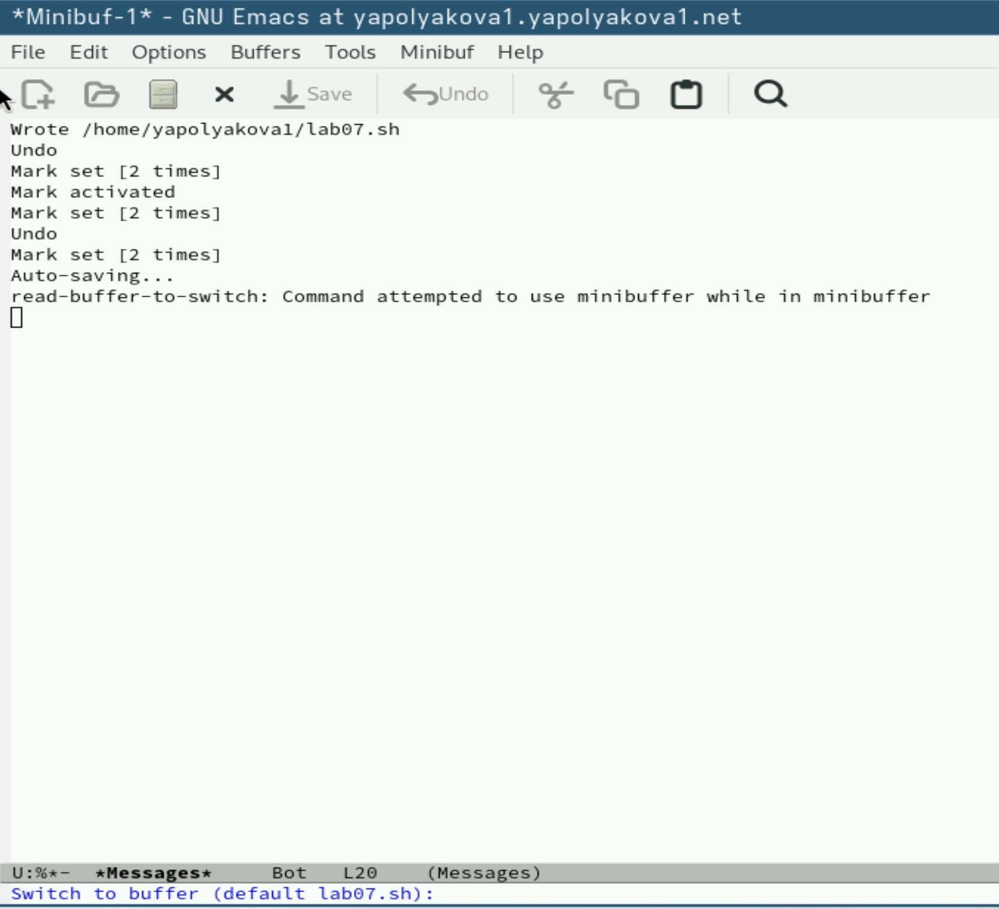{#fig:009 width=70%}

10. Делим фрейм на 4 части: делим на два окна по вертикали (C-x 3), а затем каждое из этих окон на две части по горизонтали (C-x 2) (переключаемся между окнами C-x o). В каждом из четырёх созданных окон открываем новый буфер (C-x C-f) и вводим несколько строк текста. (рис. [-@fig:010])

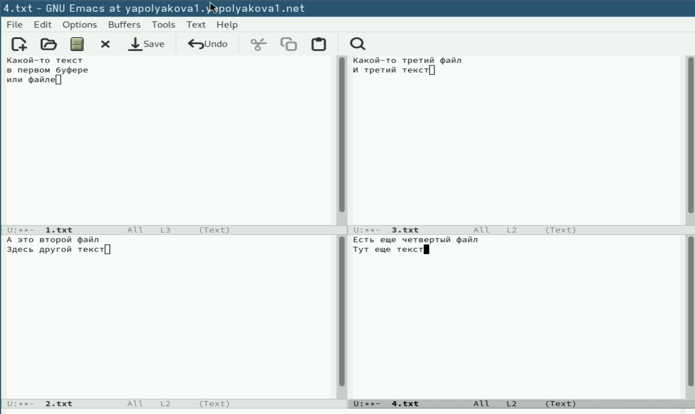{#fig:010 width=70%}

11. Переключаемся в режим поиска (C-s) и ищем несколько слов, присутствующих в тексте. (рис. [-@fig:011])

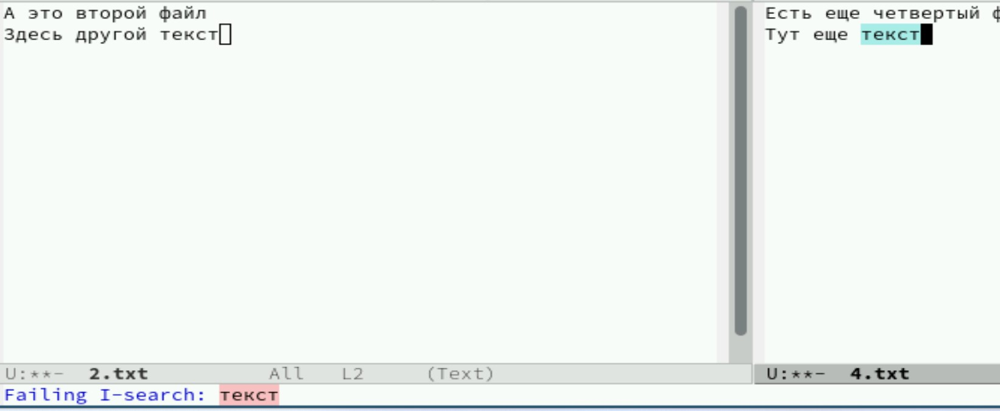{#fig:011 width=70%}

12. Переключаемся между результатами поиска, нажимая C-s. Выходим из режима поиска, нажав C-g (рис. [-@fig:012])

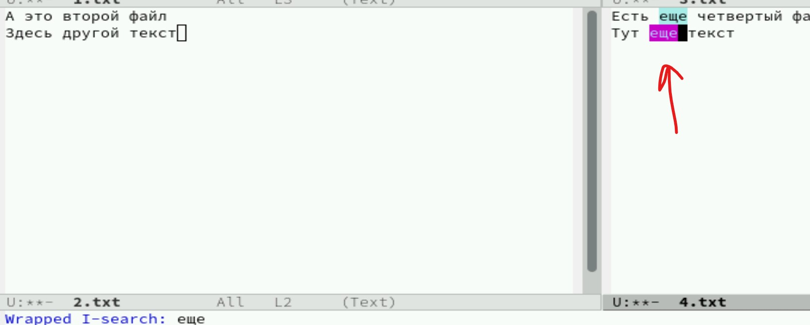{#fig:012 width=70%}

13. Заменяем "еще" на "ещё", используем режим поиска и замены (M-%), вводим текст, который следует найти и заменить, нажимаем Enter, затем вводим текст для замены. После того как будут подсвечены результаты поиска, нажимаем ! для подтверждения замены. (рис. [-@fig:013])

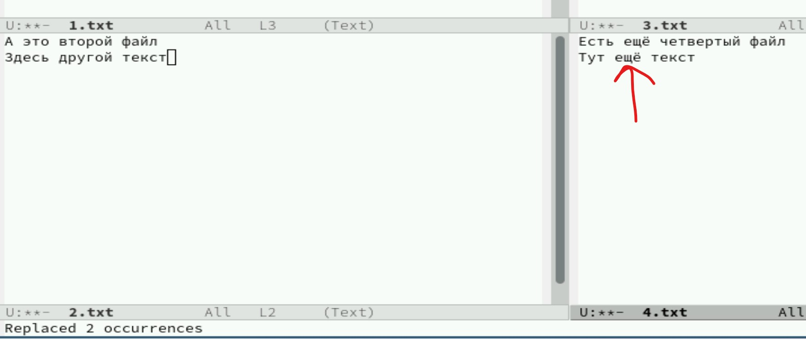{#fig:013 width=70%}

14. Пробуем другой режим поиска, нажав M-s o. Он отличается от предыдущих тем, что выводит результат поиска в отдельном окне. Он показывает кол-во совпадений, имя файла и место в файле (рис. [-@fig:014])

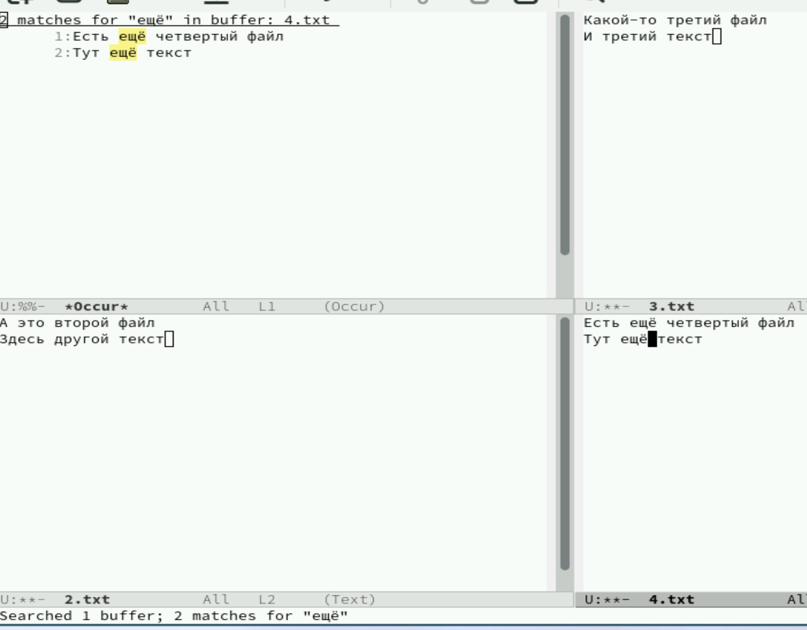{#fig:014 width=70%}

# Контрольные вопросы

1. Краткая характеристика Emacs

Emacs — мощный расширяемый текстовый редактор с открытым исходным кодом, известный своей гибкостью и возможностями кастомизации. Поддерживает широкий спектр функций от простого редактирования текста до сложных операций программирования, организации рабочего процесса и даже электронной почты.

2. Особенности сложности для новичков:

 * Многочисленные комбинации клавиш: основная функциональность требует запоминания множества сочетаний клавиш (C-x, C-s и др.).
 * Строгая структура команд: некоторые команды требуют точного набора символов.
 * Высокая степень настраиваемости: большое количество настроек и конфигураций делает начальное освоение непростой задачей.
 * Необходимость изучения базовых концептов, таких как буферы, окна, режимы.

3. Буфер и окно в терминологии Emacs'а:

Буфер — это контейнер для хранения содержимого документа (текста), независимо от отображаемого окна. Окно же представляет собой область экрана, в которой отображается содержимое одного или нескольких буферов одновременно. Один буфер может отображаться сразу в нескольких окнах, а одно окно может показывать разные участки одного буфера.

4. Можно ли открыть больше 10 буферов в одном окне?

Да, можно. Количество открытых буферов никак не ограничено количеством окон. Каждый буфер хранится отдельно, а окно лишь показывает определённый участок текущего активного буфера.

5. Какие буферы создаются по умолчанию при запуске Emacs?

При старте Emacs автоматически создаёт два основных буфера:

 * \*scratch\*: специальный буфер для временного ввода и тестирования выражений Elisp.
 * \*Messages\*: здесь выводятся информационные сообщения и предупреждения системы.

6. Комбинации клавиш:

Чтобы ввести последовательность C-c |, нажимаем сначала сочетание Ctrl+C, отпускаем, потом вводим символ вертикальной черты ("|"). Для последовательности C-c C-| выполняем аналогично, только вторую часть вводим удерживая Control и Shift: Ctrl+C → отпускаем → снова нажимаем Ctrl+Shift+"|".

7. Разделение окна на две части:

Используя команду C-x 2 разделяет активное окно горизонтально пополам. Команда C-x 3 делит окно вертикально на две части.

8. Файл конфигурации Emacs:

Настройки сохраняются в файле .emacs.d/init.el. Этот файл находится в домашнем каталоге пользователя и хранит всю необходимую конфигурацию и расширения.

9. Клавиша Escape (или Meta):

Клавиша Esc (Meta) используется для запуска различных команд Emacs. Её часто применяют совместно с другими клавишами для активации специализированных действий. Эту клавишу можно переназначить путём изменения соответствующего макроса в настройках файла init.el.

10. Удобство Emacs vs Vi/Vim:

Выбор между Emacs и Vim зависит от личных предпочтений и целей использования. Например, если важна высокая степень настройки и возможность автоматизации процессов разработки, Emacs станет лучшим выбором благодаря своей мощной экосистеме плагинов и встроенному языку сценариев (Elisp). Если важнее скорость навигации по тексту и минимальные усилия на обучение клавиатурных сокращений, то Vim может показаться предпочтительнее. Оба инструмента имеют сильные стороны, и выбор идеального решения индивидуален. Удобнее мне показался emacs, так как он наиболее приближен к привычным редакторам, например, к Блокноту или gedit.

# Вывод

Были получены практические навыки работы с редактором Emacs.
