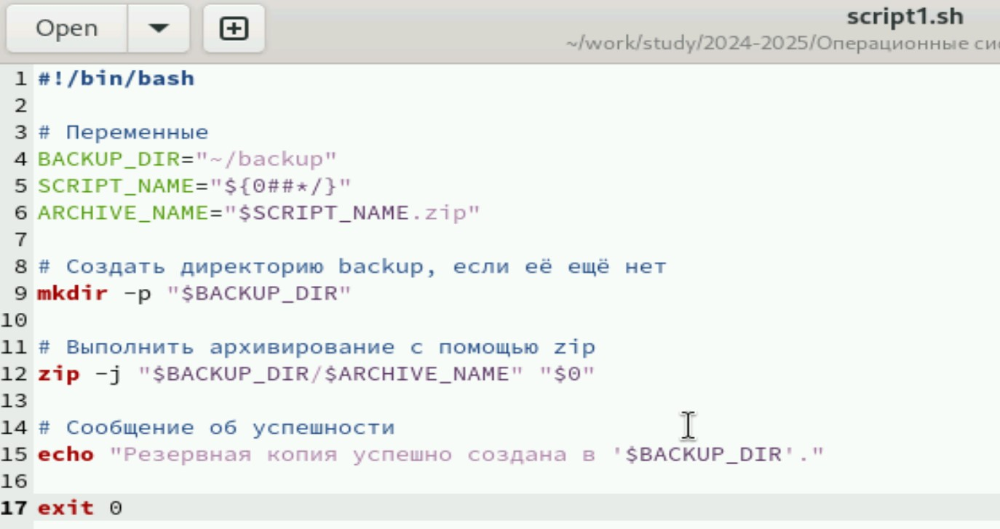
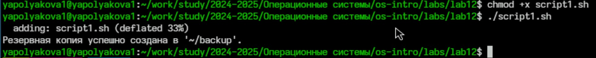
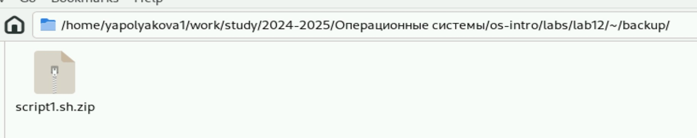
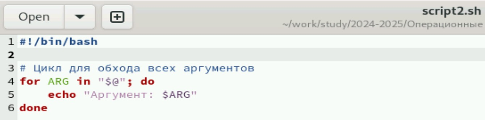
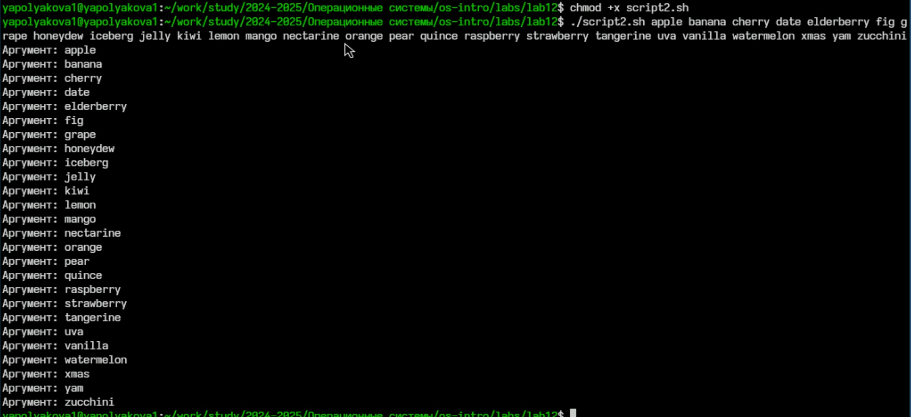
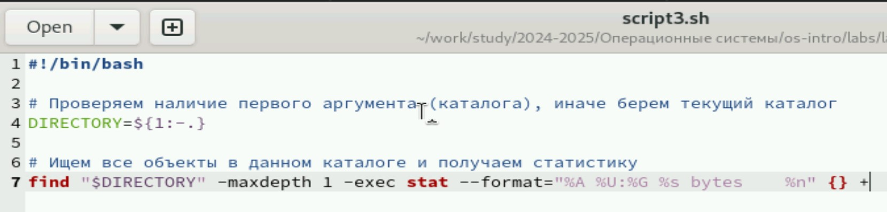
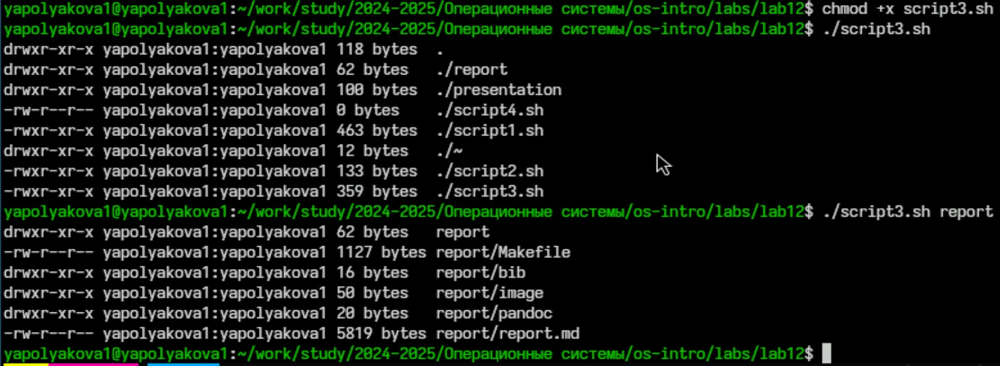
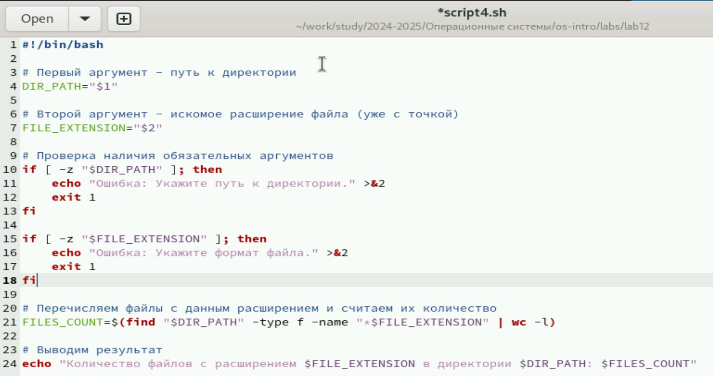
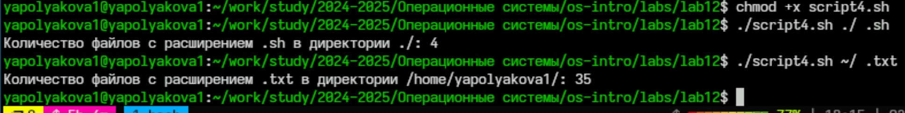

---
## Front matter
lang: ru-RU
title: Лабораторная работа №12
subtitle: Программирование в командном процессоре ОС UNIX. Командные файлы
author:
  - Полякова Ю.А.
institute:
  - Российский университет дружбы народов, Москва, Россия
  - Преподаватель Кулябов Д. С., д.ф.\-м.н., профессор
date: 28 февраля 2007

## i18n babel
babel-lang: russian
babel-otherlangs: english

## Formatting pdf
toc: false
toc-title: Содержание
slide_level: 2
aspectratio: 169
section-titles: true
theme: metropolis
header-includes:
 - \metroset{progressbar=frametitle,sectionpage=progressbar,numbering=fraction}
---

# Информация

## Докладчик

:::::::::::::: {.columns align=center}
::: {.column width="70%"}

  * Полякова Юлия Александровна
  * Студент
  * Российский университет дружбы народов
  * [yulya.polyakova.07@mail.ru](mailto:yulya.polyakova.07@mail.ru)
  * <https://github.com/JuliaMaffin123>

:::
::: {.column width="30%"}


:::
::::::::::::::

# Вводная часть

## Актуальность

- Умение работать с командными файлами важно для понимания системы и будет полезно в будущем

## Объект и предмет исследования

- командный процессор ОС UNIX. Командные файлы

## Цели и задачи

- Цель: Изучить основы программирования в оболочке ОС UNIX/Linux. Научиться писать небольшие командные файлы.
- Задачи:
	- Ознакомиться с теоретическим материалом.
	- Написать 4 командных файла по заданию.
	- Ответить на контрольные вопросы.

## Материалы и методы

- редактор gedit
- терминал
- командные файлы

# Выполнение лабораторной работы

## Листинг script1.sh

Для начала командой touch создаем 4 файла с расширением .sh Рассмотрим первый скрипт. При запуске будет делает резервную копию самого себя (то есть файла, в котором содержится его исходный код) в другую директорию backup. Архивируется архиватором zip.

{#fig:001 width=55%}

## Запуск script1.sh

Чтобы запустить файл нужно дать ему доступ на исполняемость. Как видно по сообщению, резервная копия успешно создалась.

{#fig:002 width=80%}

## Архив в backup

Файл сархивировался в этот каталог.

{#fig:003 width=70%}

## Листинг script2.sh

Рассмотрим второй скрипт. Обрабатывает любое произвольное число аргументов командной строки, в том числе превышающее десять. Последовательно распечатывает значения всех переданных аргументов в цикле

{#fig:004 width=70%}

## Запуск script2.sh

Даем доступ на исполняемость и запускаем с большим кол-вом аргументов

{#fig:005 width=60%}

## Листинг script3.sh

Рассмотрим третий скрипт. Это командный файл — аналог команды ls (без использования самой этой команды и команды dir). Выдает информацию о нужном каталоге и выводит информацию о возможностях доступа к файлам этого каталога

{#fig:006 width=70%}

## Запуск script3.sh

Даем доступ к исполнению. Если не указать аргумент, то выведутся данные текущего каталога, если указать, то указанного

{#fig:007 width=70%}

## Листинг script4.sh

Рассмотрим четвертый скрипт. Командный файл, получает в качестве аргумента командной строки формат файла (.txt, .doc, .jpg, .pdf и т.д., но сразу с точкой) и путь к директории, вычисляет количество таких файлов. Также я решила добавить проверку наличия аргументов.

{#fig:008 width=52%}

## Запуск script4.sh

Даем возможность исполнения, запускаем с различными форматами и каталогами.

{#fig:009 width=80%}

# Контрольные вопросы

## Контрольные вопросы

1. Объясните понятие командной оболочки. Приведите примеры командных оболочек. Чем они отличаются?

Командный процессор (командная оболочка, интерпретатор команд shell) — это программа, позволяющая пользователю взаимодействовать с операционной системой компьютера. 

* оболочка Борна (Bourne shell или sh) — стандартная командная оболочка UNIX/Linux, содержащая базовый, но полный набор функций;
* С-оболочка (или csh) — надстройка на оболочкой Борна, использующая С-подобный синтаксис команд с возможностью сохранения истории выполнения команд;
* оболочка Корна (или ksh) — напоминает оболочку С, но операторы управления программой совместимы с операторами оболочки Борна;
* BASH — сокращение от Bourne Again Shell (опять оболочка Борна), совмещает свойства оболочек С и Корна (разработка компании Free Software Foundation).

## Контрольные вопросы

Основные отличия:

* Синтаксис и особенности: Каждая оболочка имеет уникальный набор возможностей и особенностей, такие как поддержка встроенных функций, автозавершение команд, управление историей команд и другие.
* Совместимость: Некоторые оболочки строго следуют стандартам POSIX, тогда как другие добавляют собственные расширения.
* Производительность: Различные оболочки могут иметь разную производительность при выполнении определённых операций

## Контрольные вопросы

2. Что такое POSIX?

POSIX (Portable Operating System Interface for Computer Environments) — набор стандартов описания интерфейсов взаимодействия операционной системы и прикладных программ. Стандарты POSIX разработаны комитетом IEEE (Institute of Electrical and Electronics Engineers) для обеспечения совместимости различных UNIX/Linux-подобных операционных систем и переносимости прикладных программ на уровне исходного кода. POSIX-совместимые оболочки разработаны на базе оболочки Корна.

## Контрольные вопросы

3. Как определяются переменные и массивы в языке программирования bash?

* Переменная определяется следующим образом: variable=value
* Массив объявляется следующим образом: array=(value1 value2 ...)
* Доступ к элементам массива осуществляется через индекс: echo ${array\[index\]}

## Контрольные вопросы

4. Каково назначение операторов let и read?

Оператор let используется для вычисления выражений и присваивания результата переменной:

let variable=expression или (( variable = expression ))

Оператор read предназначен для чтения строки из стандартного ввода и сохранения её в переменную: read variable

## Контрольные вопросы

5. Какие арифметические операции можно применять в языке программирования bash?

* сложение (+)
* вычитание (-)
* умножение (*)
* деление (/)
* остаток от деления (%)
* возведение в степень (**)

Пример: result=$((a + b))

## Контрольные вопросы

6. Что означает операция (( ))?

Операция (( )) позволяет выполнять арифметическое выражение внутри скобок и автоматически возвращает результат.

Например: (( result = a * b ))

Это эквивалентно использованию оператора let, но удобнее и нагляднее.

## Контрольные вопросы

7. Какие стандартные имена переменных Вам известны?

* $HOME: домашний каталог текущего пользователя.
* $PATH: список путей для поиска исполняемых файлов.
* $USER: имя текущего пользователя.
* $SHELL: используемая командная оболочка.
* $PWD: текущий рабочий каталог.
* $PS1: строка приглашения.

## Контрольные вопросы

8. Что такое метасимволы?

Метасимволы — это символы, имеющие специальное значение в командной строке. Они используются для обозначения шаблонов имен файлов, перенаправлений ввода-вывода и специальных действий. Примеры метасимволов:

* \*
* ?
* \[ \]
* \< \> | & ;

## Контрольные вопросы

9. Как экранировать метасимволы?

Экранирование выполняется с использованием обратного слэша (\) или двойных кавычек ("). Пример:

ls file\\* # выводит все файлы начинающиеся с 'file'

## Контрольные вопросы

10. Как создавать и запускать командные файлы?

Сначала нужно создать файл с расширением .sh, затем добавить код и сделать файл исполняемым:

chmod +x script.sh

Чтобы запустить из текущего каталога: ./script.sh, если в другом, то полный путь.

## Контрольные вопросы

11. Как определяются функции в языке программирования bash?

```make
function_name() {
   commands
}
```

Пример:

```make
hello_world() {
   echo "Hello World!"
}
```

## Контрольные вопросы

12. Каким образом можно выяснить, является файл каталогом или обычным файлом?

Использовать команду test или оператор \[\[ \]\]. Например:

```make
if [[ -d "$filename" ]]; then
   echo "Файл является каталогом"
fi
```

## Контрольные вопросы

13. Каково назначение команд set, typeset и unset?

* Команда set устанавливает значения глобальных переменных окружения.
* Команда typeset (аналогична declare) создаёт локальные переменные и задаёт атрибуты переменным.
* Команда unset удаляет переменные или функции.

## Контрольные вопросы

14. Как передаются параметры в командные файлы?

Параметры передаются следующим образом:

./script.sh arg1 arg2 ...

Доступ к параметрам осуществляется через позиционные переменные: $1, $2, ..., $n

## Контрольные вопросы

15. Назовите специальные переменные языка bash и их назначение.

* $#: количество аргументов.
* $@: аргументы команды как отдельные элементы.
* $*: аргументы команды как одна строка.
* $$: PID процесса оболочки.
* $!: PID последнего запущенного фона.
* $?: статус завершения последней выполненной команды.

## Вывод

Были изучены основы программирования в оболочке ОС UNIX/Linux. Также мы научились писать небольшие командные файлы.
