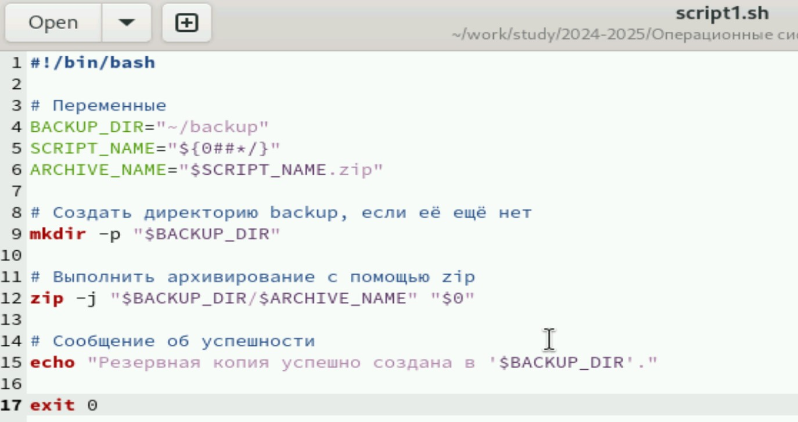
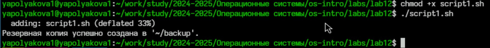
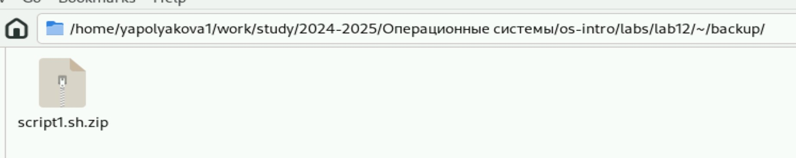
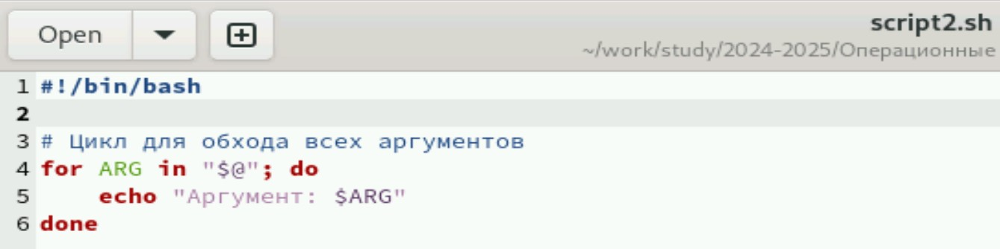
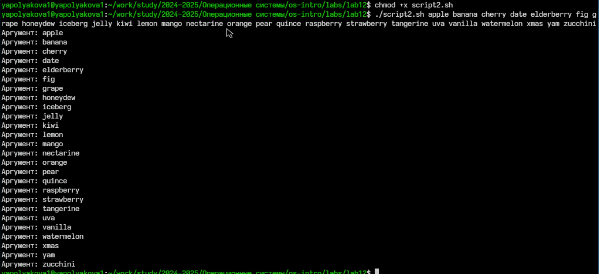
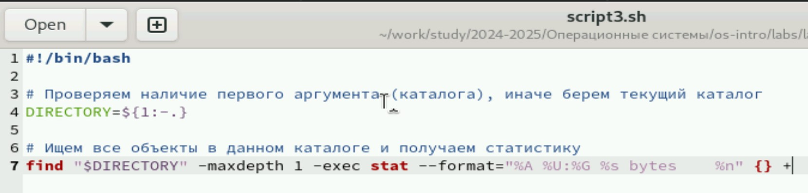
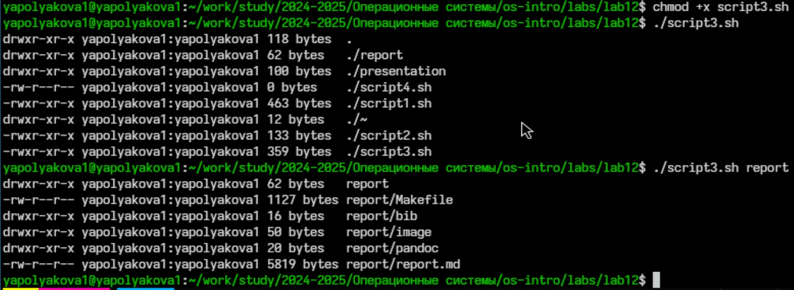
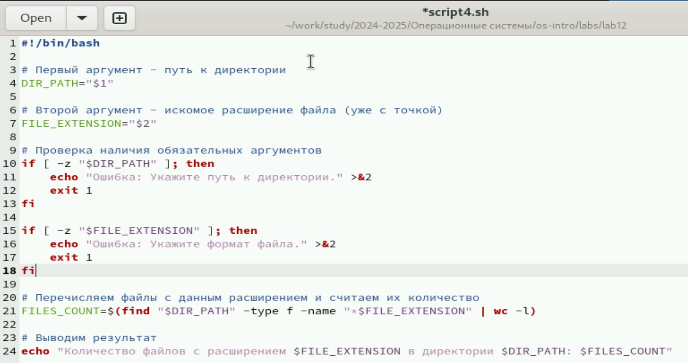
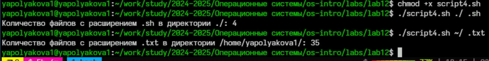

---
## Front matter
title: "Лабораторная работа №12"
subtitle: "Программирование в командном процессоре ОС UNIX. Командные файлы"
author: "Полякова Юлия Александровна"

## Generic otions
lang: ru-RU
toc-title: "Содержание"

## Bibliography
bibliography: bib/cite.bib
csl: pandoc/csl/gost-r-7-0-5-2008-numeric.csl

## Pdf output format
toc: true # Table of contents
toc-depth: 2
lof: true # List of figures
lot: true # List of tables
fontsize: 12pt
linestretch: 1.5
papersize: a4
documentclass: scrreprt
## I18n polyglossia
polyglossia-lang:
  name: russian
  options:
	- spelling=modern
	- babelshorthands=true
polyglossia-otherlangs:
  name: english
## I18n babel
babel-lang: russian
babel-otherlangs: english
## Fonts
mainfont: IBM Plex Serif
romanfont: IBM Plex Serif
sansfont: IBM Plex Sans
monofont: IBM Plex Mono
mathfont: STIX Two Math
mainfontoptions: Ligatures=Common,Ligatures=TeX,Scale=0.94
romanfontoptions: Ligatures=Common,Ligatures=TeX,Scale=0.94
sansfontoptions: Ligatures=Common,Ligatures=TeX,Scale=MatchLowercase,Scale=0.94
monofontoptions: Scale=MatchLowercase,Scale=0.94,FakeStretch=0.9
mathfontoptions:
## Biblatex
biblatex: true
biblio-style: "gost-numeric"
biblatexoptions:
  - parentracker=true
  - backend=biber
  - hyperref=auto
  - language=auto
  - autolang=other*
  - citestyle=gost-numeric
## Pandoc-crossref LaTeX customization
figureTitle: "Рис."
tableTitle: "Таблица"
listingTitle: "Листинг"
lofTitle: "Список иллюстраций"
lotTitle: "Список таблиц"
lolTitle: "Листинги"
## Misc options
indent: true
header-includes:
  - \usepackage{indentfirst}
  - \usepackage{float} # keep figures where there are in the text
  - \floatplacement{figure}{H} # keep figures where there are in the text
---

# Цель работы

Изучить основы программирования в оболочке ОС UNIX/Linux. Научиться писать небольшие командные файлы.

# Задание

1. Ознакомиться с теоретическим материалом.
2. Написать 4 командных файла по заданию.
4. Ответить на контрольные вопросы.

# Выполнение лабораторной работы

1. Для начала командой touch создаем 4 файла с расширением .sh Рассмотрим первый скрипт. При запуске будет делает резервную копию самого себя (то есть файла, в котором содержится его исходный код) в другую директорию backup. Архивируется архиватором zip. (рис. [-@fig:001]).

{#fig:001 width=70%}

2. Чтобы запустить файл нужно дать ему доступ на исполняемость. Как видно по сообщению, резервная копия успешно создалась. (рис. [-@fig:002])

{#fig:002 width=70%}

3. Файл сархивировался в этот каталог. (рис. [-@fig:003])

{#fig:003 width=70%}

4. Рассмотрим второй скрипт. Обрабатывает любое произвольное число аргументов командной строки, в том числе превышающее десять. Последовательно распечатывает значения всех переданных аргументов в цикле (рис. [-@fig:004])

{#fig:004 width=70%}

5. Даем доступ на исполняемость и запускаем с большим кол-вом аргументов (рис. [-@fig:005])

{#fig:005 width=70%}

6. Рассмотрим третий скрипт. Это командный файл — аналог команды ls (без использования самой этой команды и команды dir). Выдает информацию о нужном каталоге и выводит информацию о возможностях доступа к файлам этого каталога (рис. [-@fig:006])

{#fig:006 width=70%}

7. Даем доступ к исполнению. Если не указать аргумент, то выведутся данные текущего каталога, если указать, то указанного (рис. [-@fig:007])

{#fig:007 width=70%}

8. Рассмотрим четвертый скрипт. Командный файл, который получает в качестве аргумента командной строки формат файла (.txt, .doc, .jpg, .pdf и т.д., но сразу с точкой) и вычисляет количество таких файлов в указанной директории. Путь к директории также передаётся в виде аргумента командной строки. Также я решила добавить проверку на наличие аргументов. (рис. [-@fig:008])

{#fig:008 width=70%}

9. Даем возможность исполнения, запускаем с различными форматами и каталогами. (рис. [-@fig:009])

{#fig:009 width=70%}

# Контрольные вопросы

1. Объясните понятие командной оболочки. Приведите примеры командных оболочек. Чем они отличаются?

Командный процессор (командная оболочка, интерпретатор команд shell) — это программа, позволяющая пользователю взаимодействовать с операционной системой компьютера. В операционных системах типа UNIX/Linux наиболее часто используются следующие реализации командных оболочек:

* оболочка Борна (Bourne shell или sh) — стандартная командная оболочка UNIX/Linux, содержащая базовый, но при этом полный набор функций;
* С-оболочка (или csh) — надстройка на оболочкой Борна, использующая С-подобный синтаксис команд с возможностью сохранения истории выполнения команд;
* оболочка Корна (или ksh) — напоминает оболочку С, но операторы управления программой совместимы с операторами оболочки Борна;
* BASH — сокращение от Bourne Again Shell (опять оболочка Борна), в основе своей совмещает свойства оболочек С и Корна (разработка компании Free Software Foundation).

Основные отличия:

* Синтаксис и особенности: Каждая оболочка имеет уникальный набор возможностей и особенностей, такие как поддержка встроенных функций, автозавершение команд, управление историей команд и другие.
* Совместимость: Некоторые оболочки строго следуют стандартам POSIX, тогда как другие добавляют собственные расширения.
* Производительность: Различные оболочки могут иметь разную производительность при выполнении определённых операций

2. Что такое POSIX?

POSIX (Portable Operating System Interface for Computer Environments) — набор стандартов описания интерфейсов взаимодействия операционной системы и прикладных программ. Стандарты POSIX разработаны комитетом IEEE (Institute of Electrical and Electronics Engineers) для обеспечения совместимости различных UNIX/Linux-подобных операционных систем и переносимости прикладных программ на уровне исходного кода. POSIX-совместимые оболочки разработаны на базе оболочки Корна.

3. Как определяются переменные и массивы в языке программирования bash?

* Переменная определяется следующим образом: variable=value
* Массив объявляется следующим образом: array=(value1 value2 ...)
* Доступ к элементам массива осуществляется через индекс: echo ${array\[index\]}

4. Каково назначение операторов let и read?

Оператор let используется для вычисления выражений и присваивания результата переменной:

let variable=expression или (( variable = expression ))

Оператор read предназначен для чтения строки из стандартного ввода и сохранения её в переменную: read variable

5. Какие арифметические операции можно применять в языке программирования bash?

* сложение (+)
* вычитание (-)
* умножение (*)
* деление (/)
* остаток от деления (%)
* возведение в степень (**)

Пример: result=$((a + b))

6. Что означает операция (( ))?

Операция (( )) позволяет выполнять арифметическое выражение внутри скобок и автоматически возвращает результат.

Например: (( result = a * b ))

Это эквивалентно использованию оператора let, но удобнее и нагляднее.

7. Какие стандартные имена переменных Вам известны?

* $HOME: домашний каталог текущего пользователя.
* $PATH: список путей для поиска исполняемых файлов.
* $USER: имя текущего пользователя.
* $SHELL: используемая командная оболочка.
* $PWD: текущий рабочий каталог.
* $PS1: строка приглашения.

8. Что такое метасимволы?

Метасимволы — это символы, имеющие специальное значение в командной строке. Они используются для обозначения шаблонов имен файлов, перенаправлений ввода-вывода и специальных действий. Примеры метасимволов:

* \*
* ?
* \[ \]
* \< \> | & ;

9. Как экранировать метасимволы?

Экранирование выполняется с использованием обратного слэша (\) или двойных кавычек ("). Пример:

ls file\\* # выводит все файлы начинающиеся с 'file'

10. Как создавать и запускать командные файлы?

Сначала нужно создать файл с расширением .sh, затем добавить код и сделать файл исполняемым:

chmod +x script.sh

Чтобы запустить из текущего каталога: ./script.sh, если в другом, то полный путь.

11. Как определяются функции в языке программирования bash?

```make
function_name() {
   commands
}
```

Пример:

```make
hello_world() {
   echo "Hello World!"
}
```

12. Каким образом можно выяснить, является файл каталогом или обычным файлом?

Использовать команду test или оператор \[\[ \]\]. Например:

```make
if [[ -d "$filename" ]]; then
   echo "Файл является каталогом"
fi
```

13. Каково назначение команд set, typeset и unset?

* Команда set устанавливает значения глобальных переменных окружения.
* Команда typeset (аналогична declare) создаёт локальные переменные и задаёт атрибуты переменным.
* Команда unset удаляет переменные или функции.

14. Как передаются параметры в командные файлы?

Параметры передаются следующим образом:

./script.sh arg1 arg2 ...

Доступ к параметрам осуществляется через позиционные переменные: $1, $2, ..., $n

15. Назовите специальные переменные языка bash и их назначение.

* $#: количество аргументов.
* $@: аргументы команды как отдельные элементы.
* $*: аргументы команды как одна строка.
* $$: PID процесса оболочки.
* $!: PID последнего запущенного фона.
* $?: статус завершения последней выполненной команды.

# Вывод

Были изучены основы программирования в оболочке ОС UNIX/Linux. Также мы научились писать небольшие командные файлы.
