---
## Front matter
lang: ru-RU
title: Лабораторная работа №13
subtitle: Программирование в командном процессоре ОС UNIX. Ветвления и циклы
author:
  - Полякова Ю.А.
institute:
  - Российский университет дружбы народов, Москва, Россия
  - Преподаватель Кулябов Д. С., д.ф.\-м.н., профессор
date: 28 февраля 2007

## i18n babel
babel-lang: russian
babel-otherlangs: english

## Formatting pdf
toc: false
toc-title: Содержание
slide_level: 2
aspectratio: 169
section-titles: true
theme: metropolis
header-includes:
 - \metroset{progressbar=frametitle,sectionpage=progressbar,numbering=fraction}
---

# Информация

## Докладчик

:::::::::::::: {.columns align=center}
::: {.column width="70%"}

  * Полякова Юлия Александровна
  * Студент
  * Российский университет дружбы народов
  * [yulya.polyakova.07@mail.ru](mailto:yulya.polyakova.07@mail.ru)
  * <https://github.com/JuliaMaffin123>

:::
::: {.column width="30%"}


:::
::::::::::::::

# Вводная часть

## Актуальность

- Умение работать с командными файлами важно для понимания системы и будет полезно в будущем

## Объект и предмет исследования

- командный процессор ОС UNIX. Командные файлы

## Цели и задачи

- Цель: Изучить основы программирования в оболочке ОС UNIX. Научится писать более сложные командные файлы с использованием логических управляющих конструкций и циклов.
- Задачи:
	- Ознакомиться с теоретическим материалом.
	- Написать 4 командных файла по заданию.
	- Ответить на контрольные вопросы.

## Материалы и методы

- редактор gedit
- терминал
- командные файлы

# Выполнение лабораторной работы

## Листинг script1.sh

Рассмотрим первый скрипт, который анализирует командную строку с ключами и ищет строки по ключу -p, ключи: -iinputfile — прочитать из указанного файла; -ooutputfile — вывести в указанный файл; -pшаблон — шаблон для поиска; -C — различать большие и малые буквы; -n — выдавать номера строк. 

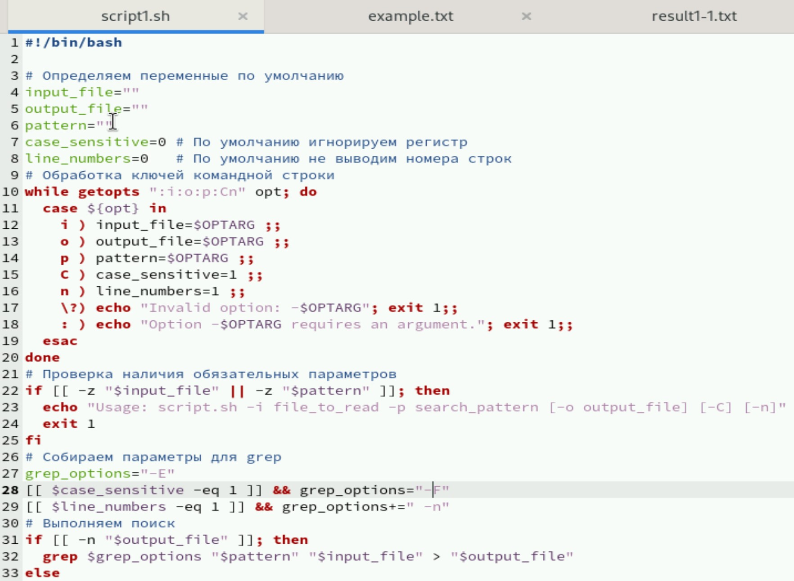{#fig:001 width=40%}

## Запуск script1.sh

Открываем доступ к файлу и запускаем. В начале мы запустили поиск "hello" в файле "example.txt" без учета регистра и номеров строк в файл result1-1.txt А затем проверили учет больших букв и номера строк и вывели результат сначала в терминал, а потом в result1-2.txt 

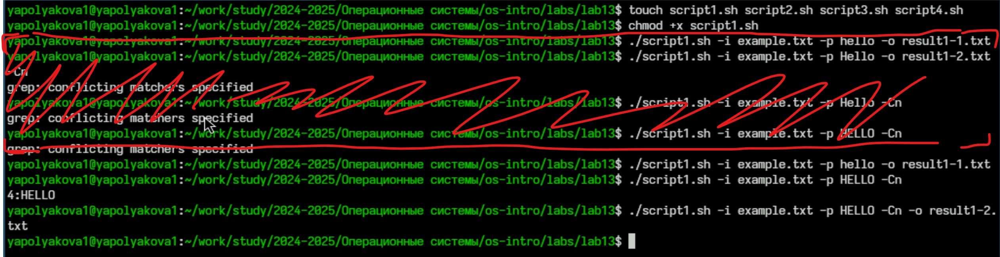{#fig:002 width=75%}

## example.txt

Файл example.txt

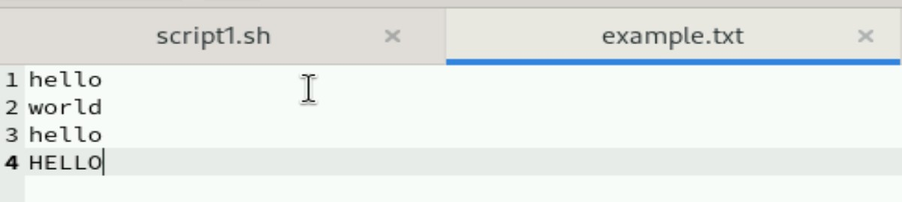{#fig:003 width=70%}

## result1-1.txt

Файл result1-1.txt

{#fig:004 width=70%}

## result1-2.txt

Файл result1-2.txt

{#fig:005 width=80%}

## Листинг check_number.c

Рассмотрим второе задание. Сначала надо было "Написать на языке Си программу, которая вводит число и определяет, является ли оно больше нуля, меньше нуля или равно нулю. Затем программа завершается с помощью функции exit(n), передавая информацию в о коде завершения в оболочку." На фото листинг

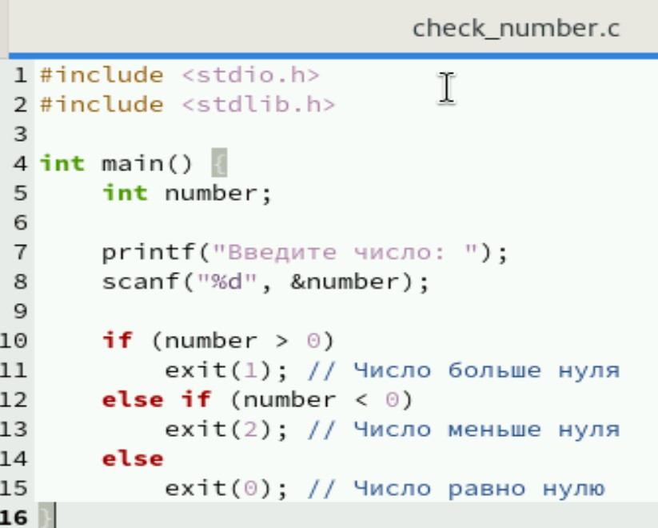{#fig:006 width=38%}

## Листинг script2.sh

Теперь рассмотрим сам командный файл. Задание:  Командный файл должен вызывать эту программу и, проанализировав с помощью команды $?, выдать сообщение о том, какое число было введено.

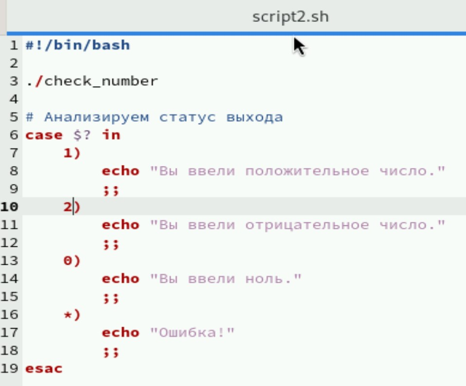{#fig:007 width=40%}

## Запуск script2.sh

Компилируем C-файл с помощью gcc, открываем доступ к командному файлу и запускаем. Тестируем с разными числами

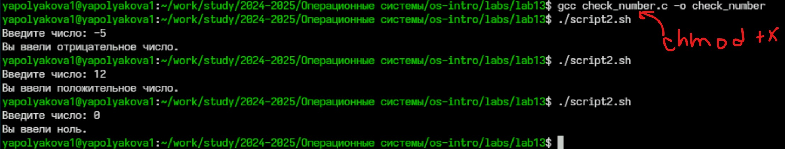{#fig:008 width=80%}

## Листинг script3.sh - часть 1

Рассмотрим третий скрипт. Задание: Написать командный файл, создающий указанное число файлов, пронумерованных последовательно от 1 до N (например 1.tmp, 2.tmp, 3.tmp и т.д.). Число файлов, которые необходимо создать, передаётся в аргументы командной строки. Этот же командный файл должен уметь удалять все созданные им файлы (если они существуют).

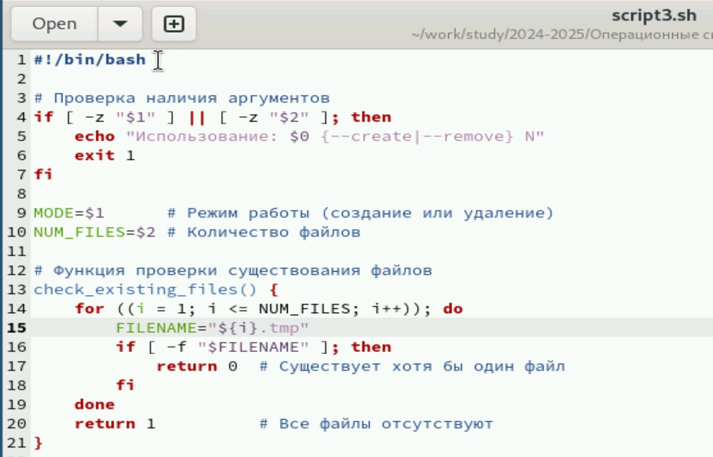{#fig:009 width=40%}

## Листинг script3.sh - часть 2

Основная часть кода script3.sh, работа с режимами

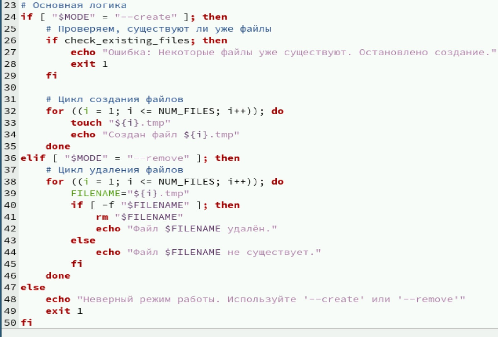{#fig:010 width=40%}

## Запуск script3.sh

Открываем доступ к исполнению, тестируем на создании и удалении 3-х файлов

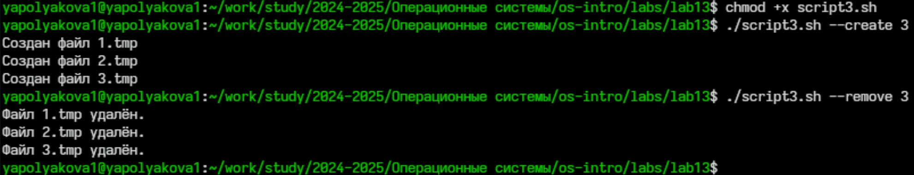{#fig:011 width=70%}

## Листинг script4.sh - часть 1

Рассмотрим 4-ый командный файл. Задание: Файл, который командой tar запаковывает в архив все файлы в указанной директории. Модифицировать, чтобы запаковывались только те файлы, которые были изменены менее недели назад (использовать find).

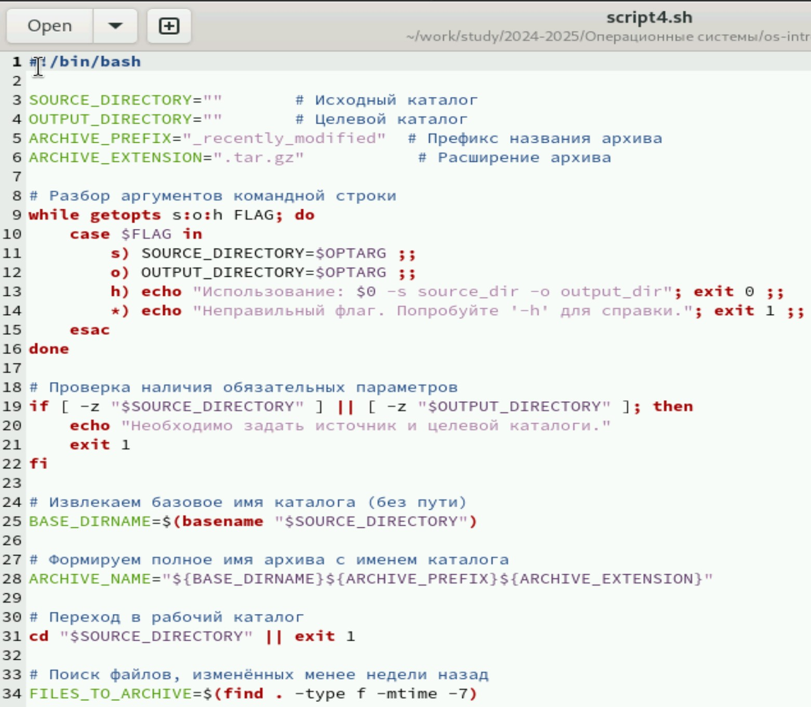{#fig:012 width=35%}

## Листинг script4.sh - часть 2

Конец скрипта с архивацией

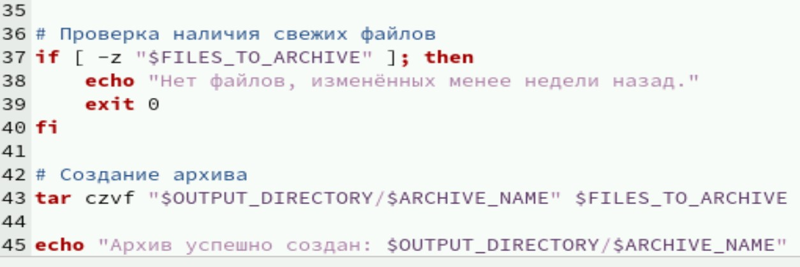{#fig:013 width=70%}

## Запуск script4.sh

Открываем доступ к исполнению, запускаем, архивируем файлы этой лабораторной работы

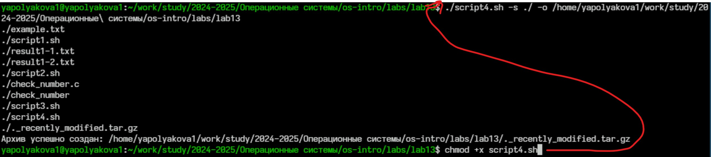{#fig:014 width=80%}

## Архив

Архив действительно создался

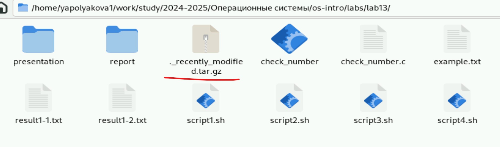{#fig:015 width=70%}

# Контрольные вопросы

## Контрольные вопросы

1. Каково предназначение команды getopts?

Команда `getopts` предназначена для удобной обработки аргументов командной строки в сценариях оболочки (shell scripts). Она помогает разбивать переданные аргументы на отдельные элементы и проверять правильность передачи флагов и значений. Обычно применяется совместно с циклом `while`, что позволяет автоматизировать обработку сложных комбинаций параметров, обеспечивая безопасность и ясность синтаксиса.

## Контрольные вопросы

Пример использования:

```bash
while getopts ab:c OPT; do
    case $OPT in
        a) echo "Опция A была указана";;
        b) echo "Опция B имеет значение: $OPTARG";;
        c) echo "Опция C указана";;
        ?) echo "Неправильно использован флаг";;
    esac
done
```

## Контрольные вопросы

2. Какое отношение метасимволы имеют к генерации имён файлов?

Метасимволы (такие как звездочка `*`, знак вопроса `?`, квадратные скобки `[]`) играют важную роль в построении масок для поиска и подбора файлов в операционной системе. Они позволяют удобно находить группы файлов по общим признакам.

Примеры:

- Маска `*.txt` выберет все файлы с расширением `.txt`.
- Маска `file?.dat` подберёт файлы с названием длиной в четыре символа, начинающиеся с `file` и оканчивающиеся на `.dat`.

Эти маски часто применяются в командах типа `ls`, `rm`, `cp`, что значительно ускоряет выбор файлов.

## Контрольные вопросы

3. Какие операторы управления действиями вы знаете?

Операторы управления помогают контролировать поток выполнения инструкций в сценарии оболочки. Основные операторы включают:

- **if** — оператор условного ветвления, позволяющий исполнять блок кода только при выполнении какого-либо условия.
- **case** — оператор множественного выбора, похожий на switch-case в языках программирования.
- **for**, **while**, **until** — операторы организации циклов.
- **break**, **continue** — операторы изменения хода выполнения цикла.
- **&&** (логическое AND) и **||** (логическое OR) — используются для объединения нескольких условий или команд.

## Контрольные вопросы

4. Какие операторы используются для прерывания цикла?

Для остановки цикла используются два оператора:

- **break** — немедленно выходит из ближайшего охватывающего цикла (`for`, `while`, `until`).
- **continue** — пропускает оставшуюся часть итерации и переходит сразу к следующей итерации цикла.

Пример использования операторов:

```bash
for i in $(seq 1 10); do
    if [ $i -gt 5 ]; then break; fi
    echo $i
done
```

## Контрольные вопросы

5. Для чего нужны команды false и true?

Командами `false` и `true` являются стандартные команды оболочки, используемые для простых тестов условий. Их назначение следующее:

- **false** — всегда возвращает ненулевой код завершения (обычно 1), обозначая ошибку или ложное условие.
- **true** — всегда возвращает нулевой код завершения (0), обозначая успешное завершение или истинное условие.

## Контрольные вопросы

Они полезны в случаях, когда необходимо организовать простую проверку или задать заведомо известное условие.

Пример использования:

```bash
if true; then
    echo "Это всегда правда"
fi
```

## Контрольные вопросы

6. Что означает строка if test -f man$s/$i.$s, встреченная в командном файле?

Эта строка представляет собой проверку существования файла с определенным форматом. Рассмотрим подробнее:

- `test -f filename` — проверяет, существует ли файл и является ли он обычным файлом (не каталогом, символьной ссылкой и т.п.).
- `man$s/$i.$s` — выражение, генерирующее динамическое имя файла. Здесь:
  - `$s` — вероятно, какая-то переменная, заменяющая расширение или категорию файла.
  - `$i` — возможно, индекс или порядковый номер файла.

Таким образом, данная конструкция проверяет, существует ли конкретный файл с определенной структурой имени.

## Контрольные вопросы

7. Объясните различия между конструкциями while и until.

Конструкция `while`: цикл выполняется, пока условие истинно. Иначе говоря, цикл выполняется снова и снова, пока условие возвращает успех (нулевой код завершения).

Конструкция `until`: цикл выполняется, пока условие ложно. Таким образом, цикл выполняется повторно, пока условие возвращает неудачу (ненулевой код завершения).

## Вывод

Были изучены основы программирования в оболочке ОС UNIX. Мы научились писать более сложные командные файлы с использованием логических управляющих конструкций и циклов.
