---
## Front matter
title: "Лабораторная работа №13"
subtitle: "Программирование в командном процессоре ОС UNIX. Ветвления и циклы"
author: "Полякова Юлия Александровна"

## Generic otions
lang: ru-RU
toc-title: "Содержание"

## Bibliography
bibliography: bib/cite.bib
csl: pandoc/csl/gost-r-7-0-5-2008-numeric.csl

## Pdf output format
toc: true # Table of contents
toc-depth: 2
lof: true # List of figures
lot: true # List of tables
fontsize: 12pt
linestretch: 1.5
papersize: a4
documentclass: scrreprt
## I18n polyglossia
polyglossia-lang:
  name: russian
  options:
	- spelling=modern
	- babelshorthands=true
polyglossia-otherlangs:
  name: english
## I18n babel
babel-lang: russian
babel-otherlangs: english
## Fonts
mainfont: IBM Plex Serif
romanfont: IBM Plex Serif
sansfont: IBM Plex Sans
monofont: IBM Plex Mono
mathfont: STIX Two Math
mainfontoptions: Ligatures=Common,Ligatures=TeX,Scale=0.94
romanfontoptions: Ligatures=Common,Ligatures=TeX,Scale=0.94
sansfontoptions: Ligatures=Common,Ligatures=TeX,Scale=MatchLowercase,Scale=0.94
monofontoptions: Scale=MatchLowercase,Scale=0.94,FakeStretch=0.9
mathfontoptions:
## Biblatex
biblatex: true
biblio-style: "gost-numeric"
biblatexoptions:
  - parentracker=true
  - backend=biber
  - hyperref=auto
  - language=auto
  - autolang=other*
  - citestyle=gost-numeric
## Pandoc-crossref LaTeX customization
figureTitle: "Рис."
tableTitle: "Таблица"
listingTitle: "Листинг"
lofTitle: "Список иллюстраций"
lotTitle: "Список таблиц"
lolTitle: "Листинги"
## Misc options
indent: true
header-includes:
  - \usepackage{indentfirst}
  - \usepackage{float} # keep figures where there are in the text
  - \floatplacement{figure}{H} # keep figures where there are in the text
---

# Цель работы

Изучить основы программирования в оболочке ОС UNIX. Научится писать более сложные командные файлы с использованием логических управляющих конструкций и циклов.

# Задание

1. Ознакомиться с теоретическим материалом.
2. Написать программы.
3. Ответить на контрольные вопросы.

# Выполнение лабораторной работы

1. Рассмотрим первый скрипт по заданию: Используя команды getopts grep, написать командный файл, который анализирует командную строку с ключами: -iinputfile — прочитать данные из указанного файла; -ooutputfile — вывести данные в указанный файл; -pшаблон — указать шаблон для поиска; -C — различать большие и малые буквы; -n — выдавать номера строк. а затем ищет в указанном файле нужные строки, определяемые ключом -p.(рис. [-@fig:001]).

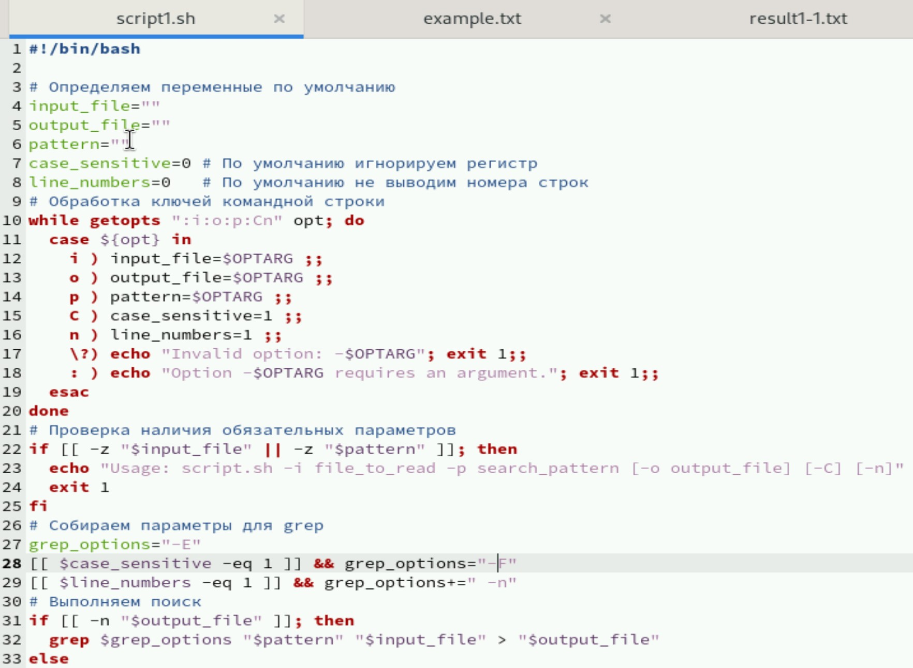{#fig:001 width=80%}

2. Открываем доступ к файлу и запускаем. В начале мы запустили поиск "hello" в файле "example.txt" без учета регистра и номеров строк в файл result1-1.txt А затем проверили учет больших букв и номера строк и вывели результат сначала в терминал, а потом в result1-2.txt (рис. [-@fig:002])

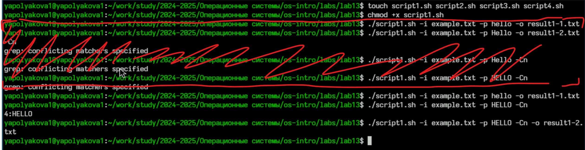{#fig:002 width=80%}

3. Файл example.txt (рис. [-@fig:003])

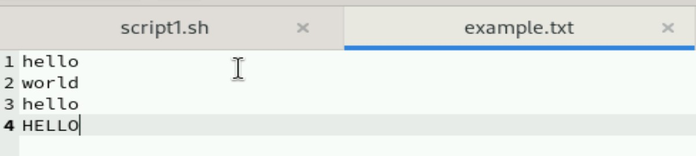{#fig:003 width=70%}

4. Файл result1-1.txt (рис. [-@fig:004])

{#fig:004 width=70%}

5. Файл result1-2.txt (рис. [-@fig:005])

{#fig:005 width=80%}

6. Рассмотрим второе задание. Сначала надо было "Написать на языке Си программу, которая вводит число и определяет, является ли оно больше нуля, меньше нуля или равно нулю. Затем программа завершается с помощью функции exit(n), передавая информацию в о коде завершения в оболочку." На фото листинг этой программы (рис. [-@fig:006])

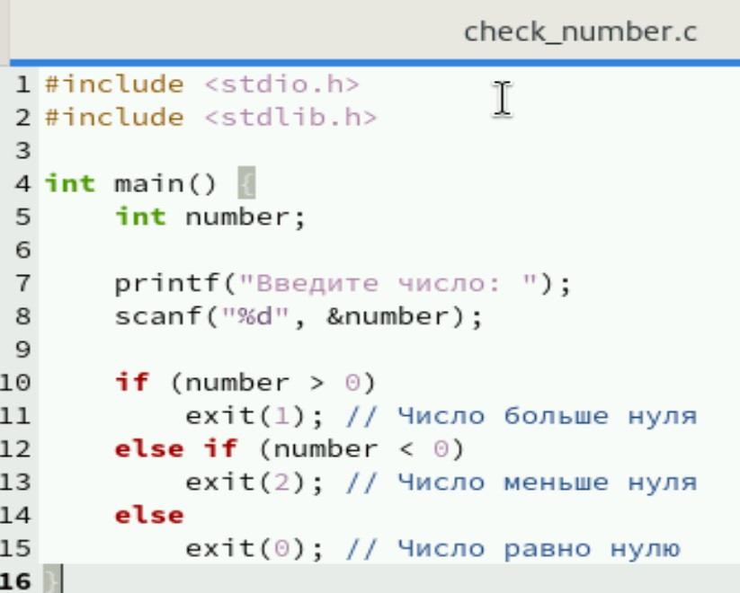{#fig:006 width=80%}

7. Теперь рассмотрим сам командный файл. Задание:  Командный файл должен вызывать эту программу и, проанализировав с помощью команды $?, выдать сообщение о том, какое число было введено. (рис. [-@fig:007])

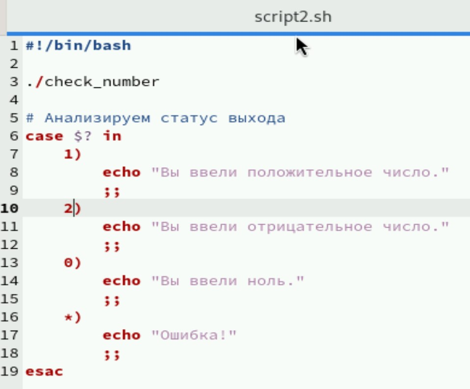{#fig:007 width=80%}

8. Компилируем C-файл с помощью gcc, открываем доступ к командному файлу и запускаем. Тестируем с разными числами (рис. [-@fig:008])

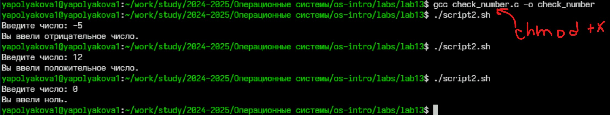{#fig:008 width=70%}

9. Рассмотрим третий скрипт. Задание: Написать командный файл, создающий указанное число файлов, пронумерованных последовательно от 1 до N (например 1.tmp, 2.tmp, 3.tmp,4.tmp и т.д.). Число файлов, которые необходимо создать, передаётся в аргументы командной строки. Этот же командный файл должен уметь удалять все созданные им файлы (если они существуют). Я реализовала 2 режима - создание и удаление (рис. [-@fig:009])

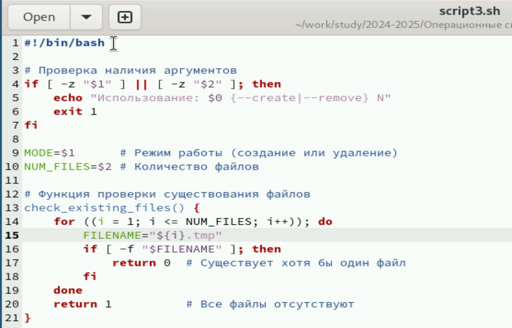{#fig:009 width=80%}

Основная часть кода script3.sh, работа с режимами (рис. [-@fig:010])

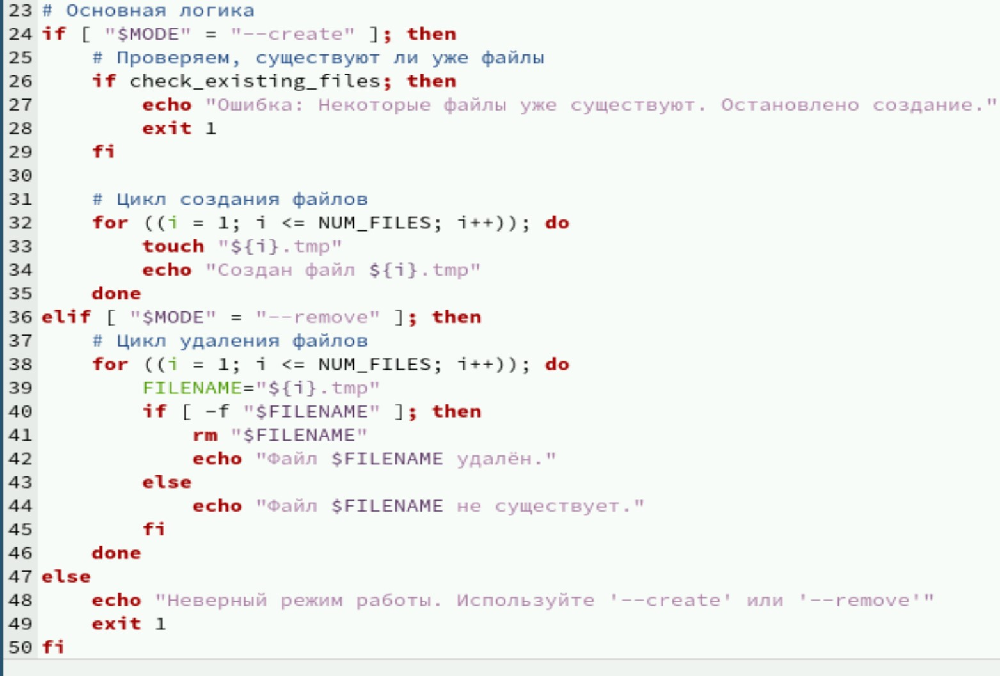{#fig:010 width=80%}

10. Открываем доступ к исполнению, тестируем на создании и удалении 3-х файлов (рис. [-@fig:011])

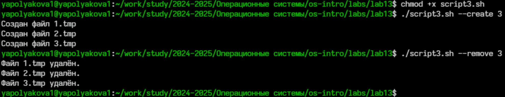{#fig:011 width=80%}

11. Рассмотрим 4-ый командный файл. Задание: Написать командный файл, который с помощью команды tar запаковывает в архив все файлы в указанной директории. Модифицировать его так, чтобы запаковывались только те файлы, которые были изменены менее недели тому назад (использовать команду find). (рис. [-@fig:012])

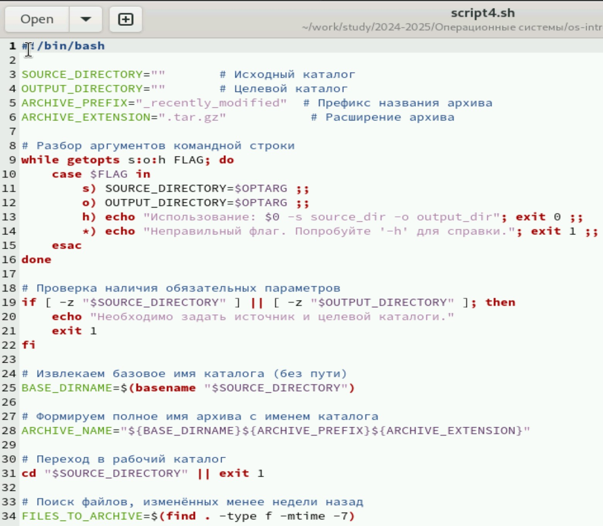{#fig:012 width=80%}

Конец скрипта с архивацией (рис. [-@fig:013])

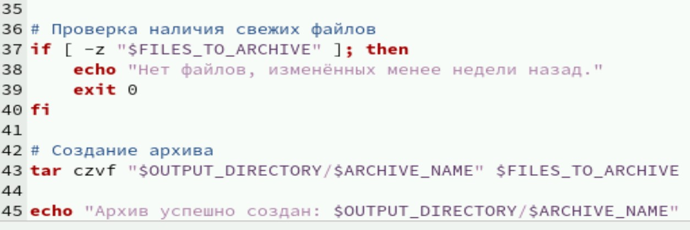{#fig:013 width=80%}

12. Открываем доступ к исполнению, запускаем, архивируем файлы этой лабораторной работы (рис. [-@fig:014])

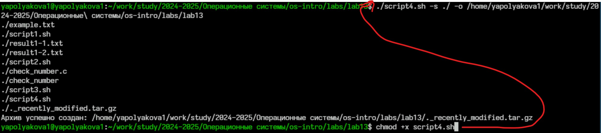{#fig:014 width=80%}

13. Архив действительно создался (рис. [-@fig:015])

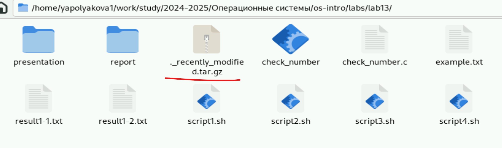{#fig:015 width=70%}

# Контрольные вопросы

1. Каково предназначение команды getopts?

Команда `getopts` предназначена для удобной обработки аргументов командной строки в сценариях оболочки (shell scripts). Она помогает разбивать переданные аргументы на отдельные элементы и проверять правильность передачи флагов и значений. Обычно применяется совместно с циклом `while`, что позволяет автоматизировать обработку сложных комбинаций параметров, обеспечивая безопасность и ясность синтаксиса.

Пример использования:

```bash
while getopts ab:c OPT; do
    case $OPT in
        a) echo "Опция A была указана";;
        b) echo "Опция B имеет значение: $OPTARG";;
        c) echo "Опция C указана";;
        ?) echo "Неправильно использован флаг";;
    esac
done
```

2. Какое отношение метасимволы имеют к генерации имён файлов?

Метасимволы (такие как звездочка `*`, знак вопроса `?`, квадратные скобки `[]`) играют важную роль в построении масок для поиска и подбора файлов в операционной системе. Они позволяют удобно находить группы файлов по общим признакам.

Примеры:

- Маска `*.txt` выберет все файлы с расширением `.txt`.
- Маска `file?.dat` подберёт файлы с названием длиной в четыре символа, начинающиеся с `file` и оканчивающиеся на `.dat`.

Эти маски часто применяются в командах типа `ls`, `rm`, `cp`, что значительно ускоряет выбор файлов.

3. Какие операторы управления действиями вы знаете?

Операторы управления помогают контролировать поток выполнения инструкций в сценарии оболочки. Основные операторы включают:

- **if** — оператор условного ветвления, позволяющий исполнять блок кода только при выполнении какого-либо условия.
- **case** — оператор множественного выбора, похожий на switch-case в языках программирования.
- **for**, **while**, **until** — операторы организации циклов.
- **break**, **continue** — операторы изменения хода выполнения цикла.
- **&&** (логическое AND) и **||** (логическое OR) — используются для объединения нескольких условий или команд.

4. Какие операторы используются для прерывания цикла?

Для остановки цикла используются два оператора:

- **break** — немедленно выходит из ближайшего охватывающего цикла (`for`, `while`, `until`).
- **continue** — пропускает оставшуюся часть итерации и переходит сразу к следующей итерации цикла.

Пример использования операторов:

```bash
for i in $(seq 1 10); do
    if [ $i -gt 5 ]; then break; fi
    echo $i
done
```

5. Для чего нужны команды false и true?

Командами `false` и `true` являются стандартные команды оболочки, используемые для простых тестов условий. Их назначение следующее:

- **false** — всегда возвращает ненулевой код завершения (обычно 1), обозначая ошибку или ложное условие.
- **true** — всегда возвращает нулевой код завершения (0), обозначая успешное завершение или истинное условие.

Они полезны в случаях, когда необходимо организовать простую проверку или задать заведомо известное условие.

Пример использования:

```bash
if true; then
    echo "Это всегда правда"
fi
```

6. Что означает строка if test -f man$s/$i.$s, встреченная в командном файле?

Эта строка представляет собой проверку существования файла с определенным форматом. Рассмотрим подробнее:

- `test -f filename` — проверяет, существует ли файл и является ли он обычным файлом (не каталогом, символьной ссылкой и т.п.).
- `man$s/$i.$s` — выражение, генерирующее динамическое имя файла. Здесь:
  - `$s` — вероятно, какая-то переменная, заменяющая расширение или категорию файла.
  - `$i` — возможно, индекс или порядковый номер файла.

Таким образом, данная конструкция проверяет, существует ли конкретный файл с определенной структурой имени.

7. Объясните различия между конструкциями while и until.

Конструкция `while`: цикл выполняется, пока условие истинно. Иначе говоря, цикл выполняется снова и снова, пока условие возвращает успех (нулевой код завершения).

Конструкция `until`: цикл выполняется, пока условие ложно. Таким образом, цикл выполняется повторно, пока условие возвращает неудачу (ненулевой код завершения).

# Вывод

Были изучены основы программирования в оболочке ОС UNIX. Мы научились писать более сложные командные файлы с использованием логических управляющих конструкций и циклов.
