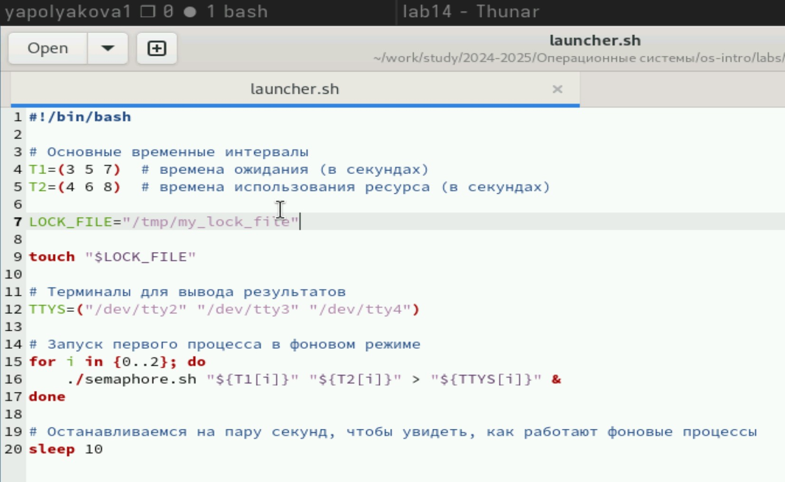

---
## Front matter
lang: ru-RU
title: Лабораторная работа №14
subtitle: Программирование в командном процессоре ОС UNIX. Расширенное программирование
author:
  - Полякова Ю.А.
institute:
  - Российский университет дружбы народов, Москва, Россия
  - Преподаватель Кулябов Д. С., д.ф.\-м.н., профессор
date: 28 февраля 2007

## i18n babel
babel-lang: russian
babel-otherlangs: english

## Formatting pdf
toc: false
toc-title: Содержание
slide_level: 2
aspectratio: 169
section-titles: true
theme: metropolis
header-includes:
 - \metroset{progressbar=frametitle,sectionpage=progressbar,numbering=fraction}
---

# Информация

## Докладчик

:::::::::::::: {.columns align=center}
::: {.column width="70%"}

  * Полякова Юлия Александровна
  * Студент
  * Российский университет дружбы народов
  * [yulya.polyakova.07@mail.ru](mailto:yulya.polyakova.07@mail.ru)
  * <https://github.com/JuliaMaffin123>

:::
::: {.column width="30%"}


:::
::::::::::::::

# Вводная часть

## Актуальность

- Умение работать с командными файлами важно для понимания системы и будет полезно в будущем

## Объект и предмет исследования

- командный процессор ОС UNIX. Командные файлы

## Цели и задачи

- Цель: Изучить основы программирования в оболочке ОС UNIX. Научиться писать более сложные командные файлы с использованием логических управляющих конструкций и циклов.
- Задачи:
	- Ознакомиться с теоретическим материалом.
	- Написать 3 командных файла по заданию.
	- Ответить на контрольные вопросы.

## Материалы и методы

- редактор gedit
- терминал
- командные файлы

# Выполнение лабораторной работы

## Листинг semaphore.sh

Рассмотрим первый скрипт по заданию: Написать командный файл, реализующий упрощённый механизм семафоров. Доработать программу так, чтобы имелась возможность взаимодействия трёх и более процессов.

{#fig:001 width=40%}

## Листинг launcher.sh

Для запуска пишем отдельную программу

{#fig:002 width=40%}

## Запуск launcher.sh

Запускаем первый скрипт так

{#fig:003 width=70%}

## Листинг my_man.sh

Рассмотрим второе задание: Реализовать команду man с помощью командного файла.

{#fig:004 width=40%}

## Запуск my_man.sh

Запуск второго задания с существующей и несуществующей командой

{#fig:005 width=70%}

## Справка после запуска

Открывается справка, если команда существует. Здесь ls

{#fig:006 width=30%}

## Листинг random_letters.sh

Третье задание: Используя встроенную переменную $RANDOM, напишите командный файл, генерирующий случайную последовательность букв латинского алфавита.

{#fig:007 width=45%}

## Запуск random_letters.sh

Как и со всеми предыдущими файлами, открываем доступ и запускаем

{#fig:008 width=70%}

# Контрольные вопросы

## Контрольные вопросы

1. Найдите синтаксическую ошибку в следующей строке:

```bash
while [$1 != "exit"]
```

**Ошибка:** Пробелы и кавычки отсутствуют. Правильная форма должна выглядеть следующим образом:

```bash
while [ "$1" != "exit" ]
```

## Контрольные вопросы

2. Как объединить (конкатенация) несколько строк в одну?

Конкатенация строк осуществляется простым соединением переменных или строковых значений с использованием оператора `+` или же путем простого следования друг за другом.

Пример:

```bash
string="Hello "
string+="World!"
echo "$string"   # Output: Hello World!
```

## Контрольные вопросы

Альтернативный способ — использование команды `printf`:

```bash
var1="Hello"
var2="World"
result=$(printf "%s%s\n" "$var1" "$var2")
echo "$result"   # Output: HelloWorld
```

## Контрольные вопросы

3. Утилита seq

Утилита **seq** используется для генерации последовательностей чисел. Она принимает аргументы, определяющие начальное значение, конечное значение и шаг последовательности.

Примеры использования:

- Последовательность от 1 до 10:

  ```bash
  seq 1 10
  ```

- Последовательность от 1 до 10 с шагом 2:

  ```bash
  seq 1 2 10
  ```

## Контрольные вопросы

Альтернативные способы реализации функционала seq в Bash:

- Использование цикла `for`:

  ```bash
  for i in {1..10}; do echo "$i"; done
  ```

- Используя цикл `while`:

  ```bash
  i=1
  while [ $i -le 10 ]; do
      echo "$i"
      let i++
  done
  ```

## Контрольные вопросы

4. Какой результат даст выражение `$((10 / 3))$?

Результатом целочисленного деления является округленное вниз число. То есть:

```bash
$((10 / 3)) = 3
```

## Контрольные вопросы

5. Основные отличия оболочек ZSH и BASH

- **ZSH**: Более расширенная функциональность по умолчанию, поддержка улучшенных автодополнений, псевдонимов, регулярных выражений прямо в шаблонах имен файлов, автоматическое исправление ошибок в командах (`correc`), встроенный механизм расширения путей (`^`, `%`) и т.п.
  
- **BASH**: Менее гибкая по функциональности, стандартная и широко используемая оболочка Unix-подобных операционных систем, доступная почти повсеместно.

## Контрольные вопросы

Основные различия:

- **Автодополнение**: ZSH предлагает гораздо больше возможностей автоматического дополнения.
- **Коррекция ввода**: ZSH автоматически пытается исправить неправильно введённые команды.
- **Расширение путей**: ZSH поддерживает более удобные механизмы работы с путями.
- **Интерактивность**: ZSH имеет более развитые возможности интерактивного взаимодействия.

## Контрольные вопросы

6. Проверка синтаксиса конструкции

```bash
for ((a=1; a <= LIMIT; a++))
```

Конструкция написана верно. Это правильный синтаксис циклов в стиле C в shell.

## Контрольные вопросы

7. Сравнение Bash с другими языками программирования

Преимущества Bash:

- **Простота**: Bash удобен для написания простых скриптов автоматизации и управления системой.
- **Интеграция с Unix**: Легкость интеграции с файловыми системами, процессами и инструментами операционной системы.
- **Широкая доступность**: Доступен практически на всех системах Linux и Unix.
- **Скриптовая природа**: Позволяет быстро решать повседневные задачи администрирования и разработки.

## Контрольные вопросы

Недостатки Bash:

- **Производительность**: Медленнее других языков программирования при сложных операциях и больших объемах данных.
- **Ограниченность типов данных**: Отсутствие поддержки классов, объектов и полноценных структур данных.
- **Отсутствие строгого контроля типов**: Ошибки легко пропустить из-за отсутствия проверки типов на этапе компиляции.
- **Недостаточная масштабируемость**: Сложно поддерживать большие проекты на Bash из-за ограничений среды исполнения.

## Вывод

Были изучены основы программирования в оболочке ОС UNIX. Мы научились писать более сложные командные файлы с использованием логических управляющих конструкций и циклов.
