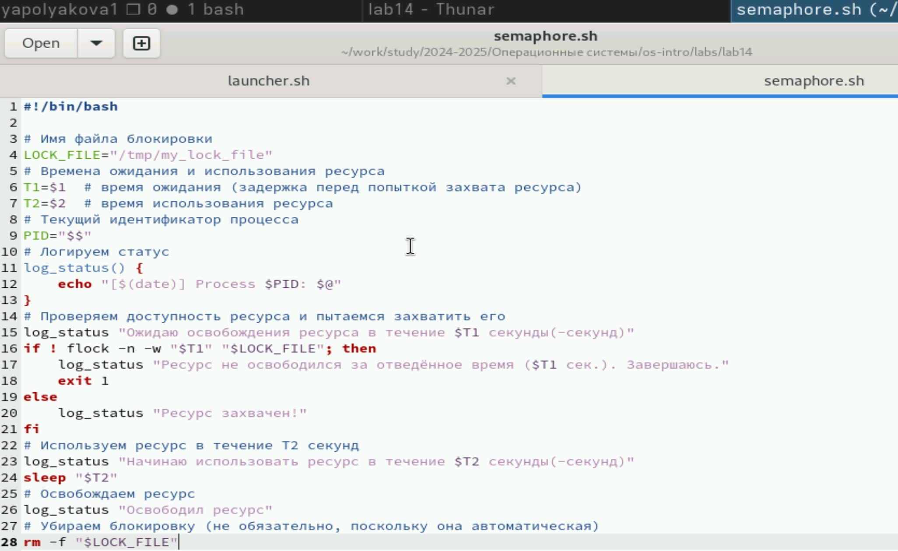
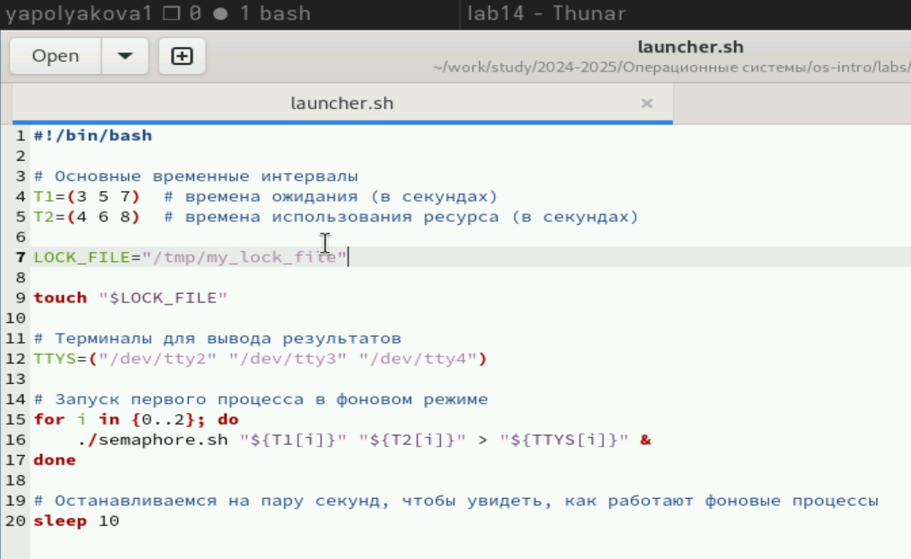
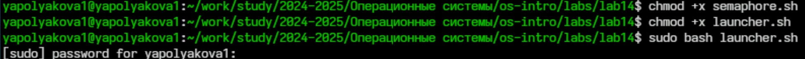
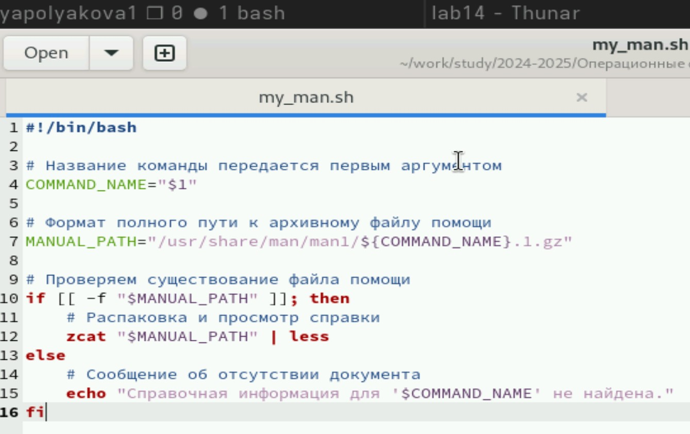
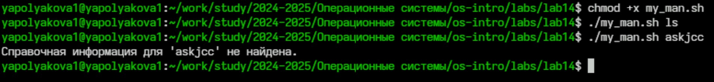
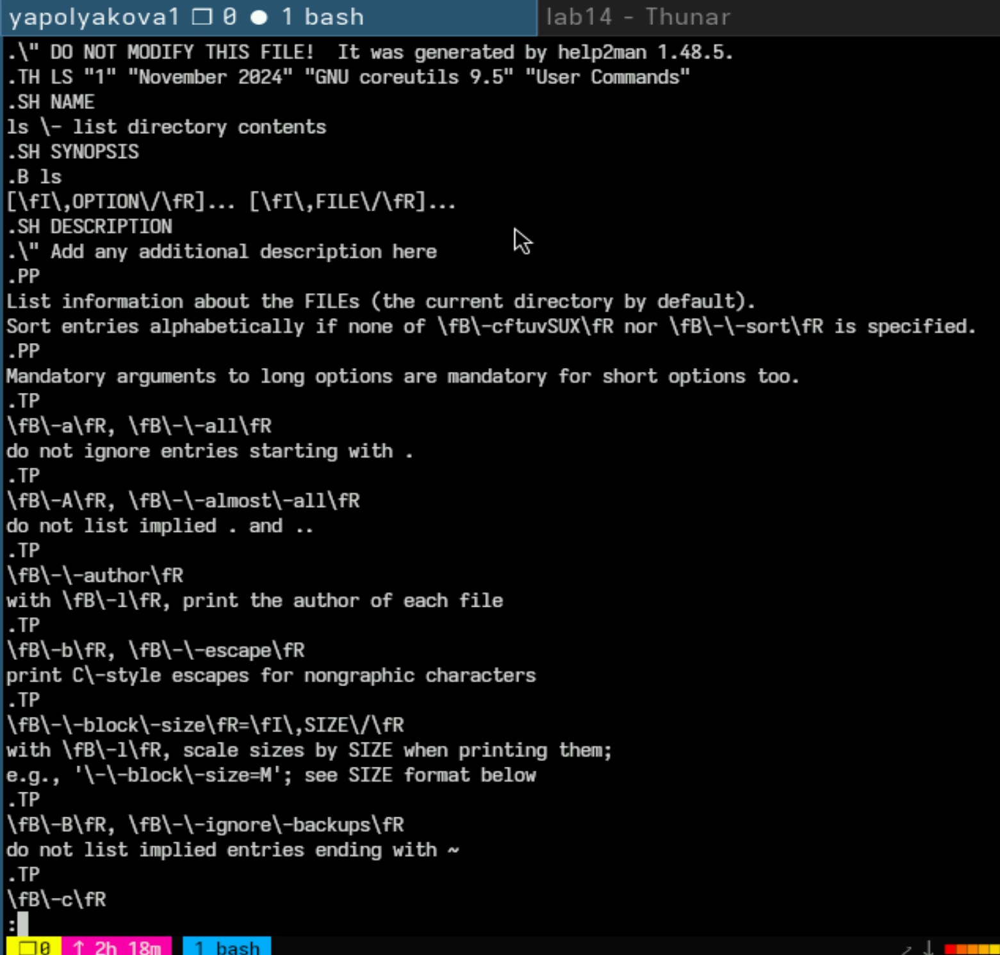
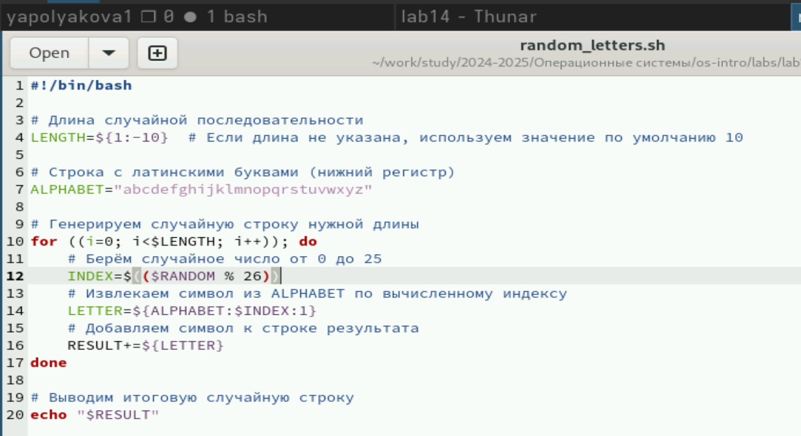
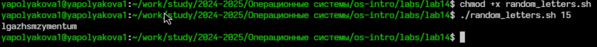

---
## Front matter
title: "Лабораторная работа №14"
subtitle: "Программирование в командном процессоре ОС UNIX. Расширенное программирование"
author: "Полякова Юлия Александровна"

## Generic otions
lang: ru-RU
toc-title: "Содержание"

## Bibliography
bibliography: bib/cite.bib
csl: pandoc/csl/gost-r-7-0-5-2008-numeric.csl

## Pdf output format
toc: true # Table of contents
toc-depth: 2
lof: true # List of figures
lot: true # List of tables
fontsize: 12pt
linestretch: 1.5
papersize: a4
documentclass: scrreprt
## I18n polyglossia
polyglossia-lang:
  name: russian
  options:
	- spelling=modern
	- babelshorthands=true
polyglossia-otherlangs:
  name: english
## I18n babel
babel-lang: russian
babel-otherlangs: english
## Fonts
mainfont: IBM Plex Serif
romanfont: IBM Plex Serif
sansfont: IBM Plex Sans
monofont: IBM Plex Mono
mathfont: STIX Two Math
mainfontoptions: Ligatures=Common,Ligatures=TeX,Scale=0.94
romanfontoptions: Ligatures=Common,Ligatures=TeX,Scale=0.94
sansfontoptions: Ligatures=Common,Ligatures=TeX,Scale=MatchLowercase,Scale=0.94
monofontoptions: Scale=MatchLowercase,Scale=0.94,FakeStretch=0.9
mathfontoptions:
## Biblatex
biblatex: true
biblio-style: "gost-numeric"
biblatexoptions:
  - parentracker=true
  - backend=biber
  - hyperref=auto
  - language=auto
  - autolang=other*
  - citestyle=gost-numeric
## Pandoc-crossref LaTeX customization
figureTitle: "Рис."
tableTitle: "Таблица"
listingTitle: "Листинг"
lofTitle: "Список иллюстраций"
lotTitle: "Список таблиц"
lolTitle: "Листинги"
## Misc options
indent: true
header-includes:
  - \usepackage{indentfirst}
  - \usepackage{float} # keep figures where there are in the text
  - \floatplacement{figure}{H} # keep figures where there are in the text
---

# Цель работы

Изучить основы программирования в оболочке ОС UNIX. Научиться писать более сложные командные файлы с использованием логических управляющих конструкций и циклов.

# Задание

1. Ознакомиться с теоретическим материалом.
2. Написать программы.
3. Ответить на контрольные вопросы.

# Выполнение лабораторной работы

1. Рассмотрим первый скрипт по заданию: Написать командный файл, реализующий упрощённый механизм семафоров. Доработать программу так, чтобы имелась возможность взаимодействия трёх и более процессов.(рис. [-@fig:001]).

{#fig:001 width=80%}

2. Для запуска пишем отдельную программу (рис. [-@fig:002])

{#fig:002 width=80%}

3. Запускаем первый скрипт так (рис. [-@fig:003])

{#fig:003 width=70%}

4. Рассмотрим второе задание: Реализовать команду man с помощью командного файла. (рис. [-@fig:004])

{#fig:004 width=70%}

5. Запуск второго задания с существующей и несуществующей командой (рис. [-@fig:005])

{#fig:005 width=80%}

6. Открывается справка, если команда существует. Здесь ls (рис. [-@fig:006])

{#fig:006 width=80%}

7. Третье задание: Используя встроенную переменную $RANDOM, напишите командный файл, генерирующий случайную последовательность букв латинского алфавита.  (рис. [-@fig:007])

{#fig:007 width=80%}

8. Как и со всеми предыдущими файлами, открываем доступ и запускаем (рис. [-@fig:008])

{#fig:008 width=70%}

# Контрольные вопросы

1. Найдите синтаксическую ошибку в следующей строке:

```bash
while [$1 != "exit"]
```

**Ошибка:** Пробелы и кавычки отсутствуют. Правильная форма должна выглядеть следующим образом:

```bash
while [ "$1" != "exit" ]
```

2. Как объединить (конкатенация) несколько строк в одну?

Конкатенация строк осуществляется простым соединением переменных или строковых значений с использованием оператора `+` или же путем простого следования друг за другом.

Пример:

```bash
string="Hello "
string+="World!"
echo "$string"   # Output: Hello World!
```

Альтернативный способ — использование команды `printf`:

```bash
var1="Hello"
var2="World"
result=$(printf "%s%s\n" "$var1" "$var2")
echo "$result"   # Output: HelloWorld
```

3. Утилита seq

Утилита **seq** используется для генерации последовательностей чисел. Она принимает аргументы, определяющие начальное значение, конечное значение и шаг последовательности.

Примеры использования:

- Последовательность от 1 до 10:

  ```bash
  seq 1 10
  ```

- Последовательность от 1 до 10 с шагом 2:

  ```bash
  seq 1 2 10
  ```

Альтернативные способы реализации функционала seq в Bash:

- Использование цикла `for`:

  ```bash
  for i in {1..10}; do echo "$i"; done
  ```

- Используя цикл `while`:

  ```bash
  i=1
  while [ $i -le 10 ]; do
      echo "$i"
      let i++
  done
  ```

4. Какой результат даст выражение `$((10 / 3))$?

Результатом целочисленного деления является округленное вниз число. То есть:

```bash
$((10 / 3)) = 3
```

5. Основные отличия оболочек ZSH и BASH

- **ZSH**: Более расширенная функциональность по умолчанию, поддержка улучшенных автодополнений, псевдонимов, регулярных выражений прямо в шаблонах имен файлов, автоматическое исправление ошибок в командах (`correc`), встроенный механизм расширения путей (`^`, `%`) и т.п.
  
- **BASH**: Менее гибкая по функциональности, стандартная и широко используемая оболочка Unix-подобных операционных систем, доступная почти повсеместно.

Основные различия:

- **Автодополнение**: ZSH предлагает гораздо больше возможностей автоматического дополнения.
- **Коррекция ввода**: ZSH автоматически пытается исправить неправильно введённые команды.
- **Расширение путей**: ZSH поддерживает более удобные механизмы работы с путями.
- **Интерактивность**: ZSH имеет более развитые возможности интерактивного взаимодействия.

6. Проверка синтаксиса конструкции

```bash
for ((a=1; a <= LIMIT; a++))
```

Конструкция написана верно. Это правильный синтаксис циклов в стиле C в shell.

7. Сравнение Bash с другими языками программирования

Преимущества Bash:

- **Простота**: Bash удобен для написания простых скриптов автоматизации и управления системой.
- **Интеграция с Unix**: Легкость интеграции с файловыми системами, процессами и инструментами операционной системы.
- **Широкая доступность**: Доступен практически на всех системах Linux и Unix.
- **Скриптовая природа**: Позволяет быстро решать повседневные задачи администрирования и разработки.

Недостатки Bash:

- **Производительность**: Медленнее других языков программирования при сложных операциях и больших объемах данных.
- **Ограниченность типов данных**: Отсутствие поддержки классов, объектов и полноценных структур данных.
- **Отсутствие строгого контроля типов**: Ошибки легко пропустить из-за отсутствия проверки типов на этапе компиляции.
- **Недостаточная масштабируемость**: Сложно поддерживать большие проекты на Bash из-за ограничений среды исполнения.

# Вывод

Были изучены основы программирования в оболочке ОС UNIX. Мы научились писать более сложные командные файлы с использованием логических управляющих конструкций и циклов.
