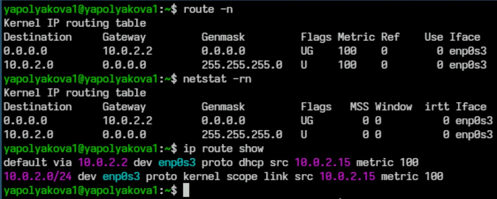
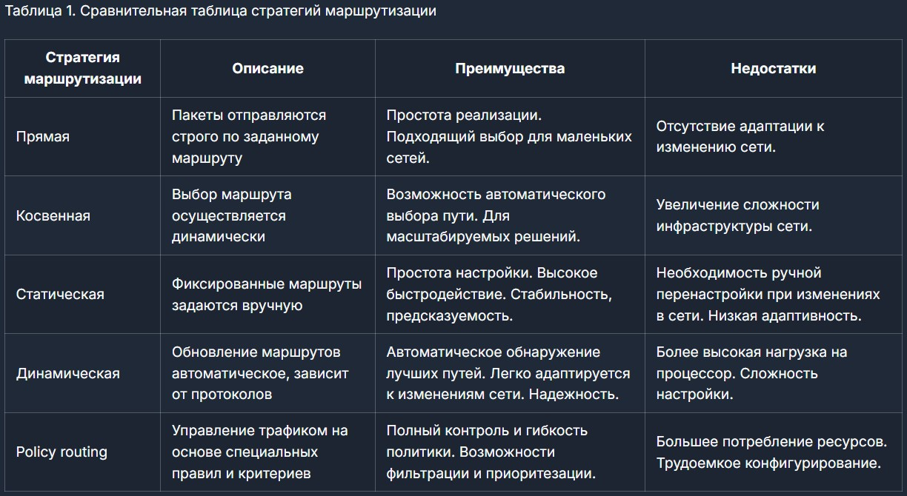
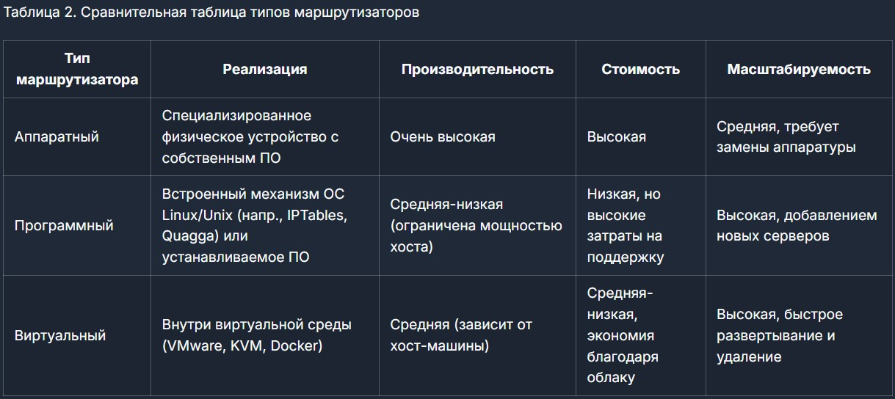

---
## Front matter
lang: ru-RU
title: Обзор стратегий маршрутизации и маршрутизаторов
subtitle: Лекция №6. Сеть в UNIX
author:
  - Полякова Ю. А.
institute:
  - Российский университет дружбы народов.
  - Преподаватель Кулябов Д. С., д.ф.\-м.н., профессор
date: 28 февраля 2007

## i18n babel
babel-lang: russian
babel-otherlangs: english

## Formatting pdf
toc: false
toc-title: Содержание
slide_level: 2
aspectratio: 169
section-titles: true
theme: metropolis
header-includes:
 - \metroset{progressbar=frametitle,sectionpage=progressbar,numbering=fraction}
---

# Информация

## Докладчик

:::::::::::::: {.columns align=center}
::: {.column width="70%"}

  * Полякова Юлия Александровна
  * Студент
  * Российский университет дружбы народов
  * [yulya.polyakova.07@mail.ru](mailto:yulya.polyakova.07@mail.ru)
  * <https://github.com/JuliaMaffin123>

:::
::: {.column width="30%"}


:::
::::::::::::::

# Вводная часть

## Обоснование значимости

**Актуальность:** Полезно узнать о маршрутизации и маршрутизаторах в Unix системах, в будущем это поможет лучше работать с сетями и понимать их устройство.

**Объект и предмет исследования:** Стратегии маршрутизации и маршрутизаторы

**Практическая значимость:** Исследование даст определенные навыки работы с маршрутизацией, которые можно применить на практике.

**Проблема:** Данное исследование поможет студентам получить основную информацию о стратегиях маршрутизации и маршрутизаторов (если говорить о проблеме отсутствия информации об этом у студентов).

## Постановка цели и задач

**Цель работы:** Сделать обзор на стратегии маршрутизации и маршрутизаторы.

**Гипотеза:** Анализ ключевых особенностей реализации маршрутизации в Unix-системах позволит выявить наиболее эффективные подходы и инструменты управления маршрутом данных, обеспечивающие надежность, масштабируемость и безопасность сетей.

**Задачи:**

1. Дать определение маршрутизации. Описать структуру таблиц маршрутизации в Unix.

2. Сделать обзор и сравнение стратегий маршрутизации.

3. Изучить команды конфигурации маршрутизации.

4. Дать определение маршрутизатора. Сравнить рализации маршрутизаторов.

5. Подвести итог исследования

# Ход работы

## Маршрутизация. Таблицы маршрутизации

Маршрутизация — процесс определения оптимального маршрута данных в сетях связи.

{#fig:001 width=80%}


## Стратегии маршрутизации

{#fig:002 width=95%}

## Команды конфигурации маршрутизации

Проверить текущие маршруты - команда netstat –r или ip route show. С фильтрами:

```make
ip route show match 192.168.1.0/24
```

Добавление маршрута:

```make
sudo ip route add <целевая подсеть> via <адрес шлюза>
```

Удаление маршрута:

```make
sudo ip route del <целевая подсеть>
```

Настройка маршрутизации через конфигурационные файлы. Например, добавляя постоянный маршрут в Debian-based дистрибутивах, внесите запись:

```make
up ip route add 192.168.1.0/24 via 10.0.0.1 dev eth0
down ip route del 192.168.1.0/24 via 10.0.0.1 dev eth0
```

## Маршрутизаторы

{#fig:003 width=95%}

## Вывод

Были проанализированы стратегии маршрутизации и маршрутизаторов. Исследование подтверждает значимость правильного выбора и настройки стратегий маршрутизации в Unix-системах для достижения максимальной производительности и стабильной работы сетевой инфраструктуры. Выбор стратегии и маршрутизатора зависит от цели и ситуации пользователя.

## Ресурсы

1. Что такое маршрутизация: построение таблиц маршрутизации в Linux // hostzealot : сайт. – URL: <https://hostzealot.ru/blog/how-to/cto-takoe-marsrutizaciya-postroenie-tablic-marsrutizacii-v-linux> (дата обращения: 18.04.2025)

2. man-pages : сайт. – URL: <https://manpages.debian.org/> (дата обращения: 18.04.2025)

3. Linux Routing // softpanorama : сайт. – URL: <https://softpanorama.org/Net/Linux_networking/linux_routing.shtml> (дата обращения: 18.04.2025)

4. Роутинг и policy-routing в Linux при помощи iproute2 // Хабр : сайт. – URL: <https://habr.com/ru/articles/108690/> (дата обращения: 18.04.2025)

5. Шпаргалка по сетевым командам Linux // merion : сайт. – URL: <https://wiki.merionet.ru/articles/spargalka-po-setevym-komandam-linux> (дата обращения: 18.04.2025)
