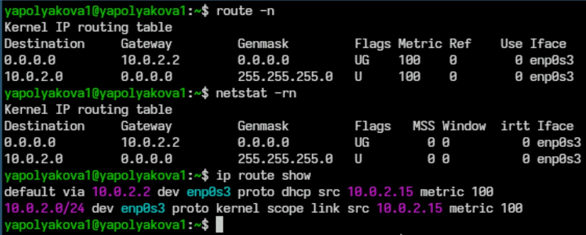

---
## Front matter
title: "Обзор стратегий маршрутизации и маршрутизаторов"
subtitle: "Лекция №6. Сеть в UNIX"
author: "Полякова Юлия Александровна"

## Generic otions
lang: ru-RU
toc-title: "Содержание"

## Bibliography
bibliography: bib/cite.bib
csl: pandoc/csl/gost-r-7-0-5-2008-numeric.csl

## Pdf output format
toc: true # Table of contents
toc-depth: 2
lof: true # List of figures
lot: true # List of tables
fontsize: 12pt
linestretch: 1.5
papersize: a4
documentclass: scrreprt
## I18n polyglossia
polyglossia-lang:
  name: russian
  options:
	- spelling=modern
	- babelshorthands=true
polyglossia-otherlangs:
  name: english
## I18n babel
babel-lang: russian
babel-otherlangs: english
## Fonts
mainfont: IBM Plex Serif
romanfont: IBM Plex Serif
sansfont: IBM Plex Sans
monofont: IBM Plex Mono
mathfont: STIX Two Math
mainfontoptions: Ligatures=Common,Ligatures=TeX,Scale=0.94
romanfontoptions: Ligatures=Common,Ligatures=TeX,Scale=0.94
sansfontoptions: Ligatures=Common,Ligatures=TeX,Scale=MatchLowercase,Scale=0.94
monofontoptions: Scale=MatchLowercase,Scale=0.94,FakeStretch=0.9
mathfontoptions:
## Biblatex
biblatex: true
biblio-style: "gost-numeric"
biblatexoptions:
  - parentracker=true
  - backend=biber
  - hyperref=auto
  - language=auto
  - autolang=other*
  - citestyle=gost-numeric
## Pandoc-crossref LaTeX customization
figureTitle: "Рис."
tableTitle: "Таблица"
listingTitle: "Листинг"
lofTitle: "Список иллюстраций"
lotTitle: "Список таблиц"
lolTitle: "Листинги"
## Misc options
indent: true
header-includes:
  - \usepackage{indentfirst}
  - \usepackage{float} # keep figures where there are in the text
  - \floatplacement{figure}{H} # keep figures where there are in the text
---

# Актуальность{.unnumbered}

Полезно узнать о маршрутизации и маршрутизаторах в Unix системах, в будущем это поможет лучше работать с сетями и понимать их устройство.

# Практическая значимость{.unnumbered}

Исследование даст определенные навыки работы с маршрутизацией, которые можно применить на практике.

# Проблема{.unnumbered}

Данное исследование поможет студентам получить основную информацию о стратегиях маршрутизации и маршрутизаторов (если говорить о проблеме отсутствия информации об этом у студентов).

# Цель работы{.unnumbered}

Сделать обзор на стратегии маршрутизации и маршрутизаторы.

# Гипотеза{.unnumbered}

Анализ ключевых особенностей реализации маршрутизации в Unix-системах позволит выявить наиболее эффективные подходы и инструменты управления маршрутом данных, обеспечивающие надежность, масштабируемость и безопасность сетей.

# Задачи{.unnumbered}

1. Дать определение маршрутизации. Описать структуру таблиц маршрутизации в Unix-системах.

2. Сделать обзор и сравнение стратегий маршрутизации.

3. Изучить команды конфигурации маршрутизации.

4. Дать определение маршрутизатора. Сравнить рализации маршрутизаторов.

5. Подвести итог исследования.

# Маршрутизация. Таблицы маршрутизации

Маршрутизация — процесс определения оптимального маршрута данных в сетях связи. В сети Интернет передача всей информации осуществляется в виде небольших блоков данных – пакетов. Пакет состоит из стартовых битов, заголовка, прицепа и полезной нагрузки – каждый такой блок с данными передается по определенному маршруту, который, в свою очередь, определяется маршрутизатором. Сетевой маршрут «прокладывается» на основании информации, получаемой из таблиц маршрутизации согласно протоколам маршрутизации и инструкциям сетевого администратора.

Таблицы маршрутизации содержат параметры, необходимые для корректной идентификации и чтения сетевого маршрута. В них содержатся следующие разделы (более подробно см. в [@hostzealot]):

* Destination (Target). IP-адрес сети назначения – это конечный пункт назначения для пакетов данных.
* Netmask (Genmask). Маска сети.
* Gateway. IP-адрес шлюза.
* Interface. Адрес сетевого интерфейса.
* Metric. Этот параметр определяет приоритет маршрута.

Управление маршрутизацией для ОС Linux осуществляется тремя командами (рис. [-@fig:001]) (более подробно см. в [@manpages]):

* route – позволяет посмотреть таблицу маршрутизации, функционирующую на данный момент;
* netstat – выводит более подробные сведения, включая IP-адрес цели, шлюза, отправителя, а также показывает используемый протокол передачи данных и сетевой интерфейс;
* ip – этот инструмент используется для глубокой настройки сетевых интерфейсов.

{#fig:001 width=70%}

# Стратегии маршрутизации

Существуют различные стратегии маршрутизации в системах UNIX (более подробно см. в [@softpanorama]):

* Прямая маршрутизация. Применяется, когда узел назначения подключён к той же физической сети, что и источник. Источник может отправить IP-датаграмму с помощью физического сетевого кадра без участия маршрутизатора.
* Косвенная маршрутизация. Используется, когда номера сетей источника и назначения не совпадают. В этом случае пакет должен быть перенаправлен на узел, который знает, как достичь назначения (маршрутизатор).
* Статические маршруты. Это постоянные записи в таблице маршрутов. После того как такой маршрут добавлен в таблицу, удалить его можно только вручную.
* Динамические маршруты. Добавляются или удаляются из таблицы маршрутов различными процессами, например in.routed или in.rdisc. Используются специальные протоколы маршрутизации, например, RIP (Routing Information Protocol), OSPF (Open Shortest Path First) и BGP (Border Gateway Protocol).
* Policy-routing. Позволяет маршрутизировать пакеты на основании ряда гибких правил. Применяется в случае наличия нескольких сетевых интерфейсов и необходимости отправлять определённые пакеты на определённый интерфейс. (более подробно см. в [@habr])

Приведем сравнительную таблицу [-@tbl:std-dir]

: Сравнительная таблица стратегий маршрутизации {#tbl:std-dir}

| **Стратегия маршрутизации** | **Описание**                                                 | **Преимущества**                                                                           | **Недостатки**                                                                 |
|-----------------------------|--------------------------------------------------------------|--------------------------------------------------------------------------------------------|--------------------------------------------------------------------------------|
| Прямая                      | Пакеты отправляются строго по заданному маршруту             | Простота реализации. Подходящий выбор для маленьких сетей.                                 | Отсутствие адаптации к изменению сети.                                         |
| Косвенная                   | Выбор маршрута осуществляется динамически                    | Возможность автоматического выбора пути. Для масштабируемых решений.                       | Увеличение сложности инфраструктуры сети.                                      |
| Статическая                 | Фиксированные маршруты задаются вручную                      | Простота настройки. Высокое быстродействие. Стабильность, предсказуемость.                 | Необходимость ручной перенастройки при изменениях в сети. Низкая адаптивность. |
| Динамическая                | Обновление маршрутов автоматическое, зависит от протоколов   | Автоматическое обнаружение лучших путей. Легко адаптируется к изменениям сети. Надежность. | Более высокая нагрузка на процессор. Сложность настройки.                      |
| Policy routing              | Управление трафиком на основе специальных правил и критериев | Полный контроль и гибкость политики. Возможности фильтрации и приоритезации.               | Большее потребление ресурсов. Трудоемкое конфигурирование.                     |

# Команды конфигурации маршрутизации

Изучим команды для конфигурации маршрутизации (более подробно см. в [@merion]):

- Проверить текущие маршруты можно командой netstat –r или ip route show Первая команда показывает список всех активных маршрутов, вторая — более подробный вывод с информацией о шлюзах и интерфейсах. Можно добавить фильтры, например, для определения маршрута только для локальной сети:

```make
ip route show match 192.168.1.0/24
```
    
- Чтобы добавить новый маршрут в систему, используем команду:

```make
sudo ip route add <целевая подсеть> via <адрес шлюза>
```

Например, чтобы добавить маршрут к адресу 192.168.1.0/24 через шлюз 10.0.0.1:

```make
sudo ip route add 192.168.1.0/24 via 10.0.0.1
```

- Удалить существующий маршрут можно следующим образом:

```make
sudo ip route del <целевая подсеть>
```

Пример удаления маршрута:

```make
sudo ip route del 192.168.1.0/24
```

- Также можно настроить маршрутизацию через конфигурационные файлы. Часто постоянные маршруты сохраняются в файлах /etc/network/interfaces (Debian/Ubuntu) или /etc/sysconfig/network-scripts/ifcfg-* (Red Hat/Fedora). Например, добавляя постоянный маршрут в Debian-based дистрибутивах, внесите запись типа:

```make
up ip route add 192.168.1.0/24 via 10.0.0.1 dev eth0
down ip route del 192.168.1.0/24 via 10.0.0.1 dev eth0
```

# Маршрутизаторы

Маршрутизатор — это устройство или программное обеспечение, предназначенное для направления потоков данных (пакетов) между различными сегментами компьютерной сети, он выбирает оптимальный путь следования на основе таблиц маршрутизации и алгоритмов принятия решения. Основная задача маршрутизатора заключается в передаче пакетов между локальными и глобальными сетями, поддерживая целостность и безопасность передаваемых данных. Можно выделить несколько типов маршрутизаторов. Их сравнение приведено в таблице ниже [-@tbl:marsh]

: Сравнительная таблица типов маршрутизаторов {#tbl:marsh}

| **Тип маршрутизатора** | **Реализация**                                                                     | **Производительность**                      | **Стоимость**                             | **Масштабируемость**                      |
|------------------------|------------------------------------------------------------------------------------|---------------------------------------------|-------------------------------------------|-------------------------------------------|
| Аппаратный             | Специализированное физическое устройство с собственным ПО                          | Очень высокая                               | Высокая                                   | Средняя, требует замены аппаратуры        |
| Программный            | Встроенный механизм ОС Linux/Unix (напр., IPTables, Quagga) или устанавливаемое ПО | Средняя-низкая (ограничена мощностью хоста) | Низкая, но высокие затраты на поддержку   | Высокая, добавлением новых серверов       |
| Виртуальный            | Внутри виртуальной среды (VMware, KVM, Docker)                                     | Средняя (зависит от хост-машины)            | Средняя-низкая, экономия благодаря облаку | Высокая, быстрое развертывание и удаление |

# Вывод{.unnumbered}

Были проанализированы стратегии маршрутизации и маршрутизаторов. Исследование подтверждает значимость правильного выбора и настройки стратегий маршрутизации в Unix-системах для достижения максимальной производительности и стабильной работы сетевой инфраструктуры. Выбор стратегии и маршрутизатора зависит от цели и ситуации пользователя.

# Список литературы{.unnumbered}

::: {#refs}
:::
