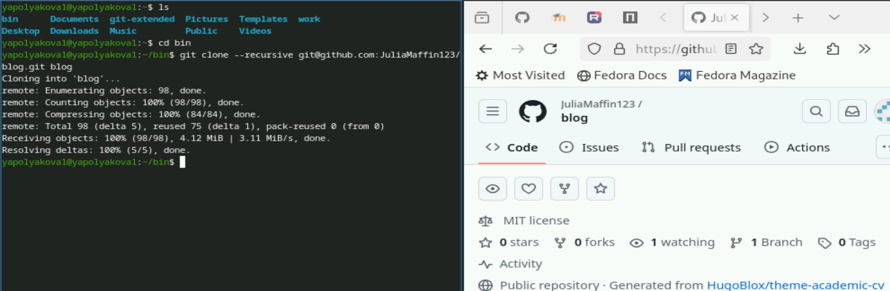
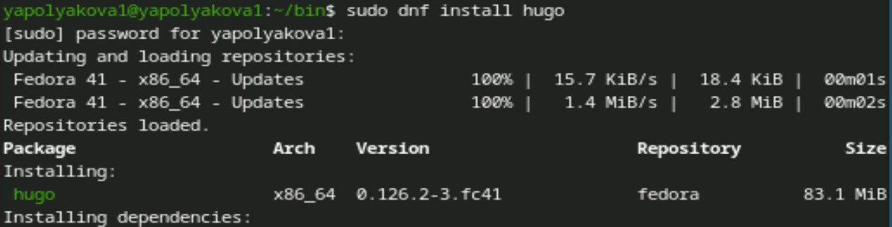
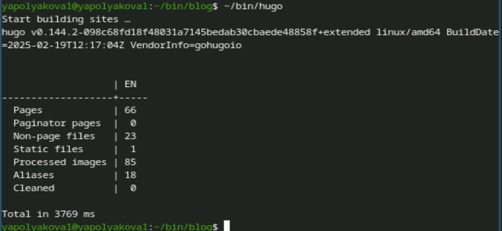
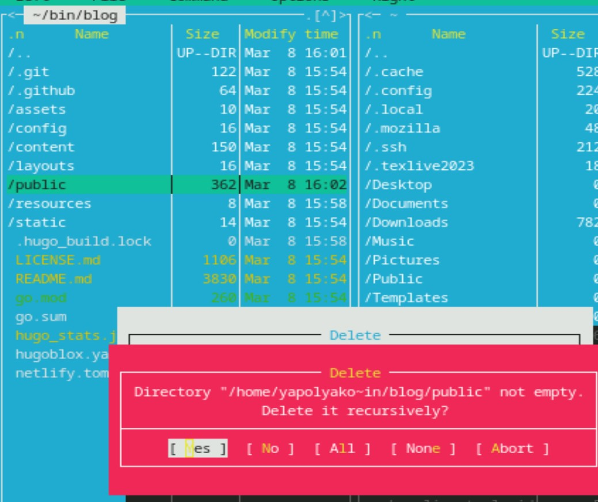
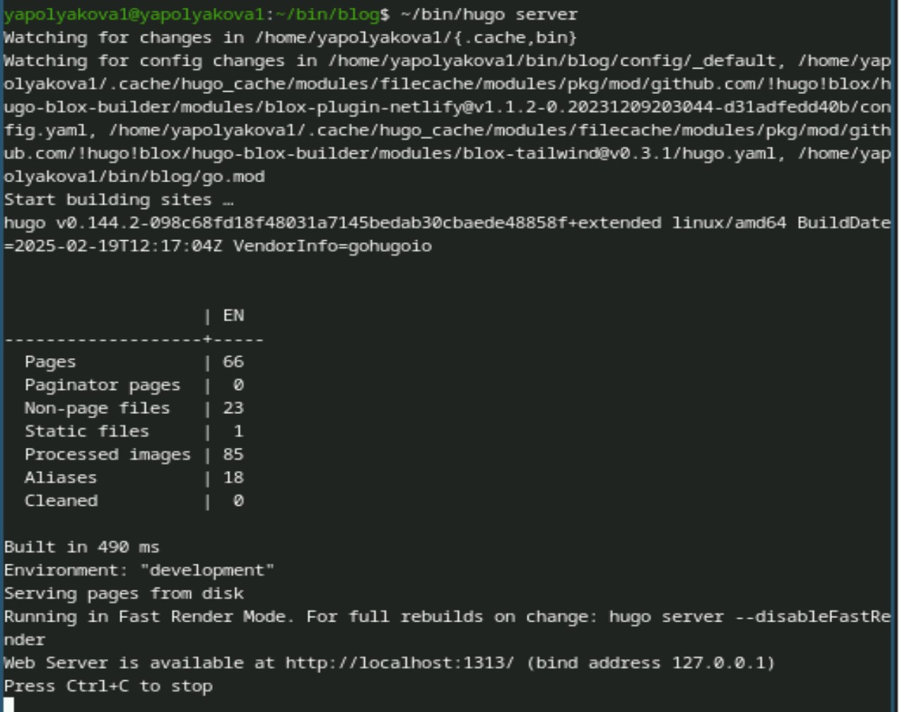
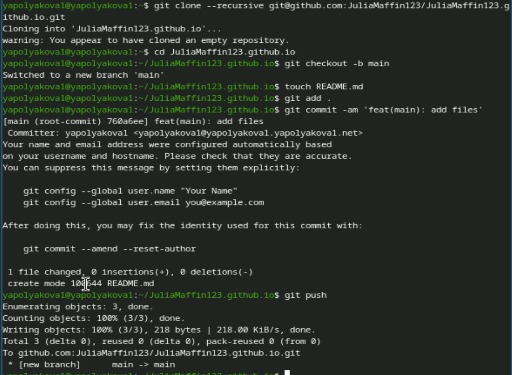
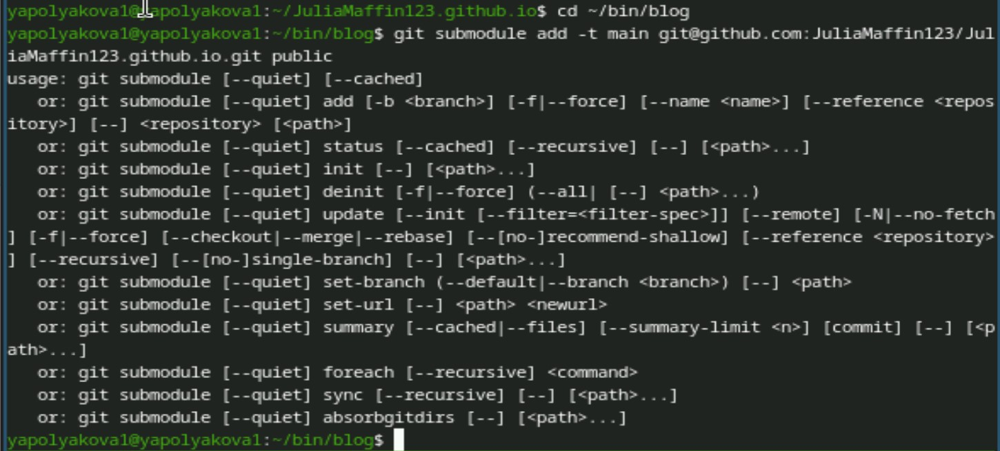
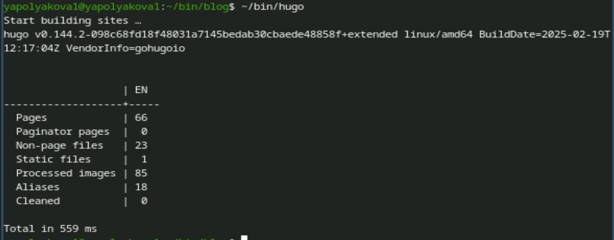
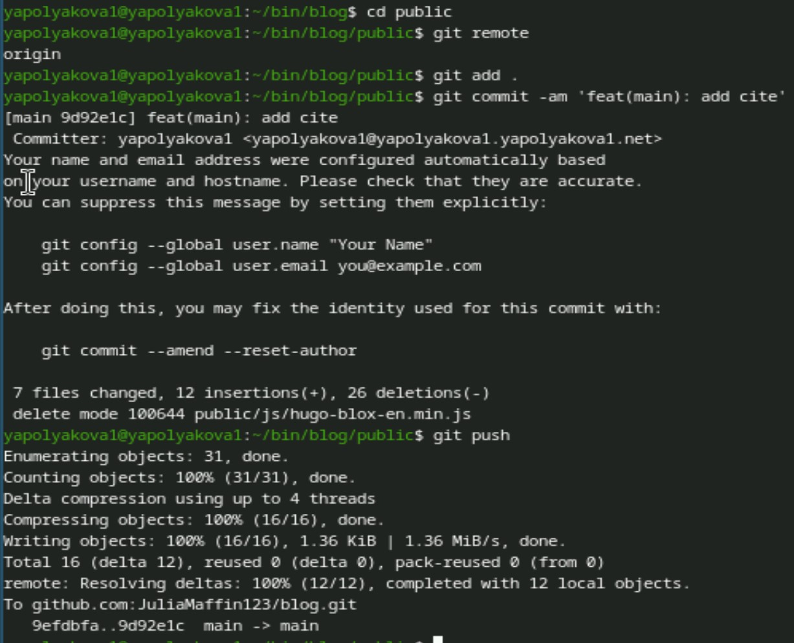
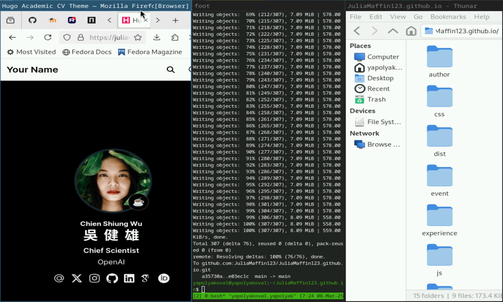

---
## Front matter
lang: ru-RU
title: Индивидуальный проект
subtitle: Этап 1
author:
  - Полякова Ю.А.
institute:
  - Российский университет дружбы народов, Москва, Россия
date: 28 февраля 2007

## i18n babel
babel-lang: russian
babel-otherlangs: english

## Formatting pdf
toc: false
toc-title: Содержание
slide_level: 2
aspectratio: 169
section-titles: true
theme: metropolis
header-includes:
 - \metroset{progressbar=frametitle,sectionpage=progressbar,numbering=fraction}
---

# Информация

## Докладчик

:::::::::::::: {.columns align=center}
::: {.column width="70%"}

  * Полякова Юлия Александровна
  * Студент
  * Российский университет дружбы народов
  * [yulya.polyakova.07@mail.ru](mailto:yulya.polyakova.07@mail.ru)
  * <https://github.com/JuliaMaffin123>

:::
::: {.column width="30%"}

:::
::::::::::::::

# Вводная часть

## Актуальность

- Полезно иметь персональную страницу с информацией о себе и со своими достижениями

## Объект и предмет исследования

- Страница github-pages

## Цели и задачи

- Размещение на Github pages заготовки для персонального сайта

## Материалы и методы

- github-pages
- hugo

# Выполнение лабораторной работы

## Создание репозитория blog

В домашней папке создаем пустой каталог bin. Устанавливаем последнюю версию hugo с github. Распаковываем архив и переносим загрузочный файл в папку bin. Создаем репозиторий на основе нужного шаблона и клонируем его себе в папку 

{#fig:001 width=70%}

## Устанавливаем hugo

Устанавливаем hugo через sudo

{#fig:002 width=70%}

## Создание сайта

Создаем загрузочным файлом в ~/bin/blog сайт

{#fig:003 width=65%}

## Удаление public

Удаляем папку public

{#fig:004 width=35%}

## Локальный сайт

Запускаем локальный сайт

{#fig:005 width=40%}

## Создание репозитория

Создаем пустой репозиторий в формате имя-на-github.github.io, клонируем его себе, проверяем ветку main, создаем README файл, добавляем все на сервер

{#fig:006 width=40%}

## submodule в public

В ~/bin/blog С помощью submodule добавляем новый репозиторий в папку public

{#fig:007 width=65%}

## Создание публичной страницы

Создаем сайт загрузочным файлом

{#fig:008 width=70%}

## Отправление файлов на сервер

Переходим в public и добавляем все файлы на сервер

{#fig:009 width=35%}

## Страница по адресу

В репозитории имя.github.io в github-pages можно найти ссылку на страницу

{#fig:010 width=45%}

## Вывод

Была размещена на Github pages заготовка для персонального сайта.
