---
## Front matter
lang: ru-RU
title: Индивидуальный проект
subtitle: Этап №2
author:
  - Полякова Ю.А.
institute:
  - Российский университет дружбы народов, Москва, Россия
date: 28 февраля 2007

## i18n babel
babel-lang: russian
babel-otherlangs: english

## Formatting pdf
toc: false
toc-title: Содержание
slide_level: 2
aspectratio: 169
section-titles: true
theme: metropolis
header-includes:
 - \metroset{progressbar=frametitle,sectionpage=progressbar,numbering=fraction}
---

# Информация

## Докладчик

:::::::::::::: {.columns align=center}
::: {.column width="70%"}

  * Полякова Юлия Александровна
  * Студент
  * Российский университет дружбы народов
  * [yulya.polyakova.07@mail.ru](mailto:yulya.polyakova.07@mail.ru)
  * <https://github.com/JuliaMaffin123>

:::
::: {.column width="30%"}

:::
::::::::::::::

# Вводная часть

## Актуальность

- Полезно иметь персональный сайт с важной информацией о себе.

## Объект и предмет исследования

- Сайт github-pages

## Цели и задачи

- Цель: добавить к сайту данные о себе.
- Задачи:
- Разместить фотографию владельца сайта.
- Разместить краткое описание владельца сайта (Biography).
- Добавить информацию об интересах (Interests).
- Добавить информацию от образовании (Education).
- Сделать пост по прошедшей неделе.
- Добавить пост на тему по выбору (Выбрано: Управление версиями. Git.)

## Материалы и методы

- github-pages
- hugo

# Выполнение лабораторной работы

## Запуск локального сайта

Сначала работа проводится на локальном сайте. Для этого запускаем его командой, а потом приступаем к изменениям

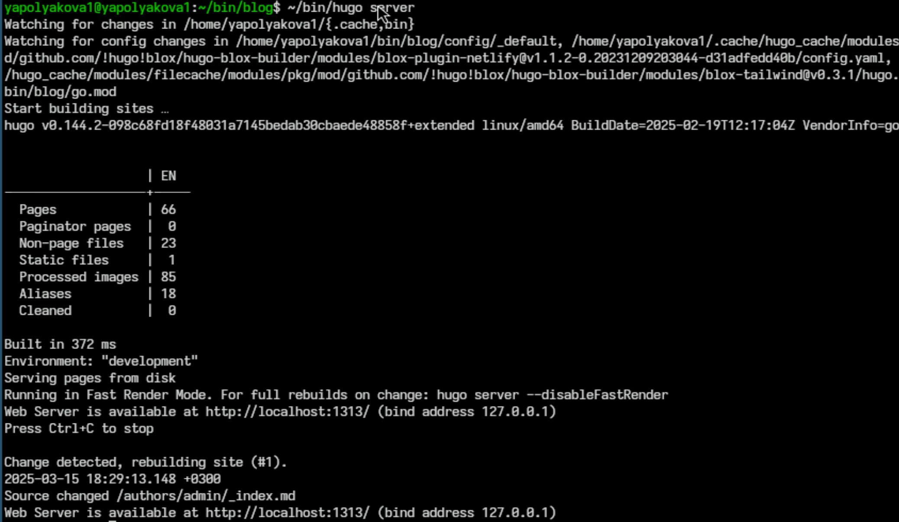{#fig:000 width=50%}

## Фотография владельца сайта

Размещаем фотографию владельца сайта

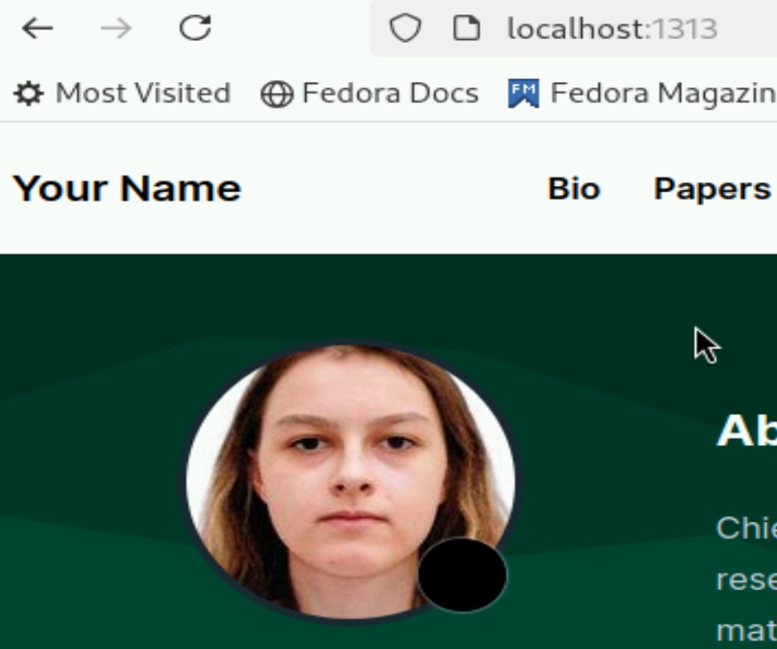{#fig:001 width=30%}

## Папка с фото

Папка, в которой находится фотография

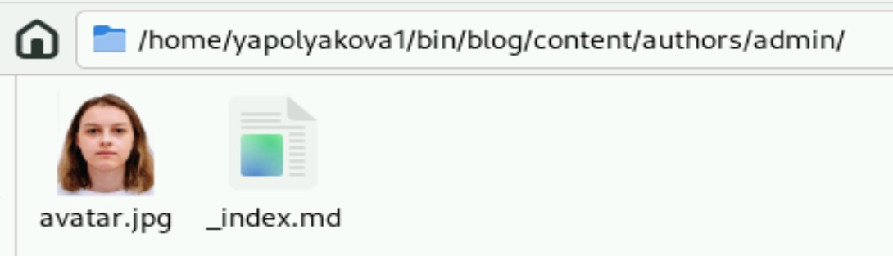{#fig:002 width=70%}

## Biography

В той же папке в файле _index.md размещаем краткое описание владельца сайта, а также меняем имя и связанную информацию

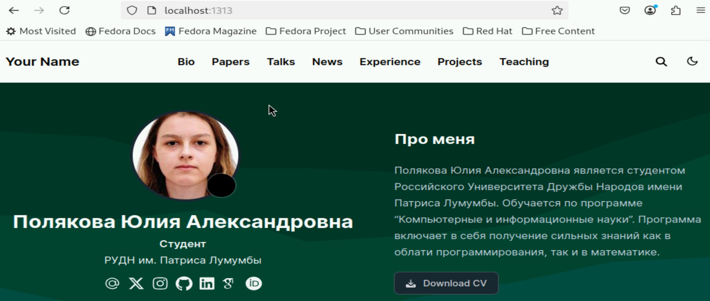{#fig:003 width=70%}

## Interests

Добавляем информацию об интересах (все в том же файле)

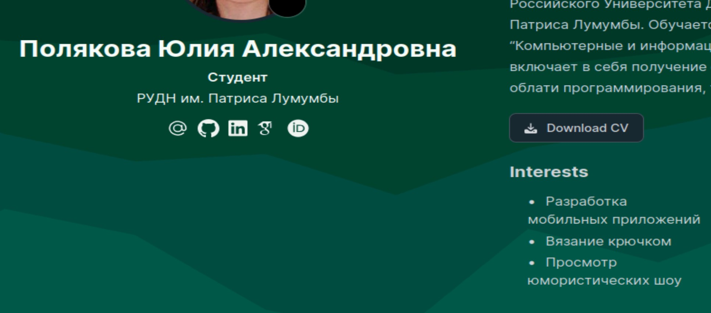{#fig:004 width=70%}

## Education

Добавляем информацию от образовании

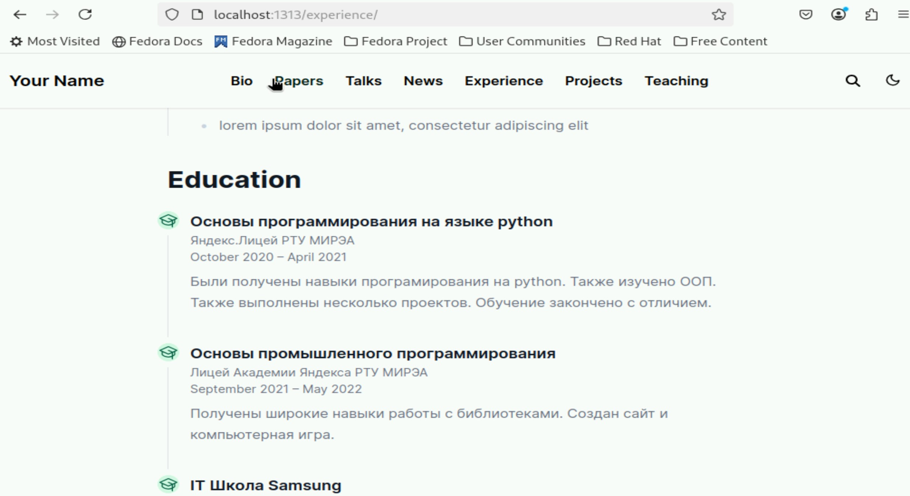{#fig:005 width=70%}

## Пост по прошедшей неделе

Делаем пост по прошедшей неделе

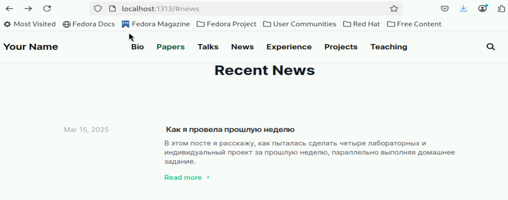{#fig:006 width=70%}

## Папка с постом по прошедшей неделе

Место и файл, в котором мы делаем пост по прошедшей неделе

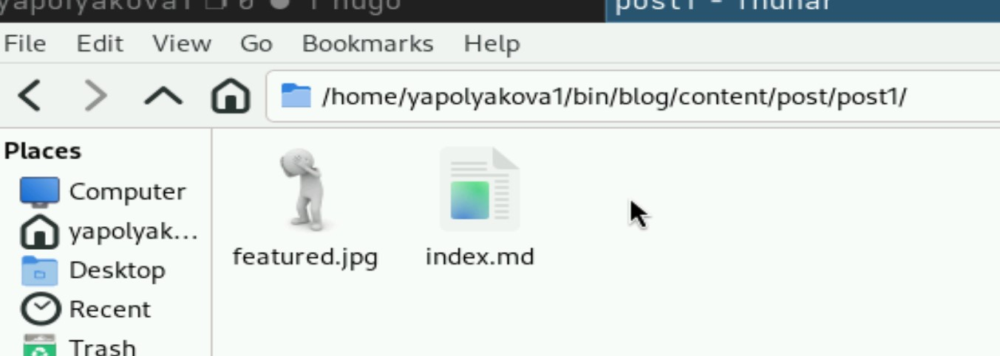{#fig:007 width=70%}

## Пост на тему по выбору

Добавляем пост на тему по выбору (Выбрано: Управление версиями. Git.) Пост создается в папке, где лежит папка с предыдущим постом

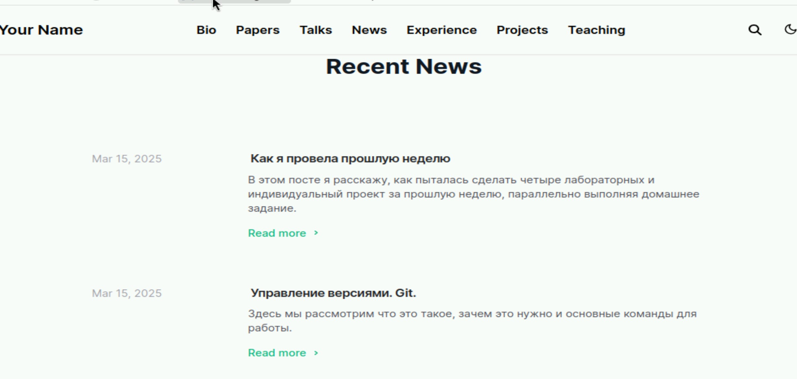{#fig:008 width=70%}

## Создаем сайт

Создаем сайт

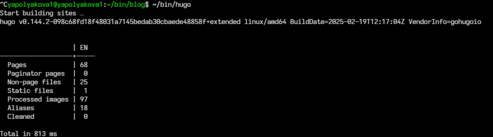{#fig:009 width=70%}

## Отправка файлов в git

Отправляем все изменения в git (git add ., git commit -am '', git push)

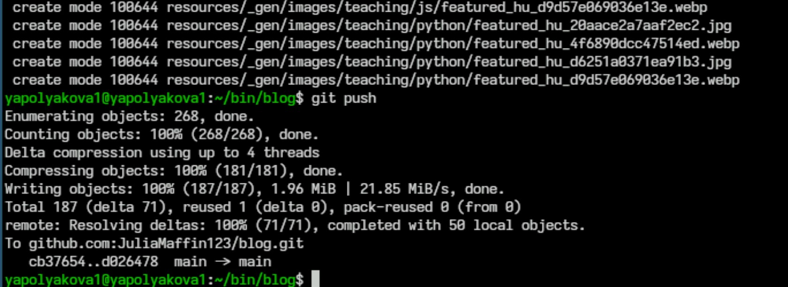{#fig:010 width=70%}

## Страница github-pages

В результате github-pages заработает в течение 10 мин

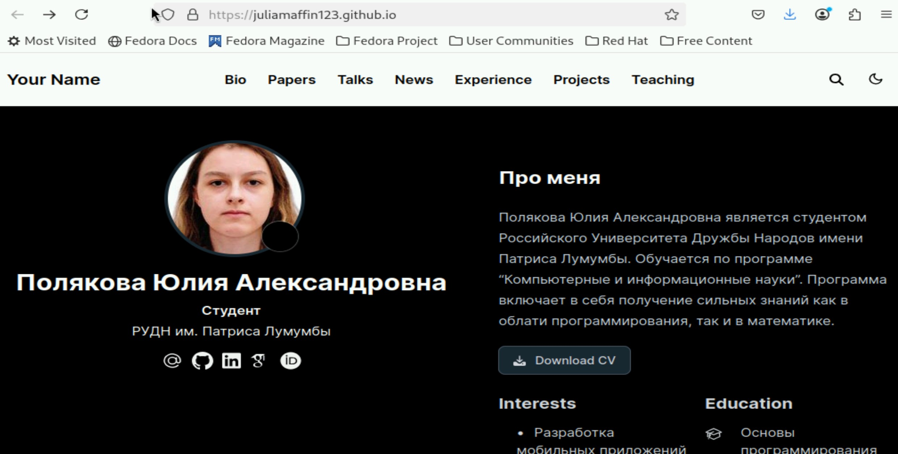{#fig:011 width=70%}

## Вывод

Были добавлены к сайту данные о себе.
