---
## Front matter
title: "Индивидуальный проект"
subtitle: "Этап №2"
author: "Полякова Юлия Александровна"

## Generic otions
lang: ru-RU
toc-title: "Содержание"

## Bibliography
bibliography: bib/cite.bib
csl: pandoc/csl/gost-r-7-0-5-2008-numeric.csl

## Pdf output format
toc: true # Table of contents
toc-depth: 2
lof: true # List of figures
lot: true # List of tables
fontsize: 12pt
linestretch: 1.5
papersize: a4
documentclass: scrreprt
## I18n polyglossia
polyglossia-lang:
  name: russian
  options:
	- spelling=modern
	- babelshorthands=true
polyglossia-otherlangs:
  name: english
## I18n babel
babel-lang: russian
babel-otherlangs: english
## Fonts
mainfont: IBM Plex Serif
romanfont: IBM Plex Serif
sansfont: IBM Plex Sans
monofont: IBM Plex Mono
mathfont: STIX Two Math
mainfontoptions: Ligatures=Common,Ligatures=TeX,Scale=0.94
romanfontoptions: Ligatures=Common,Ligatures=TeX,Scale=0.94
sansfontoptions: Ligatures=Common,Ligatures=TeX,Scale=MatchLowercase,Scale=0.94
monofontoptions: Scale=MatchLowercase,Scale=0.94,FakeStretch=0.9
mathfontoptions:
## Biblatex
biblatex: true
biblio-style: "gost-numeric"
biblatexoptions:
  - parentracker=true
  - backend=biber
  - hyperref=auto
  - language=auto
  - autolang=other*
  - citestyle=gost-numeric
## Pandoc-crossref LaTeX customization
figureTitle: "Рис."
tableTitle: "Таблица"
listingTitle: "Листинг"
lofTitle: "Список иллюстраций"
lotTitle: "Список таблиц"
lolTitle: "Листинги"
## Misc options
indent: true
header-includes:
  - \usepackage{indentfirst}
  - \usepackage{float} # keep figures where there are in the text
  - \floatplacement{figure}{H} # keep figures where there are in the text
---

# Цель работы

Добавить к сайту данные о себе.

# Задание

- Разместить фотографию владельца сайта.
- Разместить краткое описание владельца сайта (Biography).
- Добавить информацию об интересах (Interests).
- Добавить информацию от образовании (Education).
- Сделать пост по прошедшей неделе.
- Добавить пост на тему по выбору (Выбрано: Управление версиями. Git.)

# Выполнение лабораторной работы

Сначала работа проводится на локальном сайте. Для этого запускаем его командой, а потом приступаем к изменениям (рис. [-@fig:000])

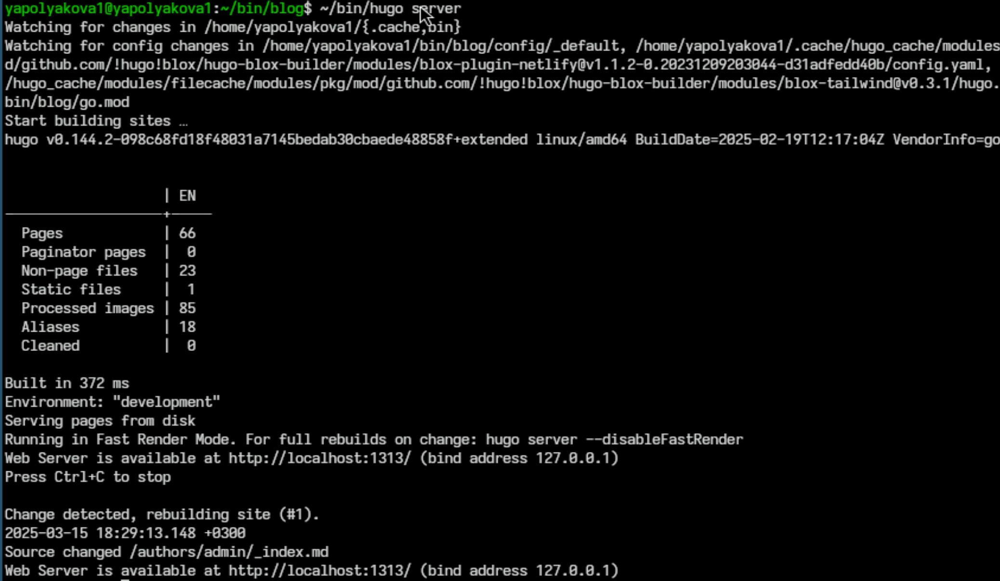{#fig:000 width=70%}

1. Размещаем фотографию владельца сайта (рис. [-@fig:001]).

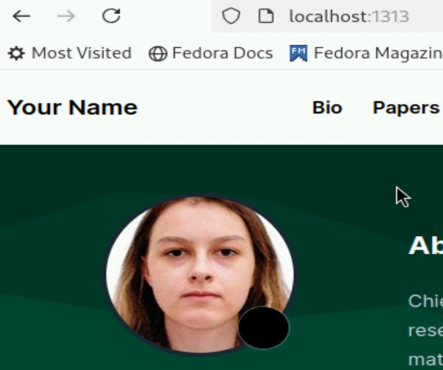{#fig:001 width=70%}

2. Папка, в которой находится фотография (рис. [-@fig:002])

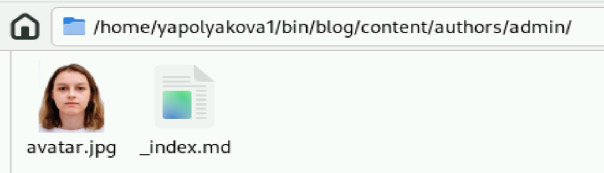{#fig:002 width=70%}

3. В той же папке в файле _index.md размещаем краткое описание владельца сайта, а также меняем имя и связанную информацию (рис. [-@fig:003])

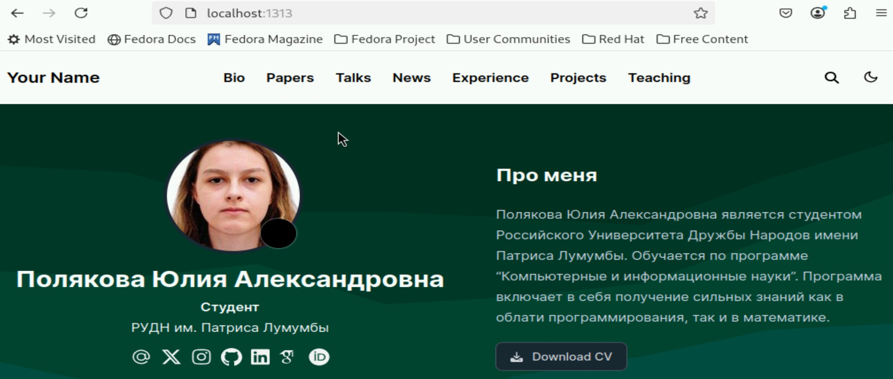{#fig:003 width=70%}

4. Добавляем информацию об интересах (все в том же файле) (рис. [-@fig:004])

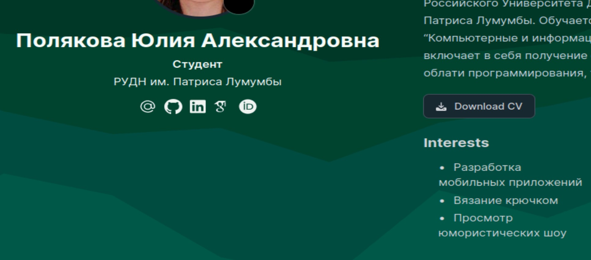{#fig:004 width=70%}

5. Добавляем информацию от образовании (рис. [-@fig:005])

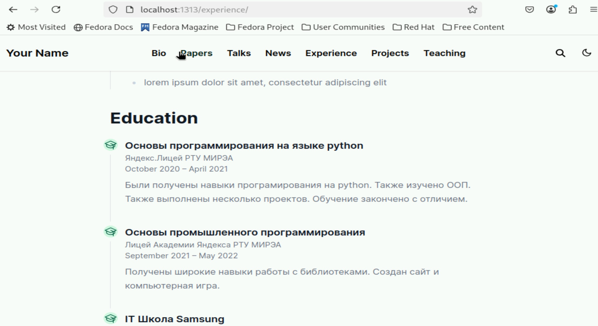{#fig:005 width=70%}

6. Делаем пост по прошедшей неделе (рис. [-@fig:006])

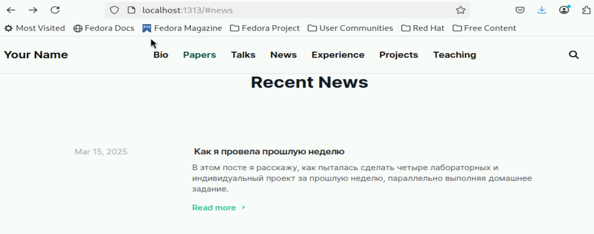{#fig:006 width=70%}

7. Место и файл, в котором мы делаем пост по прошедшей неделе (рис. [-@fig:007])

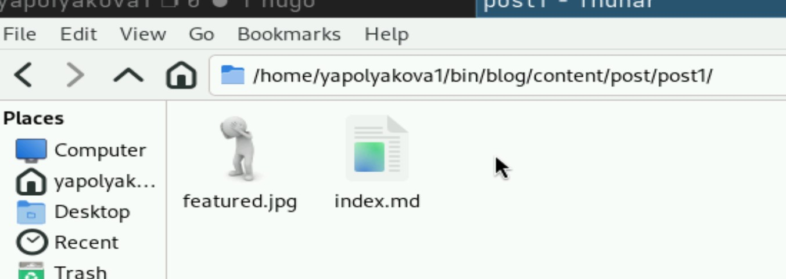{#fig:007 width=70%}

8. Добавляем пост на тему по выбору (Выбрано: Управление версиями. Git.) Пост создается в папке, где лежит папка с предыдущим постом (рис. [-@fig:008])

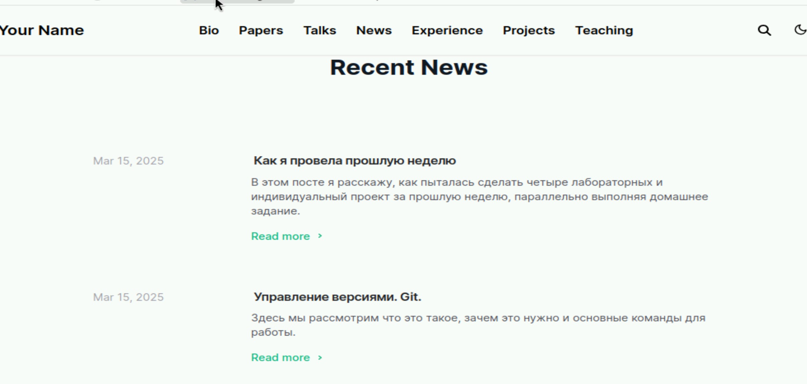{#fig:008 width=70%}

9. Создаем сайт (рис. [-@fig:009])

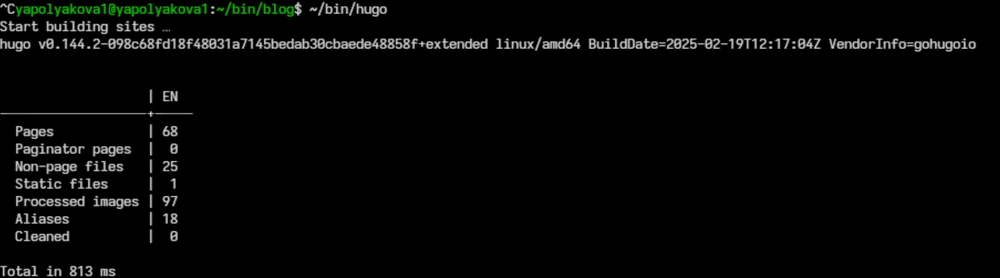{#fig:009 width=70%}

10. Отправляем все изменения в git (git add ., git commit -am '', git push) (рис. [-@fig:010])

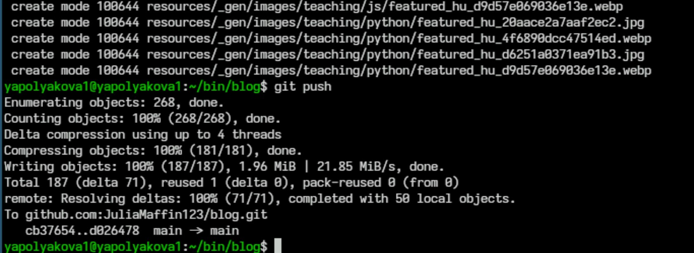{#fig:010 width=70%}

11. В результате github-pages заработает в течение 10 мин (рис. [-@fig:011])

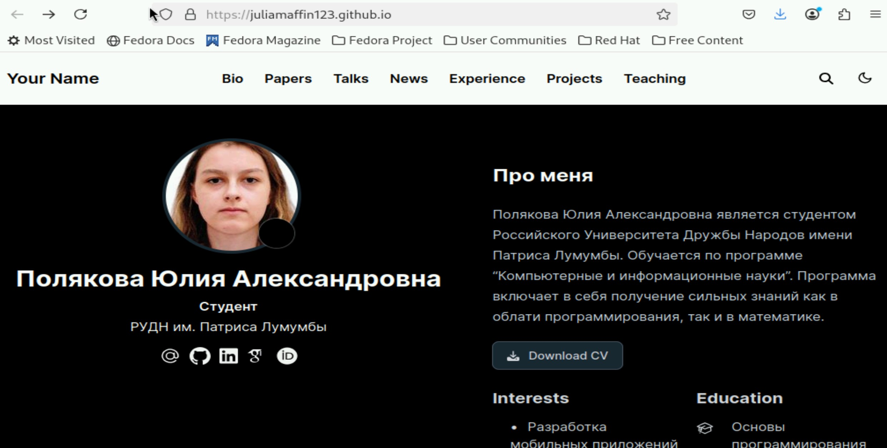{#fig:011 width=70%}

# Вывод

Были добавлены к сайту данные о себе.

