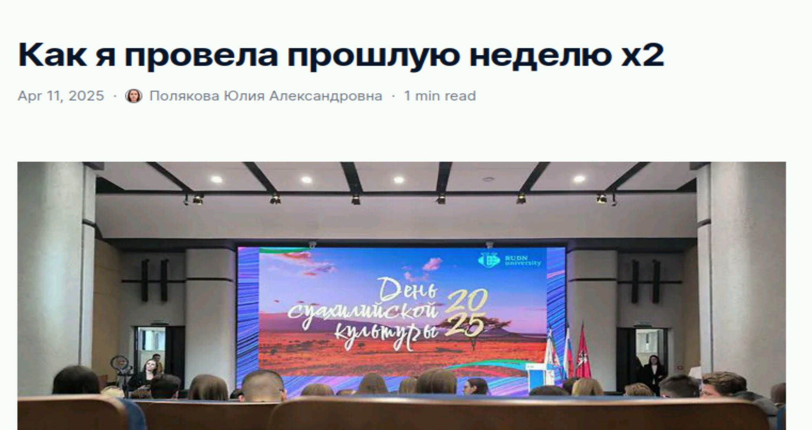

---
## Front matter
lang: ru-RU
title: Индивидуальный проект
subtitle: Этап №3
author:
  - Полякова Ю.А.
institute:
  - Российский университет дружбы народов, Москва, Россия
date: 28 февраля 2007

## i18n babel
babel-lang: russian
babel-otherlangs: english

## Formatting pdf
toc: false
toc-title: Содержание
slide_level: 2
aspectratio: 169
section-titles: true
theme: metropolis
header-includes:
 - \metroset{progressbar=frametitle,sectionpage=progressbar,numbering=fraction}
---

# Информация

## Докладчик

:::::::::::::: {.columns align=center}
::: {.column width="70%"}

  * Полякова Юлия Александровна
  * Студент
  * Российский университет дружбы народов
  * [yulya.polyakova.07@mail.ru](mailto:yulya.polyakova.07@mail.ru)
  * <https://github.com/JuliaMaffin123>

:::
::: {.column width="30%"}

:::
::::::::::::::

# Вводная часть

## Актуальность

- Полезно имень собственный сайт с важной информацией о себе.

## Объект и предмет исследования

- Страница github-pages

## Цели и задачи

- Цель:
	- Добавить к сайту достижения.
- Задачи:
	- Добавить информацию о навыках (Skills).
	- Добавить информацию об опыте (Experience).
	- Добавить информацию о достижениях (Accomplishments).
	- Сделать пост по прошедшей неделе.
	- Добавить пост на тему по выбору. Я выбрала "Язык разметки Markdown"

## Материалы и методы

- Язык разметки Markdown
- github-pages
- gedit

# Выполнение этапа проекта

## Skills & Hobby

Переходим в папку blog и запускаем локальный сайт командой ~/bin/hugo server, чтобы в рельном времени отследить изменения. Добавляем информацию о навыках (Skills) и хобби.

{#fig:001 width=70%}

## Файл шаблона для изменений

Изменения проводим в файле index.md в каталоге content/authors/admin 

{#fig:002 width=70%}

## Experience

Там же добавляем опыт (Experience), но опыта работы у меня нет.

{#fig:003 width=70%}

## Accomplishments

Добавляем информацию о достижениях.

{#fig:004 width=70%}

## Пост по прошедшей неделе

Создаем пост по прошедшей неделе.

{#fig:005 width=70%}

## Пост "Язык разметки Markdown"

Создаем пост на выбранную тему. Я выбрала "Язык разметки Markdown"

{#fig:006 width=70%}

## Каталог post с постами

Все это делаем в каталоге content/post. То есть создаем там новые папки и, пользуясь шаблонами, создаем пост.

{#fig:007 width=70%}

## Страница github-pages, посты

Затем отправляем все файлы на git, и в течение 10 минут сайт начинает работать по адресу имя-в-GitHub.github.io

{#fig:008 width=50%}

## Вывод

К сайту были добавлены достижения.
