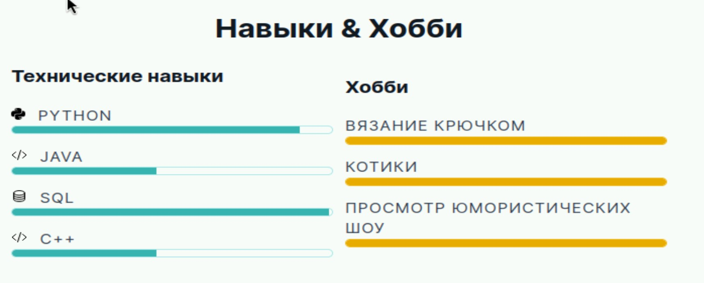
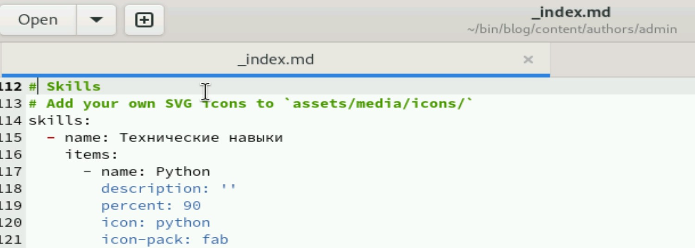
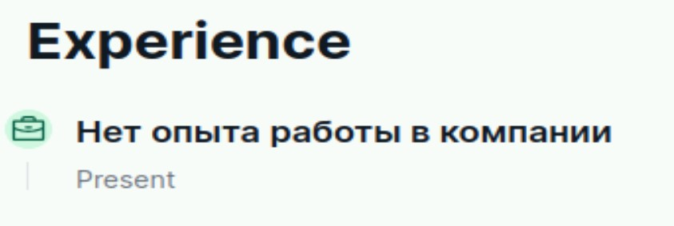
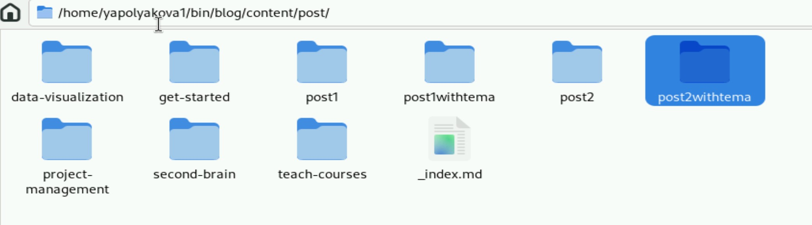

---
## Front matter
title: "Индивидуальный проект"
subtitle: "Этап №3"
author: "Полякова Юлия Александровна"

## Generic otions
lang: ru-RU
toc-title: "Содержание"

## Bibliography
bibliography: bib/cite.bib
csl: pandoc/csl/gost-r-7-0-5-2008-numeric.csl

## Pdf output format
toc: true # Table of contents
toc-depth: 2
lof: true # List of figures
lot: true # List of tables
fontsize: 12pt
linestretch: 1.5
papersize: a4
documentclass: scrreprt
## I18n polyglossia
polyglossia-lang:
  name: russian
  options:
	- spelling=modern
	- babelshorthands=true
polyglossia-otherlangs:
  name: english
## I18n babel
babel-lang: russian
babel-otherlangs: english
## Fonts
mainfont: IBM Plex Serif
romanfont: IBM Plex Serif
sansfont: IBM Plex Sans
monofont: IBM Plex Mono
mathfont: STIX Two Math
mainfontoptions: Ligatures=Common,Ligatures=TeX,Scale=0.94
romanfontoptions: Ligatures=Common,Ligatures=TeX,Scale=0.94
sansfontoptions: Ligatures=Common,Ligatures=TeX,Scale=MatchLowercase,Scale=0.94
monofontoptions: Scale=MatchLowercase,Scale=0.94,FakeStretch=0.9
mathfontoptions:
## Biblatex
biblatex: true
biblio-style: "gost-numeric"
biblatexoptions:
  - parentracker=true
  - backend=biber
  - hyperref=auto
  - language=auto
  - autolang=other*
  - citestyle=gost-numeric
## Pandoc-crossref LaTeX customization
figureTitle: "Рис."
tableTitle: "Таблица"
listingTitle: "Листинг"
lofTitle: "Список иллюстраций"
lotTitle: "Список таблиц"
lolTitle: "Листинги"
## Misc options
indent: true
header-includes:
  - \usepackage{indentfirst}
  - \usepackage{float} # keep figures where there are in the text
  - \floatplacement{figure}{H} # keep figures where there are in the text
---

# Цель работы

Добавить к сайту достижения.

# Задание

 * Добавить информацию о навыках (Skills).
 * Добавить информацию об опыте (Experience).
 * Добавить информацию о достижениях (Accomplishments).
 * Сделать пост по прошедшей неделе.
 * Добавить пост на тему по выбору. Я выбрала "Язык разметки Markdown"

# Выполнение этапа проекта

1. Переходим в папку blog и запускаем локальный сайт командой ~/bin/hugo server, чтобы в рельном времени отследить изменения. Добавляем информацию о навыках (Skills) и хобби (рис. [-@fig:001]).

{#fig:001 width=70%}

2. Изменения проводим в файле index.md в каталоге content/authors/admin (рис. [-@fig:002])

{#fig:002 width=70%}

3. Там же добавляем опыт (Experience), но опыта работы у меня нет (рис. [-@fig:003])

{#fig:003 width=70%}

4. Добавляем информацию о достижениях (рис. [-@fig:004])

{#fig:004 width=70%}

5. Создаем пост по прошедшей неделе (рис. [-@fig:005])

{#fig:005 width=70%}

6. Создаем пост на выбранную тему. Я выбрала "Язык разметки Markdown" (рис. [-@fig:006])

{#fig:006 width=70%}

7. Все это делаем в каталоге content/post. То есть создаем там новые папки и, пользуясь шаблонами, создаем пост (рис. [-@fig:007])

{#fig:007 width=70%}

8. Затем отправляем все файлы на git, и в течение 10 минут сайт начинает работать по адресу имя-в-GitHub.github.io (рис. [-@fig:008])

{#fig:008 width=70%}

# Вывод

К сайту были добавлены достижения.
