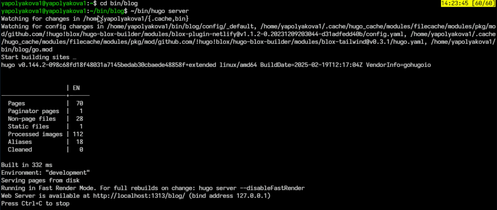

---
## Front matter
lang: ru-RU
title: Индивидуальный проект
subtitle: Этап №4
author:
  - Полякова Ю.А.
institute:
  - Российский университет дружбы народов, Москва, Россия
  - Преподаватель Кулябов Д. С., д.ф.\-м.н., профессор
date: 28 февраля 2007

## i18n babel
babel-lang: russian
babel-otherlangs: english

## Formatting pdf
toc: false
toc-title: Содержание
slide_level: 2
aspectratio: 169
section-titles: true
theme: metropolis
header-includes:
 - \metroset{progressbar=frametitle,sectionpage=progressbar,numbering=fraction}
---

# Информация

## Докладчик

:::::::::::::: {.columns align=center}
::: {.column width="70%"}

  * Полякова Юлия Александровна
  * Студент
  * Российский университет дружбы народов
  * [yulya.polyakova.07@mail.ru](mailto:yulya.polyakova.07@mail.ru)
  * <https://github.com/JuliaMaffin123>

:::
::: {.column width="30%"}

:::
::::::::::::::

# Вводная часть

## Актуальность

- Важно иметь собственный личный сайт с портфолио и информацией о себе

## Объект и предмет исследования

- Страница github-pages

## Цели и задачи

 * Добавить ссылки и ресурсы, предварительно зарегистрироваться.
 * Сделать пост по прошедшей неделе.
 * Добавить пост на тему по выбору. Я выбрала "Создание презентаций в Markdown"

## Материалы и методы

- Процессор `pandoc` для входного формата Markdown
- github-pages
- Автоматизация процесса создания: `Makefile`

# Выполнение лабораторной работы

## Запуск локального сайта

Переходим в папку blog и запускаем локальный сайт командой ~/bin/hugo server, чтобы в рельном времени отследить изменения

{#fig:001 width=70%}

## Файл шаблона для изменений

Добавляем ссылки и иконки. Изменения проводим в файле index.md в каталоге content/authors/admin

{#fig:002 width=40%}

## Пост по прошедшей неделе

Создаем пост по прошедшей неделе

{#fig:003 width=70%}

## Пост на тему

Создаем пост на выбранную тему. Я выбрала "Создание презентаций в Markdown"

{#fig:004 width=70%}

## Каталог post с постами

Все это делаем в каталоге content/post. То есть создаем там новые папки и, пользуясь шаблонами, создаем пост

{#fig:005 width=70%}

## Загружаем в git

Отправляем все файлы на git

{#fig:006 width=70%}

## Страница

В течение 10 минут сайт начинает работать по адресу имя-в-GitHub.github.io

{#fig:007 width=40%}

## Вывод

К сайту были добавлены ссылки на научные и библиометрические ресурсы. Сделано два поста.
