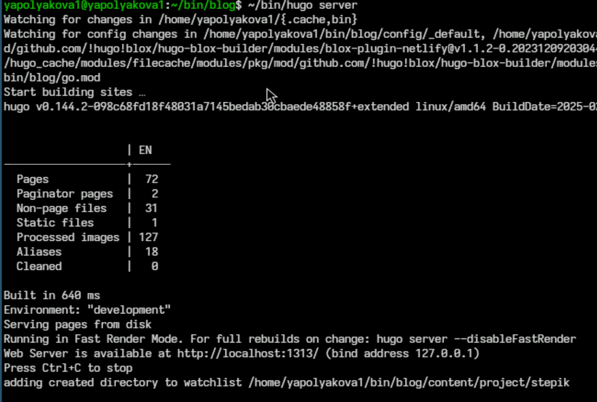
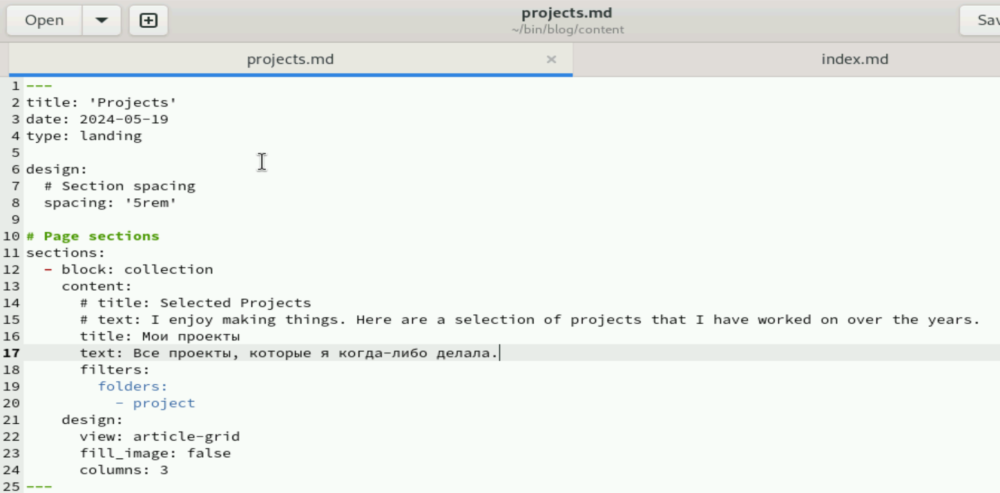
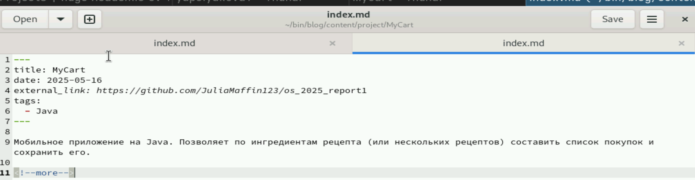
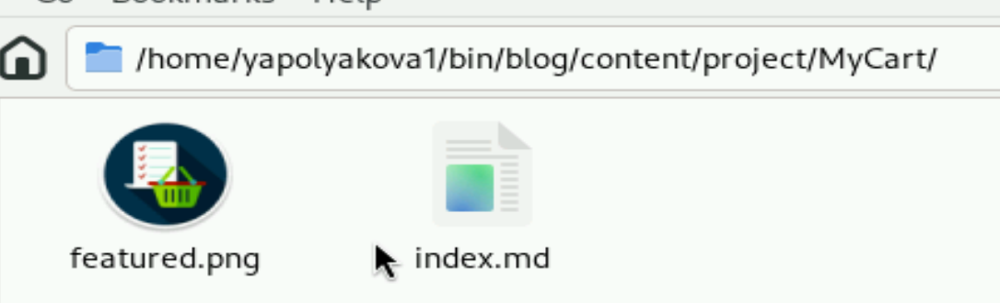
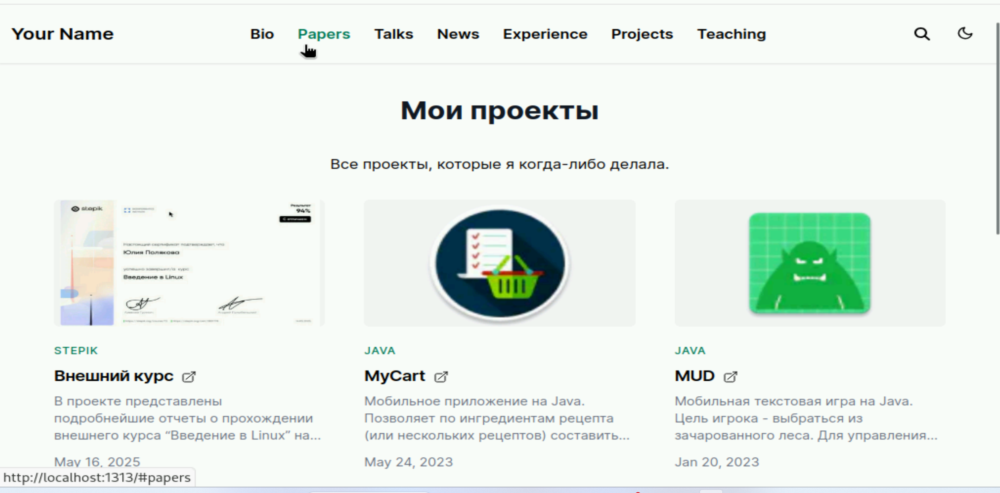
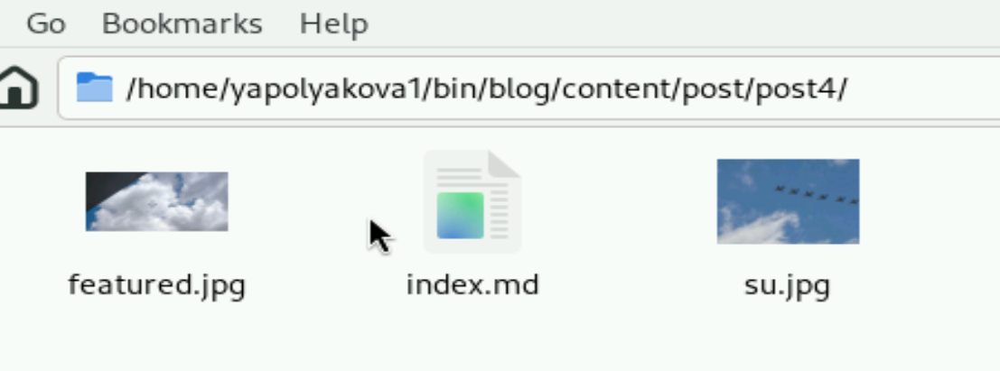
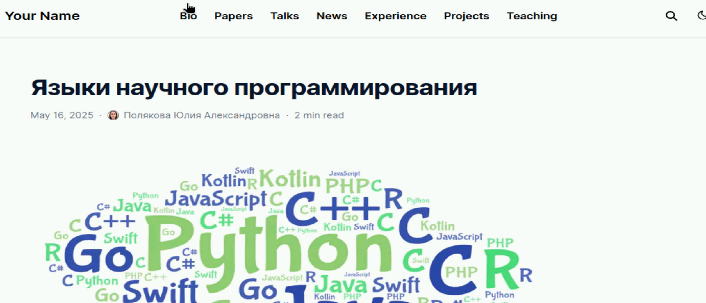
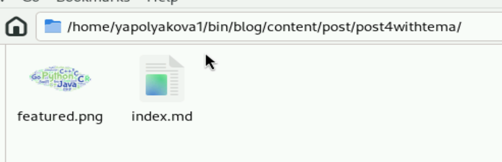
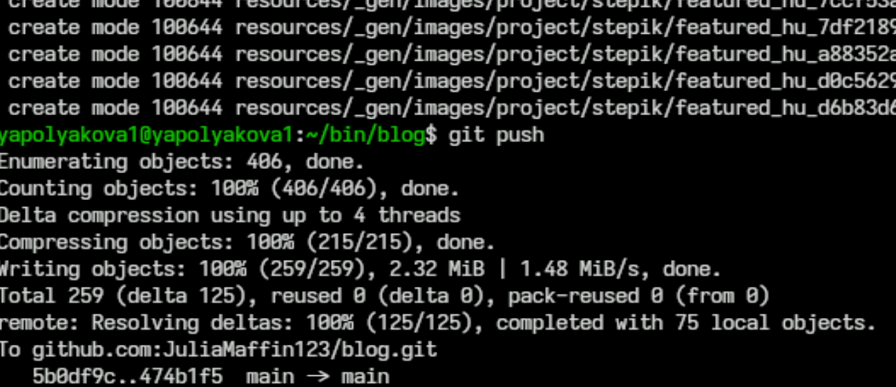

---
## Front matter
lang: ru-RU
title: Индивидуальный проект
subtitle: Этап №5
author:
  - Полякова Ю.А.
institute:
  - Российский университет дружбы народов, Москва, Россия
  - Преподаватель Кулябов Д. С., д.ф.\-м.н., профессор
date: 28 февраля 2007

## i18n babel
babel-lang: russian
babel-otherlangs: english

## Formatting pdf
toc: false
toc-title: Содержание
slide_level: 2
aspectratio: 169
section-titles: true
theme: metropolis
header-includes:
 - \metroset{progressbar=frametitle,sectionpage=progressbar,numbering=fraction}
---

# Информация

## Докладчик

:::::::::::::: {.columns align=center}
::: {.column width="70%"}

  * Полякова Юлия Александровна
  * Студент
  * Российский университет дружбы народов
  * [yulya.polyakova.07@mail.ru](mailto:yulya.polyakova.07@mail.ru)
  * <https://github.com/JuliaMaffin123>

:::
::: {.column width="30%"}

:::
::::::::::::::

# Вводная часть

## Актуальность

- Важно иметь собственный личный сайт с портфолио и информацией о себе

## Объект и предмет исследования

- Страница github-pages

## Цели и задачи

 * Добавить записи для персональных проектов.
 * Сделать пост по прошедшей неделе.
 * Добавить пост на тему по выбору "Языки научного программирования"

## Материалы и методы

- Процессор `pandoc` для входного формата Markdown
- github-pages
- Автоматизация процесса создания: `Makefile`

# Выполнение лабораторной работы

## Запуск локального сайта

Переходим в папку blog и запускаем локальный сайт командой ~/bin/hugo server, чтобы в рельном времени отследить изменения

{#fig:001 width=50%}

## Меняем текст на русский

Меняем английский текст на странице проектов в projects.md

{#fig:002 width=70%}

## Файл проекта

Добавляем файл проекта

{#fig:003 width=70%}

## Папка проекта

Что находится в папке с проектом

{#fig:004 width=70%}

## Добавляем проекты

Добавляем персональные проекты, проверяем локальный сайт

{#fig:005 width=70%}

## Пост по прошедшей неделе

Создаем пост по прошлой неделе, вот папка с ним

{#fig:006 width=70%}

## Пост по теме

Делаем пост по теме

{#fig:007 width=70%}

## Пост по теме, папка

Папка с постом по теме

{#fig:008 width=70%}

## Загрузка на гит

Останавливаем локальный сайт, делаем ~/bin/hugo, отправляем все файлы на гит. Через пару минут страница заработает

{#fig:009 width=70%}

## Вывод

К сайту были добавлены ссылки на проекты. Сделано два поста.
