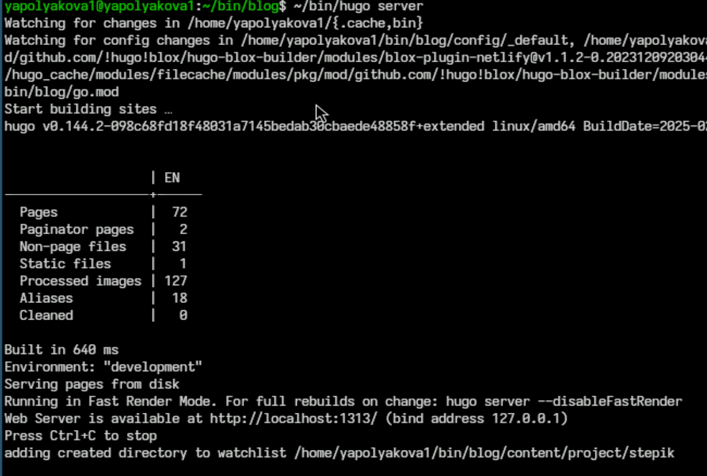
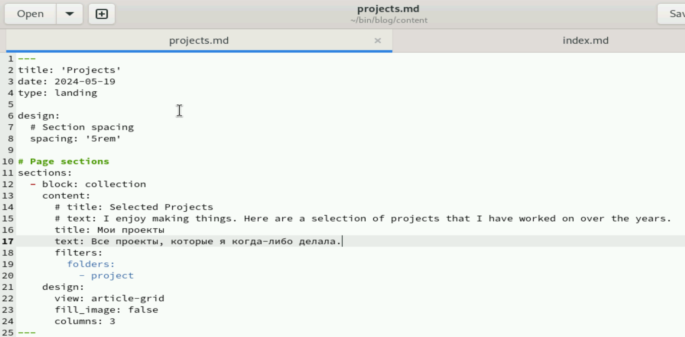
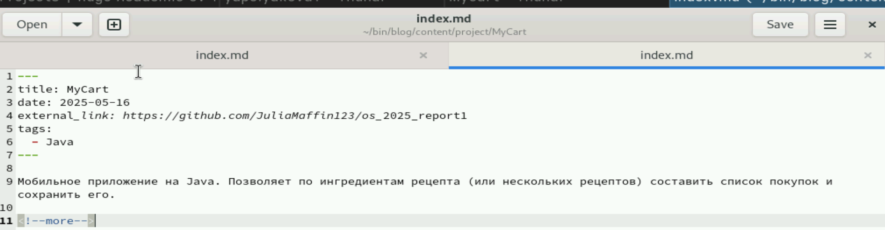
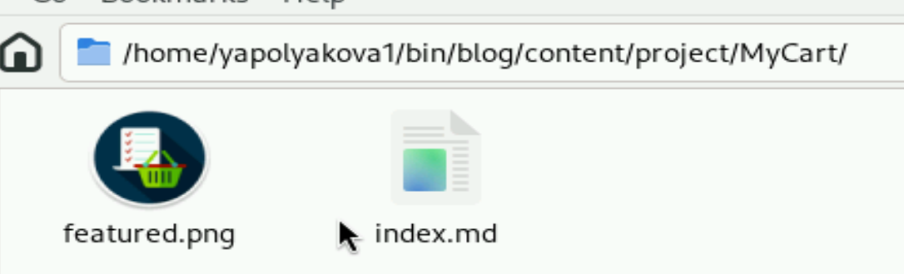
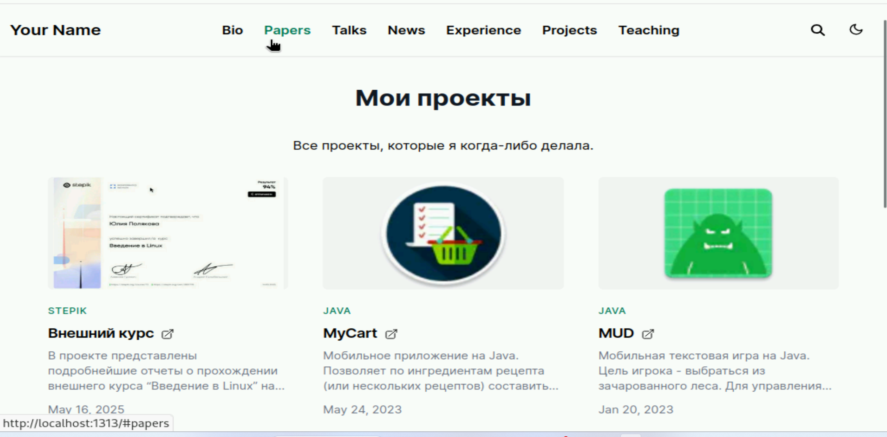
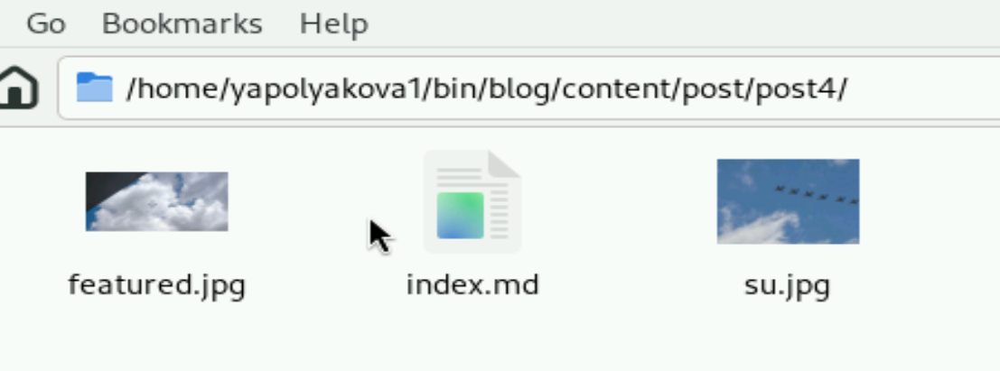
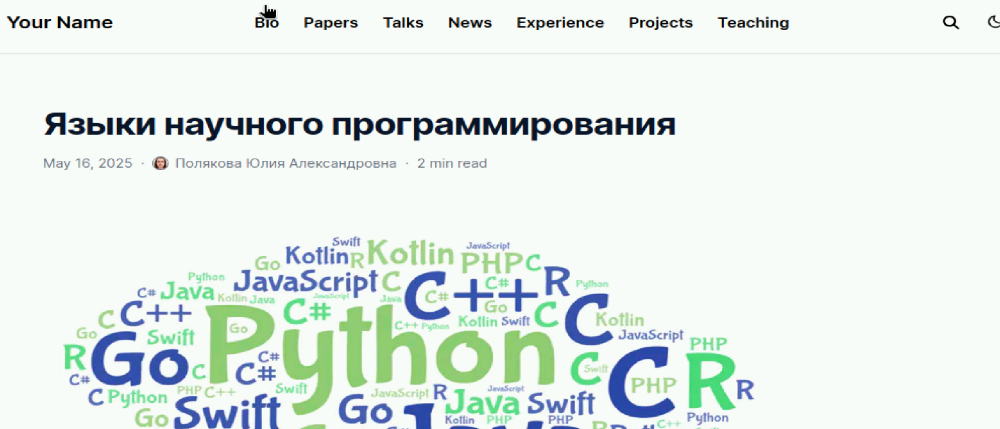
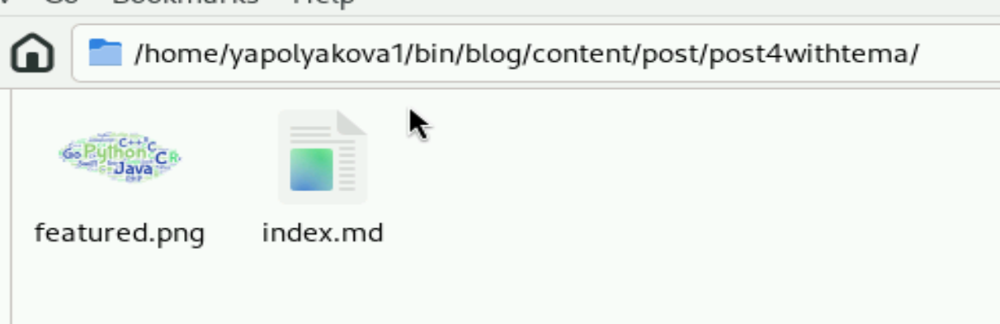
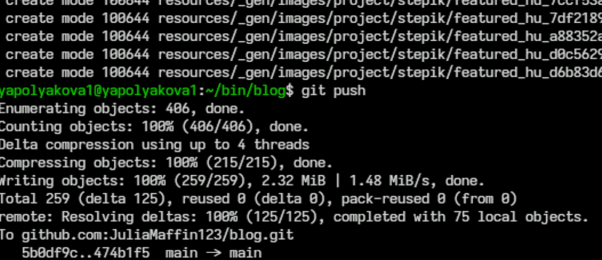

---
## Front matter
title: "Индивидуальный проект"
subtitle: "Этап №5"
author: "Полякова Юлия Александровна"

## Generic otions
lang: ru-RU
toc-title: "Содержание"

## Bibliography
bibliography: bib/cite.bib
csl: pandoc/csl/gost-r-7-0-5-2008-numeric.csl

## Pdf output format
toc: true # Table of contents
toc-depth: 2
lof: true # List of figures
lot: true # List of tables
fontsize: 12pt
linestretch: 1.5
papersize: a4
documentclass: scrreprt
## I18n polyglossia
polyglossia-lang:
  name: russian
  options:
	- spelling=modern
	- babelshorthands=true
polyglossia-otherlangs:
  name: english
## I18n babel
babel-lang: russian
babel-otherlangs: english
## Fonts
mainfont: IBM Plex Serif
romanfont: IBM Plex Serif
sansfont: IBM Plex Sans
monofont: IBM Plex Mono
mathfont: STIX Two Math
mainfontoptions: Ligatures=Common,Ligatures=TeX,Scale=0.94
romanfontoptions: Ligatures=Common,Ligatures=TeX,Scale=0.94
sansfontoptions: Ligatures=Common,Ligatures=TeX,Scale=MatchLowercase,Scale=0.94
monofontoptions: Scale=MatchLowercase,Scale=0.94,FakeStretch=0.9
mathfontoptions:
## Biblatex
biblatex: true
biblio-style: "gost-numeric"
biblatexoptions:
  - parentracker=true
  - backend=biber
  - hyperref=auto
  - language=auto
  - autolang=other*
  - citestyle=gost-numeric
## Pandoc-crossref LaTeX customization
figureTitle: "Рис."
tableTitle: "Таблица"
listingTitle: "Листинг"
lofTitle: "Список иллюстраций"
lotTitle: "Список таблиц"
lolTitle: "Листинги"
## Misc options
indent: true
header-includes:
  - \usepackage{indentfirst}
  - \usepackage{float} # keep figures where there are in the text
  - \floatplacement{figure}{H} # keep figures where there are in the text
---

# Цель работы

Добавить к сайту все остальные элементы.

# Задание

 * Добавить записи для персональных проектов.
 * Сделать пост по прошедшей неделе.
 * Добавить пост на тему по выбору "Языки научного программирования"

# Выполнение этапа проекта

1. Переходим в папку blog и запускаем локальный сайт командой ~/bin/hugo server, чтобы в рельном времени отследить изменения (рис. [-@fig:001]).

{#fig:001 width=70%}

2. Меняем английский текст на странице проектов в projects.md (рис. [-@fig:002])

{#fig:002 width=70%}

3. Добавляем файл проекта (рис. [-@fig:003])

{#fig:003 width=70%}

4. Что находится в папке с проектом (рис. [-@fig:004])

{#fig:004 width=70%}

5. Добавляем персональные проекты, проверяем локальный сайт (рис. [-@fig:005])

{#fig:005 width=70%}

6. Создаем пост по прошлой неделе, вот папка с ним (рис. [-@fig:006])

{#fig:006 width=70%}

7. Делаем пост по теме (рис. [-@fig:007])

{#fig:007 width=70%}

8. Папка с постом по теме (рис. [-@fig:008])

{#fig:008 width=70%}

9. Останавливаем локальный сайт, делаем ~/bin/hugo, отправляем все файлы на гит. Через пару минут страница заработает (рис. [-@fig:009])

{#fig:009 width=70%}

# Вывод

К сайту были добавлены ссылки проекты. Сделано два поста.
